# Card Game Platform — Architecture Overview

> **Document Type:** Architecture Decision Record (ADR) & System Overview
> **Status:** Draft v1.0
> **Last Updated:** March 2026

---

## 1. Project Vision

A fullstack web-based card game platform built as a production-grade, enterprise-ready system. Players can register, create or join rooms, invite others, and play card games in real-time — against other players or an AI opponent.

Built solo, engineered like a team of ten owns it.

---

## 2. High-Level System Architecture

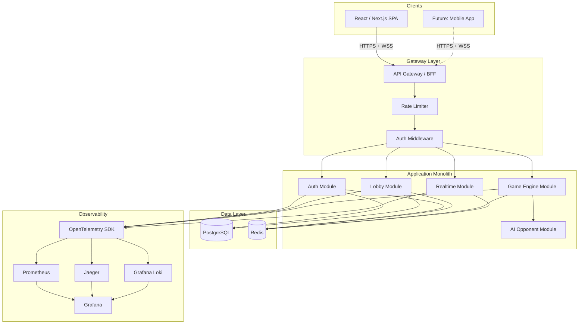

---

## 3. Architecture Pattern: Modular Monolith

### Decision

Start as a **well-structured monolith** with strict module boundaries. Each module maps to a future service extraction point.

### Rationale

- Solo developer — microservices multiply operational overhead without a team to absorb it.
- Module boundaries enforce separation of concerns without network hops.
- Extraction to services is a cut along existing interfaces, not a rewrite.
- One deployable unit means one CI pipeline, one container, one thing to monitor.

### Module Boundary Rules

- Modules communicate through **typed interfaces only** — no direct imports of another module's internals.
- Each module owns its own database tables (logical separation, shared physical DB).
- Shared types live in a dedicated `/shared` directory.

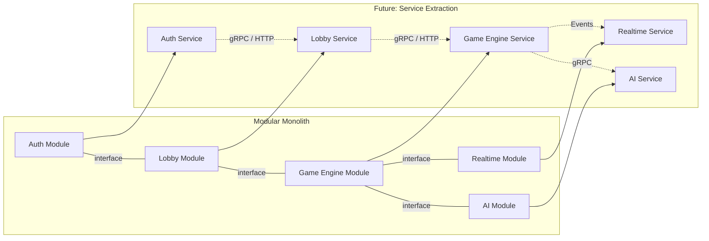

---

## 4. Project Structure

```
root/
├── app/                        # Next.js frontend
│   ├── pages/
│   ├── components/
│   ├── hooks/
│   ├── stores/                 # Client state management
│   └── styles/
├── server/                     # Node.js/TS monolith
│   ├── modules/
│   │   ├── auth/               # Registration, login, JWT
│   │   ├── lobby/              # Room CRUD, invites, matchmaking
│   │   ├── game-engine/        # State machine, rules, validation
│   │   ├── realtime/           # WebSocket handling, broadcast
│   │   └── ai/                 # AI opponent strategies
│   ├── shared/
│   │   ├── types/              # Domain types shared across modules
│   │   ├── errors/             # Typed error hierarchy
│   │   ├── middleware/         # Auth, rate-limit, tracing
│   │   └── config/             # Env-based config (zod validated)
│   ├── infra/
│   │   ├── database/           # Migrations, connection pool
│   │   ├── redis/              # Client, pub/sub wrappers
│   │   └── websocket/          # Socket.IO server setup
│   └── server.ts               # Composition root
├── shared/                     # Types shared between FE and BE
├── infra/
│   ├── terraform/              # Cloud infrastructure as code
│   ├── docker/                 # Dockerfiles, compose
│   └── k8s/                    # Helm charts / manifests
├── observability/
│   ├── grafana/                # Dashboard JSON exports
│   ├── prometheus/             # Recording rules, alerts
│   └── otel/                   # Collector config
├── docs/
│   ├── adrs/                   # Architecture Decision Records
│   └── runbooks/               # Incident response playbooks
└── docker-compose.yml          # Full local dev stack
```

---

## 5. Technology Stack

| Layer | Technology | Rationale |
|---|---|---|
| **Frontend** | Next.js + React + Tailwind CSS | SSR for landing/auth, SPA for gameplay. Utility-first CSS with JIT for minimal bundles. |
| **Backend** | Node.js + TypeScript | Shared types with FE. Async I/O fits WebSocket workload. One language across the stack maximizes solo-dev velocity. |
| **Realtime** | Socket.IO | Built-in rooms, auto-reconnect, polling fallback. Battle-tested. |
| **Database** | PostgreSQL | Durable storage for users, game history, leaderboards. |
| **Cache / PubSub** | Redis | Session store, ephemeral room state, WS scaling backplane. |
| **Auth** | Custom JWT + bcrypt | Short-lived access tokens + refresh tokens. Add OAuth later. |
| **AI Engine** | Server-side TS module | Pluggable strategy interface. Worker threads for CPU isolation. |
| **Observability** | OpenTelemetry + Prometheus + Grafana + Jaeger + Loki | Unified instrumentation, three pillars of observability. |
| **IaC** | Terraform + Docker | Reproducible infra. Compose for local dev, Terraform for cloud. |
| **CI/CD** | GitHub Actions | Lint, test, build, deploy — automated on every PR and merge. |

---

## 6. Module Deep Dives

### 6.1 Auth Module

**Responsibility:** Identity management — registration, login, token lifecycle.

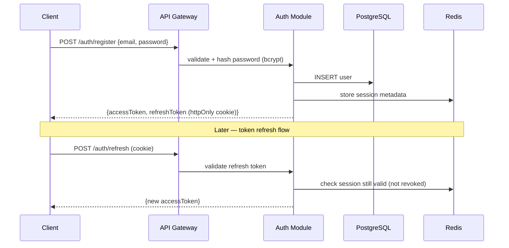

**Key Decisions:**
- JWT access tokens (short-lived, 15 min) — stateless validation at the gateway.
- Refresh tokens in httpOnly cookies — not accessible to JS, immune to XSS.
- Redis-backed session tracking — enables forced logout and ban enforcement.
- OAuth (Google, Discord) deferred to Phase 2 — not before there are players.

---

### 6.2 Lobby Module

**Responsibility:** Room lifecycle, player invitations, pre-game coordination.

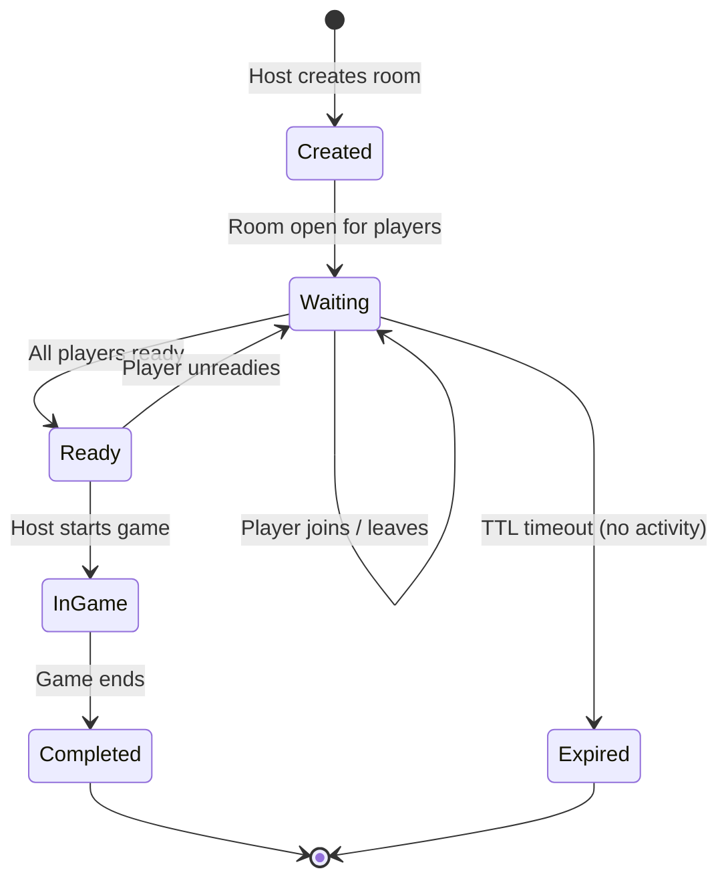

**Key Decisions:**
- Active rooms live in **Redis with TTL** — ephemeral by nature. No reason to model transient state in a relational DB.
- Room state persisted to Postgres **only when a game starts** — for history and replay.
- Room discovery: public rooms listed via Redis scan, private rooms via invite link (UUID token).
- Maximum room size enforced server-side. Client is never trusted.

---

### 6.3 Game Engine Module (Core Domain)

**Responsibility:** Authoritative game logic — state machine, move validation, effect resolution, win conditions.

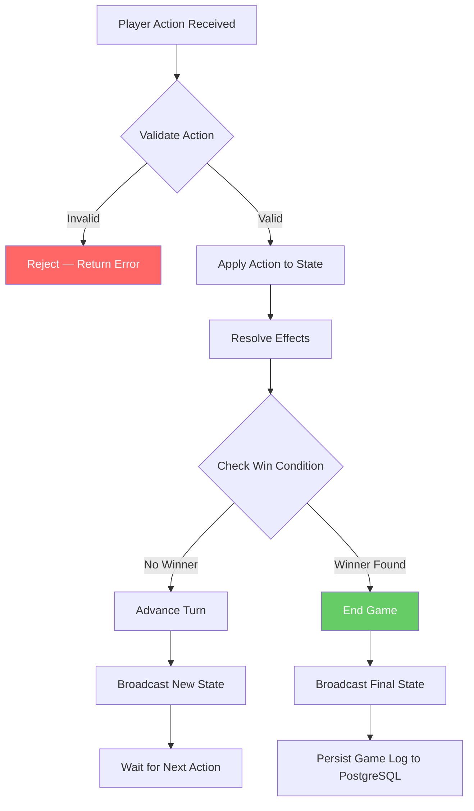

**Design Pattern: Event-Sourced State Machine**

Game state is **never mutated in place**. Every player action produces a new immutable state. The game is a sequence of `(action, resulting_state)` pairs.

```
State₀ → Action₁ → State₁ → Action₂ → State₂ → ... → Stateₙ (terminal)
```

**Why this matters:**
- **Replay:** Feed the action log into the engine to reconstruct any point in the game.
- **Spectator mode:** Late joiners receive the current state, then live actions.
- **Disconnect recovery:** Player reconnects → server sends current state.
- **Debugging:** Full action history for every game. Reproduce any bug deterministically.
- **Undo (if rules allow):** Pop the last action, revert to previous state.

**Subcomponents:**

| Component | Responsibility |
|---|---|
| **State Machine** | Legal moves, turn order, phase transitions |
| **Action Validator** | Rejects illegal plays before any state mutation |
| **Effect Resolver** | Applies card effects, computes derived state |
| **Win Condition Evaluator** | Checks end-game after every state transition |
| **Game Clock** | Turn timers, inactivity timeout, auto-forfeit |

**Key Decisions:**
- **Server is authoritative.** Client renders state, never computes it. Prevents cheating entirely.
- **Deterministic engine.** Same inputs → same outputs. No randomness after initial shuffle (or seeded RNG).
- **Active game state lives in-memory** on the server process, snapshotted to Redis periodically. Persisted to PostgreSQL only after the match concludes.

---

### 6.4 AI Opponent Module

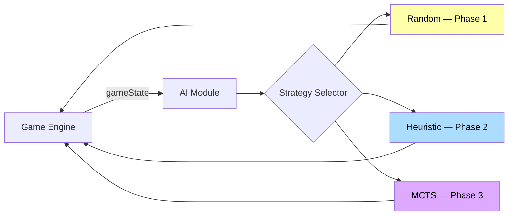

**Key Decisions:**
- Pluggable strategy interface — swap implementations without touching the engine.
- AI runs on **worker threads** to avoid blocking the event loop.
- Same game engine validates AI moves — no special path, no cheating.

---

### 6.5 Realtime Module

**Responsibility:** Bidirectional communication, room-scoped event broadcasting, presence management, reconnection handling.

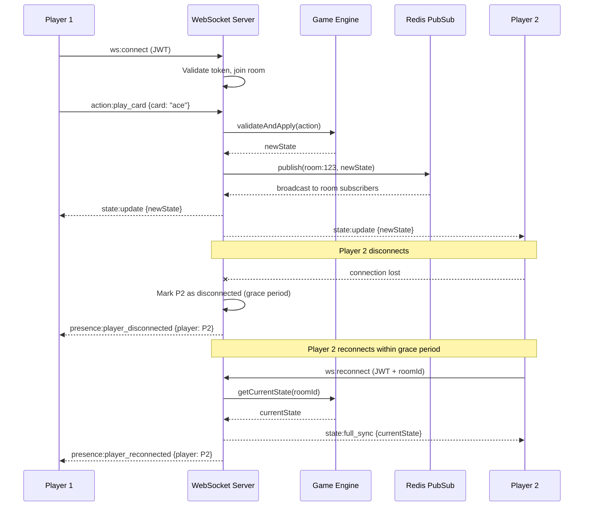

**Key Decisions:**
- **Socket.IO** over raw WebSockets — rooms, auto-reconnect, fallback to polling are built-in.
- **Redis pub/sub as backplane** — required when running multiple server instances. A broadcast in process A reaches clients connected to process B.
- **Grace period on disconnect** — don't forfeit immediately. Network hiccups are normal. 30-second window to reconnect.
- **State rehydration on reconnect** — server sends full current state, not the missed event delta. Simpler, less error-prone.

---

## 7. Data Architecture

### 7.1 Storage Strategy

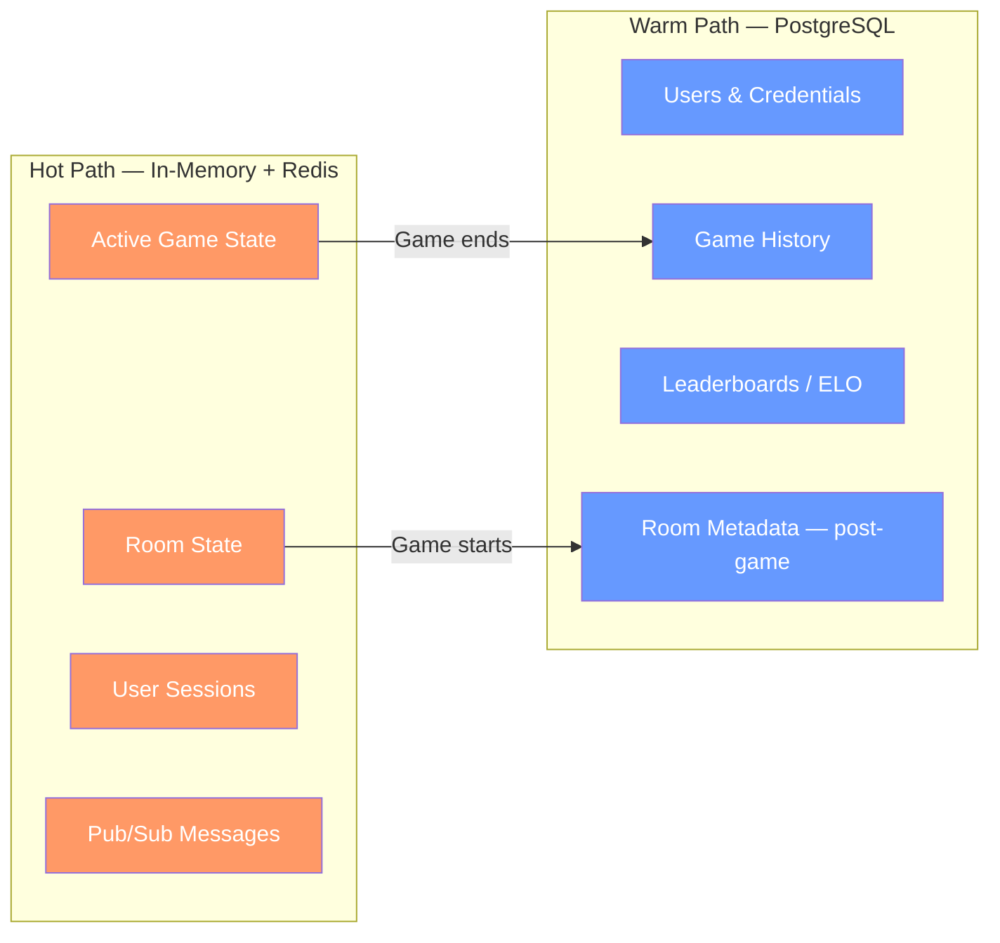

### 7.2 Data Ownership by Module

| Module | PostgreSQL Tables | Redis Keys |
|---|---|---|
| **Auth** | `users`, `credentials`, `oauth_providers` | `session:{userId}`, `refresh:{token}` |
| **Lobby** | `rooms` (post-game archive) | `room:{roomId}`, `room:public_list` |
| **Game Engine** | `games`, `game_actions` (post-game log) | `game:{gameId}:state`, `game:{gameId}:snapshot` |
| **Realtime** | — | `ws:room:{roomId}` (pub/sub channel) |
| **Leaderboard** | `ratings`, `match_results` | `leaderboard:top100` (cached) |

### 7.3 Why Two Stores

| Concern | PostgreSQL | Redis |
|---|---|---|
| **Durability** | ACID, WAL, point-in-time recovery | Best-effort persistence |
| **Query flexibility** | Complex joins, aggregations | Key-value, simple structures |
| **Write latency** | ~2-10ms | ~0.1-1ms |
| **Use case** | Data that must survive restarts | Data that must be fast and can be rebuilt |

**Rule of thumb:** If losing the data requires a user to re-register or loses game history, it goes in Postgres. If losing it means a player has to refresh or rejoin a room, it goes in Redis.

---

## 8. Observability Stack — Three Pillars

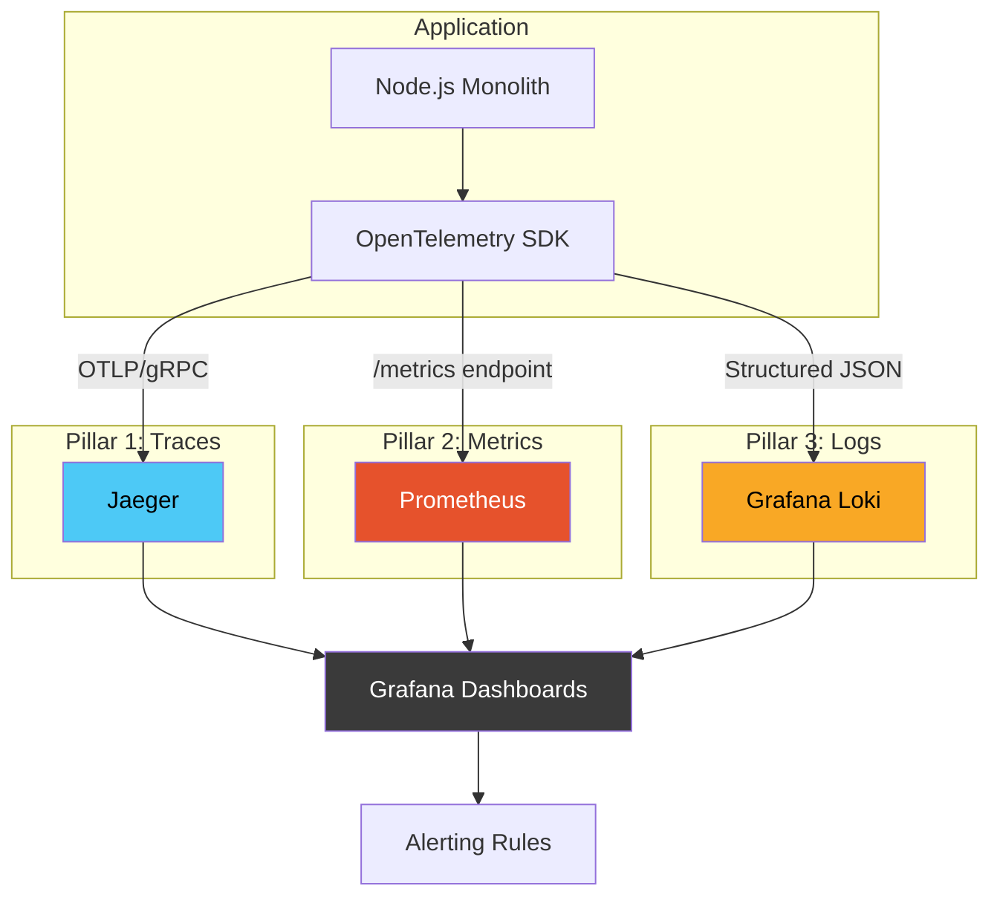

### 8.1 What Each Pillar Provides

**Traces** — Follow a single player action across the full system. Player clicks "play card" → WebSocket event → game engine validation → state mutation → Redis write → broadcast to all clients. Each step annotated with latency.

**Metrics** — Quantitative health signals: requests/sec, active WebSocket connections, game rooms open, error rate, p95/p99 latencies, Redis and Postgres pool saturation.

**Logs** — Structured JSON with correlation IDs. Every log line carries `traceId`, `userId`, `roomId`, `gameId`. No `console.log("broke")` — ever.

### 8.2 Key Metrics to Track

| Category | Metric | Type | Purpose |
|---|---|---|---|
| **System** | `ws_connections_active` | Gauge | Current WebSocket load |
| **System** | `http_request_duration_ms` | Histogram | API latency distribution |
| **System** | `db_pool_active_connections` | Gauge | Postgres connection saturation |
| **System** | `redis_latency_ms` | Histogram | Redis response time |
| **Business** | `games_active` | Gauge | Live games in progress |
| **Business** | `game_actions_total` | Counter | Total game actions processed |
| **Business** | `matchmaking_queue_depth` | Gauge | Players waiting for match |
| **Business** | `ai_move_duration_ms` | Histogram | AI computation latency |
| **Errors** | `game_engine_errors_total` | Counter | Failed state transitions |
| **Errors** | `ws_disconnects_unclean_total` | Counter | Unexpected disconnections |
| **Capacity** | `games_per_instance` | Gauge | Load per server instance |
| **Capacity** | `event_loop_lag_ms` | Histogram | Node.js event loop health |

### 8.3 Structured Logging Standard

```typescript
// Every log entry follows this shape
interface LogEntry {
  timestamp: string;       // ISO 8601
  level: 'debug' | 'info' | 'warn' | 'error';
  msg: string;             // Human-readable event name
  traceId: string;         // Distributed trace correlation
  userId?: string;
  roomId?: string;
  gameId?: string;
  [key: string]: unknown;  // Event-specific fields
}

// Example
{
  "timestamp": "2026-03-07T14:22:01.003Z",
  "level": "info",
  "msg": "card_played",
  "traceId": "abc-123-def",
  "userId": "u_42",
  "gameId": "g_891",
  "card": "ace_of_spades",
  "turnNumber": 7,
  "latencyMs": 12
}
```

---

## 9. Infrastructure & Deployment

### 9.1 CI/CD Pipeline

```mermaid
flowchart LR
    PR[Pull Request] --> LINT[Lint + Typecheck]
    LINT --> TEST[Unit + Integration Tests]
    TEST --> BUILD[Build Check]
    BUILD --> REVIEW[Code Review]
    REVIEW --> MERGE[Merge to Main]
    MERGE --> IMAGE[Build Container Image]
    IMAGE --> STAGING[Deploy to Staging — Auto]
    STAGING --> SMOKE[Smoke Tests]
    SMOKE --> PROD[Deploy to Prod — Manual Gate]

    style PR fill:#888,color:#fff
    style PROD fill:#6c6,color:#fff
```

### 9.2 Container Strategy

Single multi-stage Dockerfile. One image runs everywhere.

```
Build Stage:    Node 20 Alpine → install deps → compile TS → prune devDeps
Runtime Stage:  Node 20 Alpine → copy compiled JS + prod deps → run
```

### 9.3 Health Check Endpoints

| Endpoint | Purpose | Used By |
|---|---|---|
| `GET /health/live` | Process is running | Kubernetes liveness probe |
| `GET /health/ready` | Dependencies are connected (DB, Redis) | Kubernetes readiness probe |
| `GET /health/capacity` | Game load and headroom | Load balancer / autoscaler |

### 9.4 Graceful Shutdown Sequence

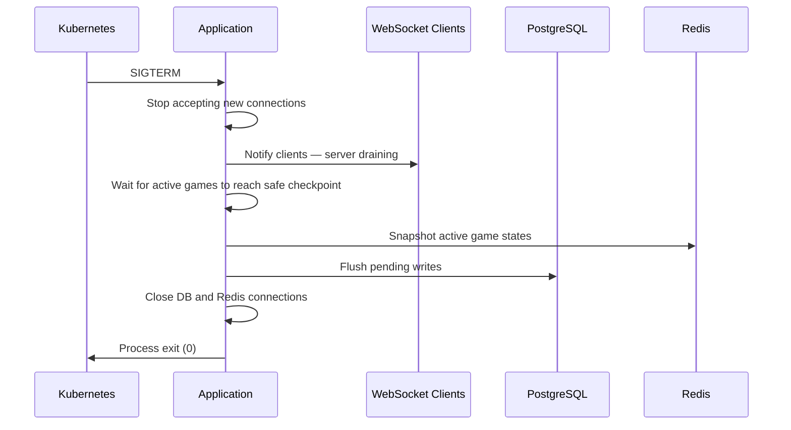

---

## 10. Security Considerations

| Concern | Implementation |
|---|---|
| **Authentication** | JWT with short TTL (15 min). Refresh via httpOnly cookie. |
| **Authorization** | Server-side checks on every action. Never trust client claims. |
| **Input validation** | Zod schemas at API boundary. Reject malformed data before it reaches business logic. |
| **Rate limiting** | Per-user, per-endpoint. Redis-backed sliding window. Prevents abuse and brute force. |
| **Game integrity** | Server is sole authority on game state. Client is a renderer only. |
| **WebSocket auth** | JWT validated on connection handshake. No anonymous sockets. |
| **Secrets management** | Env-based config with runtime validation. No secrets in code or version control. |
| **CORS** | Strict origin whitelist. No wildcard in production. |

---

## 11. Scaling Strategy

### Phase 1 — Single Instance (0–500 users)

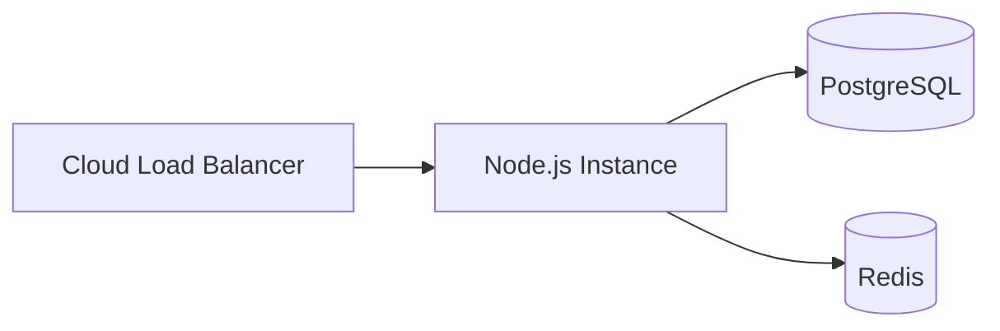

One instance handles everything. Postgres and Redis as managed services.

### Phase 2 — Horizontal Scaling (500–5,000 users)

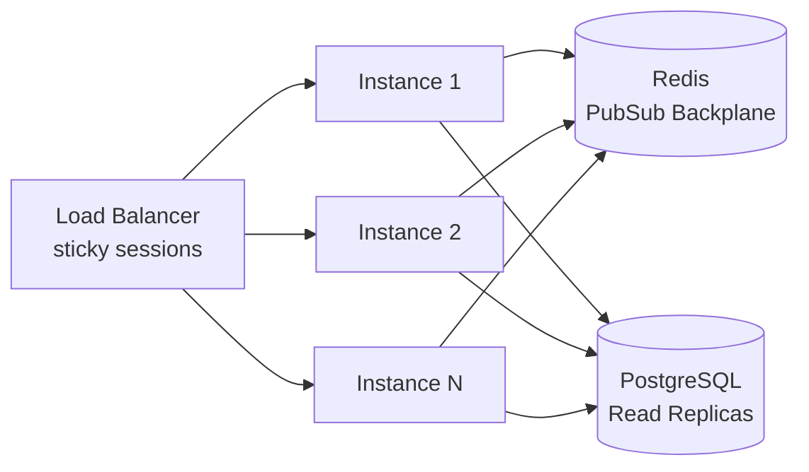

- Multiple Node instances behind a load balancer with sticky sessions (for WebSocket affinity).
- Redis pub/sub ensures broadcasts reach all connected clients regardless of which instance they're on.
- Postgres read replicas for leaderboard queries and game history.

### Phase 3 — Service Extraction (5,000+ users)

Extract the game engine into its own service when profiling shows it as the bottleneck. The modular monolith boundaries make this a clean cut.

---

## 12. Key Design Principles

| # | Principle | Application |
|---|---|---|
| 1 | **Server is authoritative** | Game state is computed and owned server-side. Client renders only. |
| 2 | **Event-sourced game state** | Immutable action log enables replay, debug, spectator mode, and disconnect recovery. |
| 3 | **Monolith-first** | Ship fast, extract services when a real bottleneck demands it. |
| 4 | **Observability from day one** | Traces, metrics, and structured logs wired in before the first deploy. |
| 5 | **Fail fast at the edges** | Validate all inputs with schemas at the API boundary. |
| 6 | **Ephemeral state in Redis, durable state in Postgres** | Match the storage engine to the data lifecycle. |
| 7 | **Graceful degradation** | Disconnect tolerance, state snapshots, health-aware load balancing. |
| 8 | **Infrastructure as code** | Docker Compose for local dev, Terraform for cloud. Nothing manual. |
| 9 | **Immutable deployments** | Container images are versioned artifacts. Replace, never patch. |
| 10 | **Blast radius minimization** | Game instances are isolated. One bad game doesn't crash the server. |

---

## 13. Local Development Stack

Everything runs via a single `docker-compose up`:

```yaml
services:
  app:        # Node.js monolith (hot reload)
  frontend:   # Next.js dev server
  postgres:   # Database
  redis:      # Cache + pub/sub
  grafana:    # Dashboards
  prometheus: # Metrics
  jaeger:     # Traces
  loki:       # Logs
```

One command, full production-mirror environment. No "works on my machine" surprises.

---

## Appendix: Architecture Decision Log

| ADR | Decision | Alternatives Considered | Rationale |
|---|---|---|---|
| ADR-001 | Modular monolith | Microservices, serverless | Solo dev. Same boundaries, one deployable. Extract later. |
| ADR-002 | Node.js + TypeScript | Go, Rust, Elixir | Shared types with FE. I/O-bound workload. Fastest iteration speed. |
| ADR-003 | Socket.IO for realtime | Raw WebSockets, SSE | Built-in rooms, reconnect, fallback. Don't reinvent. |
| ADR-004 | Redis for ephemeral state | Postgres, in-memory only | Fast writes, TTL, pub/sub for WS scaling. Survives process restart. |
| ADR-005 | Event-sourced game state | Mutable state with snapshots | Free replay, undo, spectator, disconnect recovery. Worth the storage. |
| ADR-006 | JWT + httpOnly refresh | Session cookies, OAuth-only | Stateless auth at gateway. Refresh tokens immune to XSS. |
| ADR-007 | OpenTelemetry unified SDK | Separate instrumentation per tool | One SDK, multiple backends. Vendor-neutral. Switch backends without code changes. |
| ADR-008 | Worker threads for AI | Separate AI service, in-process | Isolate CPU-bound work without network overhead. Extract to service only if needed. |
| ADR-009 | Docker Compose for local dev | Manual setup, Vagrant | Mirror prod topology locally. One command startup. |
| ADR-010 | GitHub Actions CI/CD | Jenkins, GitLab CI, CircleCI | Native GitHub integration. Free tier sufficient. YAML-based, version-controlled. |
