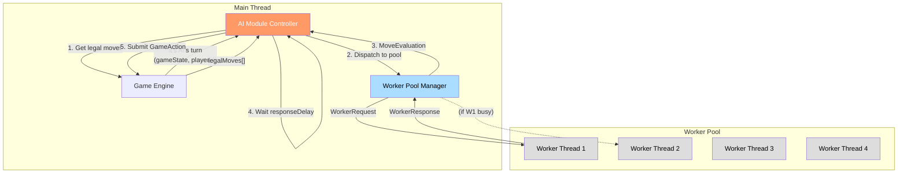
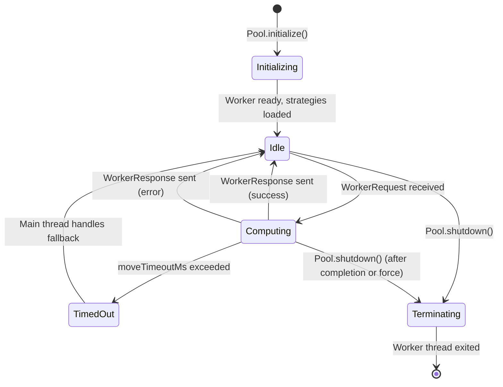
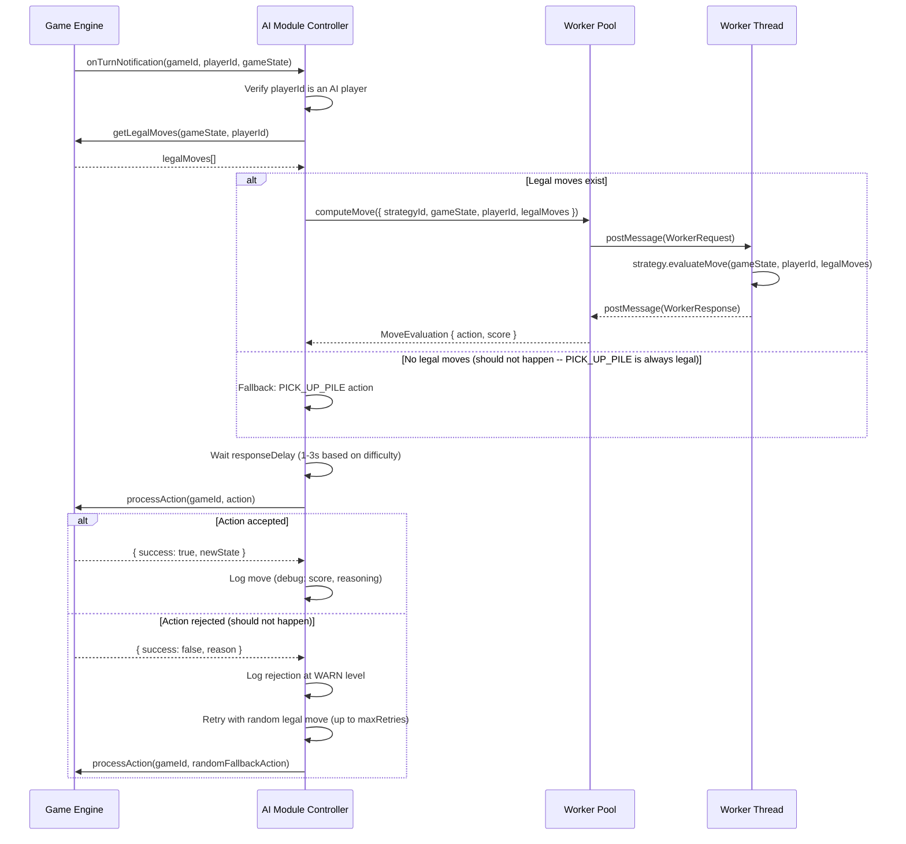
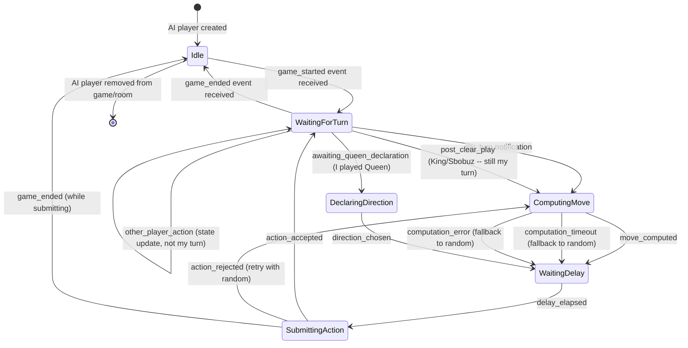
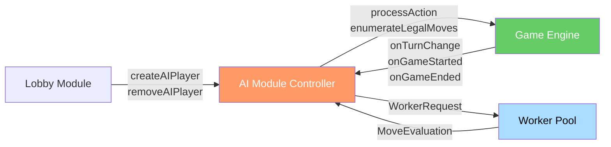

# AI Opponent Module -- Pluggable AI Strategies with Worker Thread Isolation

> **Document Type:** Module Spec
> **Status:** Draft
> **Last Updated:** March 2026

---

## 1. Overview

The AI Opponent Module provides computer-controlled players that participate in Sbobuz games as if they were human players. AI players submit their actions through the same Game Engine validation pipeline as human players -- there is no special path, no cheating, no rule bypasses. The Game Engine is the sole authority on game state, and AI players are subject to every rule, validation, and effect.

The module implements a pluggable strategy interface that decouples the decision-making algorithm from the game engine integration. Strategies can be swapped at the difficulty level without modifying any other component. Three difficulty tiers are defined: **EASY** (random legal moves), **MEDIUM** (heuristic scoring), and **HARD** (Monte Carlo Tree Search, deferred to a future phase).

To prevent CPU-intensive move computation from blocking the Node.js event loop, AI strategies execute on a pool of **worker threads**. The main thread dispatches game state to an available worker, the worker computes the move, and the result is returned asynchronously. Workers are stateless -- every request includes the full game state. If a worker exceeds its time budget, the main thread falls back to a random legal move.

The AI module interacts with two other modules: the **Game Engine** (receives turn notifications, submits actions, receives state updates) and the **Lobby** (AI players join rooms as synthetic players during room setup).

---

## 2. Data Model

All types are defined in TypeScript. Types imported from the Game Engine (`GameState`, `GameAction`, `PlayerState`, `Card`) are referenced from `SBOBUZ_ENGINE_SPEC.md`.

### 2.1 AI Player Identity

```typescript
/**
 * Represents an AI-controlled player in the system.
 * AI players have synthetic user IDs and are never authenticated via JWT.
 */
interface AIPlayer {
  playerId: string;                        // Format: "ai_{uuid}" -- prefixed to distinguish from human users
  displayName: string;                     // Human-readable name (e.g., "Bot Alice", "Bot Bob")
  strategyId: AIStrategyId;                // Which strategy implementation to use
  difficulty: AIDifficulty;                // Difficulty level (maps to strategy)
  responseDelayMs: ResponseDelayConfig;    // Simulated "thinking" time range
  gameId: string | null;                   // Currently active game, or null if idle
}

type AIDifficulty = 'EASY' | 'MEDIUM' | 'HARD';

type AIStrategyId = 'random' | 'heuristic' | 'mcts';

interface ResponseDelayConfig {
  minMs: number;                           // Minimum delay before submitting action
  maxMs: number;                           // Maximum delay before submitting action
}
```

### 2.2 Strategy Interface

```typescript
/**
 * The core strategy contract. Every AI difficulty level implements this interface.
 * Strategies are pure functions: given game state and a player ID, return a move.
 *
 * This interface runs INSIDE a worker thread. The main thread sends the
 * serialized inputs and receives the serialized output.
 */
interface AIStrategy {
  readonly id: AIStrategyId;
  readonly name: string;                   // Human-readable strategy name
  readonly difficulty: AIDifficulty;

  /**
   * Evaluate the current game state and choose an action.
   * @param gameState - Full game state (not sanitized -- AI has server-side access)
   * @param playerId - The AI player's ID
   * @param legalMoves - Pre-computed list of all legal moves for this player
   * @returns The chosen action and optional evaluation metadata
   */
  evaluateMove(
    gameState: GameState,
    playerId: string,
    legalMoves: GameAction[]
  ): MoveEvaluation;
}

/**
 * The result of a strategy evaluation.
 * Contains the chosen action and optional diagnostic metadata.
 */
interface MoveEvaluation {
  action: GameAction;                      // The action to submit to the Game Engine
  score: number;                           // Strategy's confidence score (0-100, for logging/debugging)
  reasoning?: string;                      // Optional human-readable explanation (debug only)
  evaluationTimeMs: number;                // Time spent computing this move
  movesConsidered: number;                 // Number of legal moves evaluated
}
```

### 2.3 Worker Communication Types

```typescript
/**
 * Message sent from main thread to worker thread.
 */
interface WorkerRequest {
  requestId: string;                       // UUID for correlating request/response
  strategyId: AIStrategyId;                // Which strategy to execute
  gameState: GameState;                    // Full serializable game state
  playerId: string;                        // The AI player's ID
  legalMoves: GameAction[];                // Pre-computed legal moves
}

/**
 * Message sent from worker thread back to main thread.
 */
interface WorkerResponse {
  requestId: string;                       // Correlates to the request
  success: boolean;
  evaluation?: MoveEvaluation;             // Present when success = true
  error?: string;                          // Present when success = false
}
```

### 2.4 Configuration

```typescript
/**
 * AI module configuration. Loaded from environment with Zod validation.
 */
interface AIConfig {
  minResponseDelayMs: number;              // Default: 500 -- minimum "thinking" time
  maxResponseDelayMs: number;              // Default: 3000 -- maximum "thinking" time
  workerPoolSize: number;                  // Default: 4 -- number of worker threads
  moveTimeoutMs: number;                   // Default: 5000 -- max time for strategy computation
  maxRetries: number;                      // Default: 2 -- retries on action rejection
  defaultDifficulty: AIDifficulty;         // Default: 'MEDIUM'
  enableDebugLogging: boolean;             // Default: false -- logs move reasoning
}

const DEFAULT_AI_CONFIG: AIConfig = {
  minResponseDelayMs: 500,
  maxResponseDelayMs: 3000,
  workerPoolSize: 4,
  moveTimeoutMs: 5000,
  maxRetries: 2,
  defaultDifficulty: 'MEDIUM',
  enableDebugLogging: false,
};
```

### 2.5 Difficulty-Specific Delay Ranges

```typescript
/**
 * Response delay ranges per difficulty.
 * Applied AFTER move computation to simulate human thinking time.
 */
const DIFFICULTY_DELAYS: Record<AIDifficulty, ResponseDelayConfig> = {
  EASY: { minMs: 1000, maxMs: 2000 },
  MEDIUM: { minMs: 1500, maxMs: 3000 },
  HARD: { minMs: 2000, maxMs: 4000 },     // MCTS -- deferred
};
```

---

## 3. Strategy Definitions

### 3.1 Phase 1: Random Strategy (EASY)

**Algorithm:** Enumerate all legal moves, pick one uniformly at random.

```
RANDOM_STRATEGY(gameState, playerId, legalMoves):
    1. Assert legalMoves is non-empty.
       (If empty, the Game Engine should not have signaled this player's turn.
        Fallback: return PICK_UP_PILE action.)
    2. Use seeded RNG (seed derived from gameState.rngSeed + actionCount)
       to select index = rng.nextInt(0, legalMoves.length - 1).
    3. Return legalMoves[index] with score = 50 (neutral confidence).
```

**Properties:**
- Deterministic given the same seed. The RNG seed for the AI is derived from `gameState.rngSeed` combined with `gameState.actionCount` to produce a unique but reproducible seed for each move decision.
- Simulated response delay: 1000-2000ms (EASY).
- No game knowledge. The AI does not prefer any move over another.
- Includes `PICK_UP_PILE` as a legal move option -- the random strategy treats voluntary pickup as equally likely as playing a card.

**Edge case handling for EASY:**
- If the only legal move is `PICK_UP_PILE`, the AI picks up without delay variance.
- If the AI is in `awaiting_queen_declaration` phase, the strategy randomly picks `'higher'` or `'lower'`.
- If the AI is in `awaiting_post_clear_play` phase, the strategy picks a random legal card from the remaining options.
- If the AI is in the face-down zone, it picks a random index from available face-down card positions.

### 3.2 Phase 2: Heuristic Strategy (MEDIUM)

**Algorithm:** Score all legal moves using a weighted heuristic function, then pick the highest-scoring move with small random variance.

```
HEURISTIC_STRATEGY(gameState, playerId, legalMoves):
    1. For each move in legalMoves:
       a. Simulate the move outcome (apply reducer to get resulting state).
       b. Score the resulting state using the heuristic function.
    2. Sort moves by score (descending).
    3. Add random variance: score += rng.nextFloat(-5, +5) to top 3 moves.
    4. Return the highest-scoring move after variance.
```

**Heuristic Scoring Function:**

Each legal move is scored by summing weighted factors. Weights are tuned constants (not learned).

```typescript
interface HeuristicWeights {
  cardValueConservation: number;       // Weight: +10 -- prefer playing lower-value cards
  specialCardTiming: number;           // Weight: +15 -- prefer special cards when pile is large
  pileClearBonus: number;              // Weight: +25 -- prefer moves that clear the pile (King)
  sbobuzSetup: number;                // Weight: +20 -- prefer contributing to a 4-of-a-kind
  avoidLargePickup: number;            // Weight: -30 -- penalty for picking up large piles
  handSizeReduction: number;           // Weight: +8  -- prefer moves that reduce total card count
  opponentPressure: number;            // Weight: +5  -- prefer moves when opponent has few cards
  faceDownZoneEntryBonus: number;      // Weight: +12 -- prefer reaching face-down zone sooner
}
```

**Scoring rules in detail:**

| Factor | Condition | Score Contribution |
|---|---|---|
| **Card value conservation** | Playing a card with rank <= 7 (low value) | `+10` per card played |
| **Card value conservation** | Playing a card with rank >= Jack (high value) | `-5` per card played |
| **Special card timing -- 2** | Playing a 2 when pile has >= 5 cards (wastes less opportunity) | `+8` |
| **Special card timing -- 2** | Playing a 2 when pile has < 3 cards | `-3` (wasteful) |
| **Special card timing -- Joker** | Playing Joker when reversing direction benefits AI (next player after reverse has many cards) | `+15` |
| **Pile clear (King)** | Playing a King when pile has >= 4 cards | `+25` |
| **Pile clear (King)** | Playing a King when pile has 0-1 cards | `+5` (still gets another turn) |
| **Sbobuz setup** | Playing a card that puts 3 of the same rank on top of pile | `+20` (one more from anyone = Sbobuz) |
| **Sbobuz completion** | Playing cards that complete a 4-of-a-kind | `+40` |
| **Avoid large pickup** | `PICK_UP_PILE` when pile has N cards | `-3 * N` (scales with pile size) |
| **Avoid large pickup** | `PICK_UP_PILE` when pile has <= 2 cards | `-2` (acceptable strategic pickup) |
| **Hand size reduction** | Move reduces player's total card count | `+8` per card reduction |
| **Opponent pressure** | Any opponent has <= 3 total cards remaining | `+5` per such opponent (play aggressively) |
| **Face-down zone entry** | Move causes player to enter face-down zone | `+12` (closer to winning) |
| **Multi-card play** | Playing 2+ cards of the same rank at once | `+6` per extra card (efficient) |

**Queen declaration heuristic:**

When the AI must declare `'higher'` or `'lower'` after playing a Queen:
1. Look at the next player's visible information (face-up cards if visible, hand size).
2. If the AI holds mostly low cards in hand, declare `'lower'` (benefits AI on next turn if turn comes back).
3. If the next player has visible high face-up cards and the AI wants to force a pickup, declare `'lower'`.
4. Default to `'higher'` when uncertain.

**Blind play heuristic (face-down zone):**

When the AI is in the face-down zone, all positions are equally unknown. The AI picks a random position (same as EASY for blind plays, since there is no information to act on).

**Simulated response delay: 1500-3000ms (MEDIUM).**

### 3.3 Phase 3: MCTS Strategy (HARD) -- Deferred

> **Status:** Deferred. Design notes captured for future implementation.

**Intended approach: Monte Carlo Tree Search with time budget.**

```
MCTS_STRATEGY(gameState, playerId, legalMoves, timeBudgetMs = 3000):
    1. Build root node from current gameState.
    2. While time_remaining > 0:
       a. SELECTION: Walk tree using UCB1 to find a promising leaf.
       b. EXPANSION: Expand leaf by one legal move.
       c. SIMULATION: Random playout from expanded node to game end.
       d. BACKPROPAGATION: Update win/visit counts up the tree.
    3. Return the move from root with highest visit count.
```

**Design notes for future implementation:**
- The simulation step uses the Random Strategy for playouts.
- Information hidden from the AI (other players' hands, face-down cards) is sampled randomly for each simulation -- information set MCTS (ISMCTS).
- The time budget is configurable but defaults to 3 seconds. The worker timeout (5 seconds) allows for 2 seconds of overhead.
- MCTS naturally handles the complexity of special card interactions -- no hand-coded evaluation needed.
- Worker threads are essential for MCTS due to heavy CPU usage.
- Estimated implementation effort: 2-3 weeks of focused work.

**Why deferred:**
- EASY and MEDIUM strategies cover the initial launch needs.
- MCTS requires careful tuning and extensive testing against human players.
- The strategy interface is designed so MCTS can be added without modifying any existing code.

---

## 4. Worker Thread Architecture

### 4.1 Architecture Diagram



### 4.2 Worker Pool Manager

```typescript
/**
 * Manages a pool of worker threads for AI move computation.
 * Workers are created on module initialization and reused across requests.
 */
interface WorkerPoolManager {
  /**
   * Initialize the pool with the configured number of workers.
   * Each worker loads all strategy implementations on startup.
   */
  initialize(config: AIConfig): Promise<void>;

  /**
   * Dispatch a move computation to an available worker.
   * Returns the evaluation result or throws on timeout/error.
   *
   * If all workers are busy, the request is queued (FIFO).
   * If the queue depth exceeds workerPoolSize * 2, the request
   * is rejected immediately with a fallback to random move.
   */
  computeMove(request: WorkerRequest): Promise<MoveEvaluation>;

  /**
   * Gracefully shut down all workers.
   * Waits for in-flight computations to complete (up to moveTimeoutMs),
   * then terminates remaining workers.
   */
  shutdown(): Promise<void>;

  /**
   * Current pool statistics for monitoring.
   */
  getStats(): WorkerPoolStats;
}

interface WorkerPoolStats {
  totalWorkers: number;
  busyWorkers: number;
  idleWorkers: number;
  queuedRequests: number;
  totalRequestsProcessed: number;
  totalTimeouts: number;
  totalErrors: number;
  avgComputeTimeMs: number;
}
```

### 4.3 Worker Lifecycle



### 4.4 Worker Behavior Rules

1. **Workers are stateless.** Every request includes the full game state and legal moves. Workers do not cache state between requests.

2. **Worker creation happens once at module startup.** Workers are created eagerly (not lazily) during `initialize()`. This avoids cold-start latency on the first AI turn.

3. **Worker crash recovery.** If a worker thread crashes (unhandled exception, out-of-memory), the pool manager detects the exit, logs an error, and spawns a replacement worker. The in-flight request that caused the crash is failed, and the AI module falls back to a random move.

4. **Timeout handling.** The main thread starts a timer when dispatching a request. If `moveTimeoutMs` (default 5000ms) elapses without a response, the main thread:
   - Marks the request as timed out.
   - Selects a random legal move as a fallback.
   - Does NOT terminate the worker -- the worker may still be computing. When the worker eventually responds, the response is discarded (matched by `requestId`).

5. **Queue management.** When all workers are busy, requests are queued FIFO. Maximum queue depth is `workerPoolSize * 2` (default 8). Beyond this limit, requests are rejected immediately and the AI falls back to a random move. This prevents unbounded memory growth when many AI games are active simultaneously.

6. **Data serialization.** `GameState` and `GameAction` objects are serialized via the structured clone algorithm (Node.js worker thread default). No custom serialization is needed. Large state objects (>1 MB) trigger a warning log but are not rejected.

---

## 5. AI Turn Flow

### 5.1 Complete Turn Sequence



### 5.2 Response Delay Implementation

The AI intentionally delays its response to simulate human thinking time. Without this delay, AI would play instantly, which feels unnatural and overwhelming.

```
computeResponseDelay(difficulty, evaluationTimeMs):
    config = DIFFICULTY_DELAYS[difficulty]
    baseDelay = random(config.minMs, config.maxMs)

    // If strategy computation already took significant time,
    // reduce the artificial delay to avoid excessive total wait
    if evaluationTimeMs > config.minMs:
        return max(200, baseDelay - evaluationTimeMs)
    else:
        return baseDelay
```

The delay is applied AFTER the worker returns the computed move but BEFORE the action is submitted to the Game Engine. During this delay, the AI module holds the computed action in memory.

---

## 6. State Machine

### 6.1 AI Player State Diagram



### 6.2 State Transition Table

| Current State | Event | Next State | Action |
|---|---|---|---|
| Idle | `game_started` | WaitingForTurn | Register for turn notifications on this gameId |
| WaitingForTurn | `my_turn` | ComputingMove | Dispatch to worker pool |
| WaitingForTurn | `game_ended` | Idle | Deregister from game |
| ComputingMove | `move_computed` | WaitingDelay | Start response delay timer |
| ComputingMove | `computation_timeout` | WaitingDelay | Select random fallback, start delay timer |
| ComputingMove | `computation_error` | WaitingDelay | Select random fallback, start delay timer, log error |
| WaitingDelay | `delay_elapsed` | SubmittingAction | Call `gameEngine.processAction()` |
| SubmittingAction | `action_accepted` | WaitingForTurn | Log move |
| SubmittingAction | `action_rejected` | ComputingMove | Increment retry counter, compute random move |
| DeclaringDirection | `direction_chosen` | WaitingDelay | Direction computed by strategy |

---

## 7. Behavior Rules

### 7.1 AI Identity

- AI player IDs are prefixed with `"ai_"` followed by a UUID v4. Example: `"ai_3f2504e0-4f89-11d3-9a0c-0305e82c3301"`.
- AI players have display names assigned from a predefined pool: `["Bot Alice", "Bot Bob", "Bot Charlie", "Bot Diana", "Bot Echo"]`.
- AI players do NOT have JWT tokens, sessions, or auth credentials. They exist only in server memory and game state.
- AI players are identified by the `"ai_"` prefix in their player ID. Any module can check `playerId.startsWith('ai_')` to determine if a player is AI-controlled.

### 7.2 Game Engine Interaction

- AI actions are submitted through the **same `gameEngine.processAction()` interface** used by the Realtime Module for human players. No special path, no privilege escalation.
- The Game Engine validates AI actions identically to human actions. If the AI submits an illegal move, it is rejected.
- The AI module receives the full (unsanitized) `GameState` from the Game Engine. This is by design -- the AI runs server-side and needs to evaluate the complete state for its strategy. The sanitization rules in `SBOBUZ_ENGINE_SPEC.md` Section 18 apply only to client-facing data.

### 7.3 Turn Notification

- The Game Engine notifies the AI module when `currentPlayerIndex` points to an AI player after a state transition.
- Notification is delivered via a callback/event emitter registered during module initialization: `gameEngine.onTurnChange(callback)`.
- The callback receives `(gameId, playerId, gameState)`.
- The AI module ignores notifications for human players (checks `"ai_"` prefix).

### 7.4 Presence

- AI players are **never disconnected**. They do not have socket connections, heartbeats, or grace periods.
- In room/game state, AI players always appear with presence status equivalent to `ONLINE`.
- The Realtime Module does not track or broadcast presence events for AI players. Their "presence" is implicit -- if they are in the game, they are available.

### 7.5 Error Recovery

- If a strategy computation throws an error inside the worker, the worker catches it and returns a `WorkerResponse` with `success: false`.
- The AI module logs the error and falls back to a random legal move.
- If the action submitted to the Game Engine is rejected (should be extremely rare since legal moves are pre-computed), the AI retries up to `maxRetries` (default 2) with a random legal move.
- If all retries fail, the AI logs at ERROR level and does not submit an action. The Game Engine's turn timer will eventually trigger a `TIMEOUT_FORFEIT` for the AI player. This situation indicates a bug.

### 7.6 Multiple AI Players

- A single game can have **multiple AI players**, potentially at different difficulty levels.
- Each AI player operates independently with its own strategy instance and turn flow.
- AI-vs-AI games (all players are AI) are supported and useful for automated testing.
- The worker pool is shared across all AI players. Multiple concurrent AI computations are handled by the pool's queuing mechanism.

---

## 8. Legal Move Enumeration

The AI module relies on a **legal move enumerator** provided by or built on top of the Game Engine. This function returns all valid `GameAction` objects for a given player in a given state.

```typescript
/**
 * Enumerates all legal moves for a player in the current game state.
 * This is called by the AI module before dispatching to the worker.
 * Implementation lives in the Game Engine module.
 */
function enumerateLegalMoves(
  gameState: GameState,
  playerId: string
): GameAction[] {
  const player = gameState.players.find(p => p.id === playerId);
  const activeZone = getActiveZone(player, gameState.drawPile.length === 0);
  const moves: GameAction[] = [];

  if (gameState.phase === 'awaiting_queen_declaration') {
    // Only direction declarations are legal
    moves.push({ type: 'DECLARE_DIRECTION', playerId, direction: 'higher' });
    moves.push({ type: 'DECLARE_DIRECTION', playerId, direction: 'lower' });
    return moves;
  }

  if (activeZone === 'faceDown') {
    // Blind plays -- one per face-down position
    for (let i = 0; i < player.faceDownCards.length; i++) {
      moves.push({ type: 'PLAY_BLIND', playerId, cardIndex: i });
    }
    // Pickup is legal if pile is non-empty
    if (gameState.playPile.length > 0) {
      moves.push({ type: 'PICK_UP_PILE', playerId });
    }
    return moves;
  }

  // Hand or face-up zone: enumerate playable card groups
  const sourceCards = activeZone === 'hand' ? player.hand : player.faceUpCards;
  const cardsByRank = groupByRank(sourceCards);

  for (const [rank, cards] of cardsByRank) {
    if (isCardLegal(rank, gameState)) {
      // Can play 1, 2, ..., up to all cards of this rank
      for (let count = 1; count <= cards.length; count++) {
        moves.push({
          type: 'PLAY_CARDS',
          playerId,
          cardIds: cards.slice(0, count).map(c => c.id),
        });
      }
    }
  }

  // Pickup is always legal (voluntary) if pile is non-empty
  if (gameState.playPile.length > 0) {
    moves.push({ type: 'PICK_UP_PILE', playerId });
  }

  return moves;
}
```

**Note:** The legal move enumeration generates all valid combinations. For a hand with three 7s, it generates three separate `PLAY_CARDS` actions: play one 7, play two 7s, play three 7s. This gives strategies the ability to choose how many cards to play at once.

---

## 9. Edge Cases

| # | Scenario | Expected Behavior |
|---|---|---|
| 1 | Worker thread crashes mid-computation | The worker pool manager detects the thread exit via the `'exit'` event. The pending request's promise is rejected. The AI module falls back to a random legal move. A replacement worker is spawned asynchronously. The AI's turn is not blocked -- fallback is immediate. |
| 2 | Worker pool exhausted (all threads busy, queue full) | The `computeMove` call is rejected immediately (not queued). The AI module selects a random legal move as fallback. Metric `ai_pool_exhaustion_total` is incremented. If this happens frequently, the `workerPoolSize` configuration should be increased. |
| 3 | AI needs to play when no legal cards exist (pile must be picked up) | The legal move enumerator always includes `PICK_UP_PILE` when the pile is non-empty. If the pile IS empty, the AI must play a card -- and since the pile is empty, any card is legal. There is no state where zero legal moves exist. |
| 4 | Multiple AI players in same game | Each AI player is notified independently when it is their turn. The worker pool handles concurrent requests via its queue. No coordination between AI players is needed -- they are independent agents. |
| 5 | AI-vs-AI game (all players are AI) | Functions identically to a mixed game. The Game Engine drives turn order, each AI responds when notified. Useful for automated testing of strategy quality and game engine correctness. No human player or WebSocket connection is involved. The game runs to completion entirely server-side. |
| 6 | Game state too large for worker message passing | The structured clone algorithm handles objects up to the V8 heap limit. A Sbobuz game state is typically < 50 KB, far below any practical limit. If state serialization fails, the error is caught and the AI falls back to random. A warning is logged. |
| 7 | AI response delay longer than turn timer | The turn timer is managed by the Game Engine's Game Clock. If the AI's combined computation time + response delay exceeds the turn timer, the Game Engine will issue a `TIMEOUT_FORFEIT` action before the AI submits its move. The AI module detects this by checking the game phase before submitting. If the game has advanced past the AI's turn, the AI discards its computed move. To prevent this, the AI module caps total delay at `turnTimerSeconds * 1000 - 2000ms` (2-second safety margin). |
| 8 | AI action rejected by Game Engine (should not happen) | The legal move enumerator computes the same legality rules as the Game Engine validator. A rejection means either the enumerator has a bug or the game state changed between enumeration and submission (race condition). The AI logs at WARN level, increments retry counter, and retries with a random legal move. After `maxRetries` failures, the AI gives up and the turn timer handles the forfeit. |
| 9 | Worker thread memory leak | Worker pool stats track average compute time and are exposed via metrics. A memory leak would manifest as increasing compute times. The operations team can restart workers by restarting the server process. Individual worker restart is not supported (workers are long-lived). For extreme cases, the pool manager could be extended to recycle workers after N requests, but this is not implemented initially. |
| 10 | Seeded RNG ensures deterministic AI behavior | The AI's random decisions (random strategy, heuristic variance) use a seeded RNG derived from `gameState.rngSeed + gameState.actionCount`. Given the same game state, the AI always makes the same move. This is critical for replay and debugging. `Math.random()` is never called in strategy code. |
| 11 | AI playing blind cards (face-down zone) | All face-down positions are equally unknown to the AI (even though the server has the data). The AI module does NOT peek at face-down card values when choosing a position. For EASY and MEDIUM strategies, the position is chosen randomly. For HARD (MCTS, deferred), ISMCTS would sample possible card assignments. |
| 12 | AI declaring direction after Queen | The heuristic strategy evaluates which direction benefits the AI based on its remaining hand cards and the next player's card count. The random strategy picks randomly. The declaration is submitted as a `DECLARE_DIRECTION` action through the standard Game Engine path. |
| 13 | AI handling Sbobuz detection | The AI does not need to detect Sbobuz -- the Game Engine handles it automatically after the AI's card is placed. However, the MEDIUM heuristic strategy considers Sbobuz setup potential when scoring moves (contributing to a 3-of-a-kind on the pile earns a bonus). |
| 14 | Server shutdown while AI is computing | During graceful shutdown (SIGTERM), the AI module calls `workerPool.shutdown()`. In-flight computations are given `moveTimeoutMs` to complete. If they do not finish, workers are forcefully terminated. Active game states are snapshotted to Redis by the Game Engine before the process exits. On restart, the AI resumes when the Game Engine restores state and reissues turn notifications. |
| 15 | AI strategy hot-swap during development/testing | The strategy is selected based on `AIPlayer.strategyId` at move computation time, not at player creation time. Updating the `strategyId` on an `AIPlayer` object takes effect on the next turn. No restart required. This is intended for development and testing -- production AI players should have a fixed strategy. |
| 16 | Game cancelled due to human player disconnect while AI is computing | The AI module checks game phase before submitting the computed action. If the game phase is `'cancelled'` or `'finished'`, the action is discarded. The AI transitions to the Idle state. |
| 17 | AI player must play after King clears the pile | The Game Engine enters `awaiting_post_clear_play` phase and re-notifies the AI module. The AI computes a new move in this context (empty pile, any card is legal). The response delay is reduced to 500-1000ms for follow-up plays to feel natural. |

---

## 10. Integration Points

### 10.1 Inbound

| Source | Interface | Data |
|---|---|---|
| Game Engine | `onTurnChange(callback: (gameId, playerId, gameState) => void)` | Turn notification when currentPlayerIndex points to an AI player |
| Game Engine | `onGameStarted(callback: (gameId, gameState) => void)` | Game start notification to initialize AI player state machines |
| Game Engine | `onGameEnded(callback: (gameId, result) => void)` | Game end notification to clean up AI player state |
| Lobby Module | `createAIPlayer(roomId, difficulty): AIPlayer` | Request to add an AI player to a room |
| Lobby Module | `removeAIPlayer(roomId, playerId): void` | Request to remove an AI player from a room |

### 10.2 Outbound

| Target | Interface | Data |
|---|---|---|
| Game Engine | `processAction(gameId, action): Promise<ActionResult>` | Submits computed action (same interface as human players via Realtime Module) |
| Game Engine | `enumerateLegalMoves(gameState, playerId): GameAction[]` | Gets all legal moves for move selection |

### 10.3 Side Effects

| Side Effect | Trigger | Description |
|---|---|---|
| Worker thread spawning | Module initialization | `workerPoolSize` threads created at startup |
| Worker thread CPU usage | Every AI turn computation | Worker threads consume CPU for strategy evaluation. Isolated from main thread event loop. |
| Structured log emission | Every AI move, every error, every fallback | JSON logs with gameId, playerId, strategyId, score, evaluationTimeMs |
| Metrics emission | Move computation, pool stats, errors | Prometheus metrics for AI performance monitoring |

### 10.4 Dependency Diagram



---

## 11. Observability

### 11.1 Metrics

| Metric | Type | Description |
|---|---|---|
| `ai_move_duration_ms` | Histogram | Total time from turn notification to action submission (includes computation + delay) |
| `ai_compute_duration_ms` | Histogram | Worker thread computation time only (excludes artificial delay) |
| `ai_response_delay_ms` | Histogram | Artificial delay applied after computation |
| `ai_strategy_score` | Histogram | Score of the chosen move (from MoveEvaluation) |
| `ai_moves_considered` | Histogram | Number of legal moves evaluated per turn |
| `ai_fallback_random_total` | Counter | Times the AI fell back to random move (timeout, error, rejection) |
| `ai_action_rejected_total` | Counter | Times the Game Engine rejected an AI action |
| `ai_pool_exhaustion_total` | Counter | Times the worker pool queue was full |
| `ai_worker_crashes_total` | Counter | Times a worker thread crashed and was restarted |
| `ai_pool_busy_workers` | Gauge | Current number of busy workers |
| `ai_pool_queued_requests` | Gauge | Current queue depth |
| `ai_games_active` | Gauge | Number of active games with at least one AI player |

### 11.2 Structured Log Examples

```typescript
// Successful AI move
{
  level: 'info',
  msg: 'ai_move_submitted',
  gameId: 'g_891',
  playerId: 'ai_3f2504e0-4f89-11d3-9a0c-0305e82c3301',
  strategyId: 'heuristic',
  difficulty: 'MEDIUM',
  actionType: 'PLAY_CARDS',
  cardIds: ['hearts_7'],
  score: 72,
  computeTimeMs: 45,
  responseDelayMs: 2100,
  totalTimeMs: 2145,
  movesConsidered: 8,
}

// Fallback to random
{
  level: 'warn',
  msg: 'ai_computation_timeout',
  gameId: 'g_891',
  playerId: 'ai_3f2504e0-4f89-11d3-9a0c-0305e82c3301',
  strategyId: 'heuristic',
  timeoutMs: 5000,
  fallback: 'random',
}
```

---

## 12. Resolved Design Decisions

| # | Question | Decision | Alternatives Considered | Rationale |
|---|---|---|---|---|
| 1 | Worker threads vs separate AI service | **Worker threads within the monolith** | Separate microservice, child processes, in-process async | Worker threads provide CPU isolation without network overhead. A separate service adds deployment complexity for a solo developer. Child processes have higher memory overhead (full V8 per process). In-process async would block the event loop. Worker threads are the right balance of isolation and simplicity. Can extract to a service later if needed (ADR-008 from architecture overview). |
| 2 | Strategy interface design | **Pure function: `(gameState, playerId, legalMoves) -> MoveEvaluation`** | Stateful strategy objects, strategy with memory of past moves | Stateless strategies are simpler, easier to test, and naturally compatible with worker thread isolation (no shared state). Memory of past moves can be derived from the game state's action log if needed in future strategies. |
| 3 | Response delay ranges | **EASY: 1-2s, MEDIUM: 1.5-3s, HARD: 2-4s** | Fixed delays, no delays, configurable per game | Ranges feel more natural than fixed values. No delay feels robotic and overwhelming. Per-game configuration adds complexity without clear benefit. The delay ranges are fast enough to keep the game moving but slow enough to feel human. |
| 4 | Worker pool size | **Default 4, configurable** | 1 (sequential), CPU cores, dynamic scaling | 4 workers handle up to 4 concurrent AI turns. A single server instance might host ~50 games, but AI turns are fast (<100ms for heuristic) so 4 workers with queuing is sufficient. Set to CPU core count in production if needed. Dynamic scaling adds complexity without clear need. |
| 5 | Timeout/fallback behavior | **5-second timeout, fall back to random legal move** | Forfeit on timeout, extend timeout, no timeout | Forfeiting penalizes the AI for a server-side issue. Extending the timeout delays the game. No timeout risks hanging the turn. Random fallback is always valid, always fast, and the player experiences a "dumb move" rather than a broken game. |
| 6 | AI user ID format | **"ai_" prefix + UUID v4** | Numeric IDs, separate ID namespace, "bot_" prefix | The `"ai_"` prefix makes AI players trivially identifiable by any module using a simple string check. UUID ensures uniqueness. The prefix convention is documented and enforced, not just a naming convention. All modules can rely on `playerId.startsWith('ai_')`. |
| 7 | AI access to full game state | **Full unsanitized GameState** | Sanitized state (same as human players), partial state | The AI runs server-side and submitting actions through the Game Engine guarantees it cannot cheat (illegal moves are rejected). Giving it full state simplifies strategy implementation. Sanitized state would handicap AI unnecessarily -- it already cannot gain advantage because the engine validates everything. The MCTS strategy (deferred) would explicitly blind itself using ISMCTS for strategic fairness. |
| 8 | Legal move enumeration location | **Game Engine provides `enumerateLegalMoves()` function** | AI module computes its own legal moves, shared utility | The Game Engine owns the validation rules. The enumerator must be perfectly consistent with the validator. Having the Game Engine provide this function ensures they cannot diverge. If the AI computed its own legal moves, bugs could cause the AI to attempt illegal actions. |
| 9 | Face-down card visibility for AI | **AI does NOT peek at face-down values** | AI peeks at own face-down cards, AI peeks at all cards | Peeking at face-down cards would be unfair -- no human player can see them. The AI picks blind positions randomly (EASY/MEDIUM). MCTS (HARD) would sample possible card assignments for strategic analysis without peeking. This maintains fairness while still being a challenging opponent at higher difficulties. |
| 10 | Follow-up play delay (King clear, Sbobuz) | **Reduced delay: 500-1000ms** | Same delay as normal turn, no delay | A follow-up play is a continuation of the same turn. A full 1.5-3s delay feels sluggish. No delay feels robotic. A brief 500-1000ms pause feels like the AI is quickly assessing the now-cleared pile before playing again. |

---

## 13. Implications for Architecture

1. **The Game Engine must expose `enumerateLegalMoves()`.** This function does not currently exist in the engine spec. It must be added as a public interface on the Game Engine module. The function computes all valid `GameAction` objects for a given player in a given state, consistent with the validation rules in `SBOBUZ_ENGINE_SPEC.md` Sections 10.1-10.5.

2. **The Game Engine must emit turn change notifications.** The current engine spec describes a pure reducer (`state + action -> newState`). For AI integration, the orchestration layer (likely in the Game Engine module's controller, not the pure reducer) must detect when the new `currentPlayerIndex` points to an AI player and notify the AI module.

3. **The Lobby Module must support synthetic AI players.** The room creation and player management flows must accommodate players without auth tokens. The `"ai_"` prefix convention must be recognized by the Lobby module's membership checks. AI players are added/removed via explicit API calls, not through the WebSocket connection flow.

4. **The Realtime Module does NOT manage AI players.** AI actions bypass WebSocket entirely. The Realtime Module broadcasts state updates that include AI player actions to human clients, but the AI module never connects to or communicates through the Realtime Module. This is by design -- AI runs server-side with no network hop.

5. **Worker thread CPU impact must be monitored.** The `event_loop_lag_ms` metric from the observability stack (`architecture-overview.md` Section 8.2) is the primary indicator of whether worker threads are impacting the main thread. If event loop lag increases, the `workerPoolSize` may need to be reduced or the AI module extracted to a separate service.

6. **AI-vs-AI games enable automated testing.** The test suite should include AI-vs-AI game simulations that run thousands of games to verify Game Engine correctness, strategy quality, and the absence of deadlocks or infinite loops. These tests run entirely server-side with no WebSocket or UI involvement.

7. **The `"ai_"` prefix is a system-wide convention.** All modules that handle player IDs must be aware of this convention. The Auth module should never receive authentication requests for AI player IDs. The Realtime Module should never expect WebSocket connections from AI players. The Lobby Module should skip presence tracking for AI players. This convention should be documented in `shared/types/` as a type guard: `function isAIPlayer(playerId: string): boolean { return playerId.startsWith('ai_'); }`.
