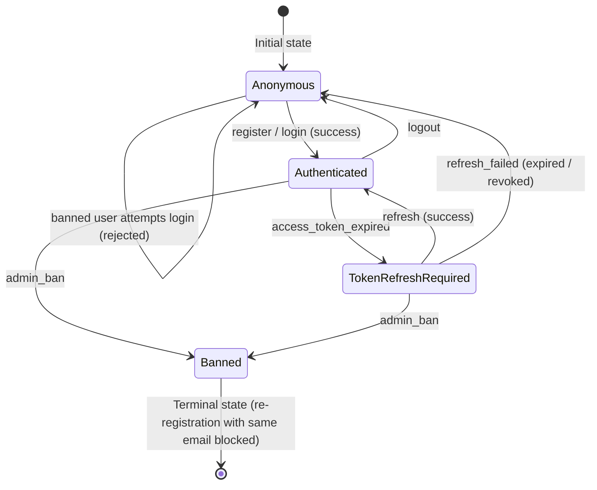
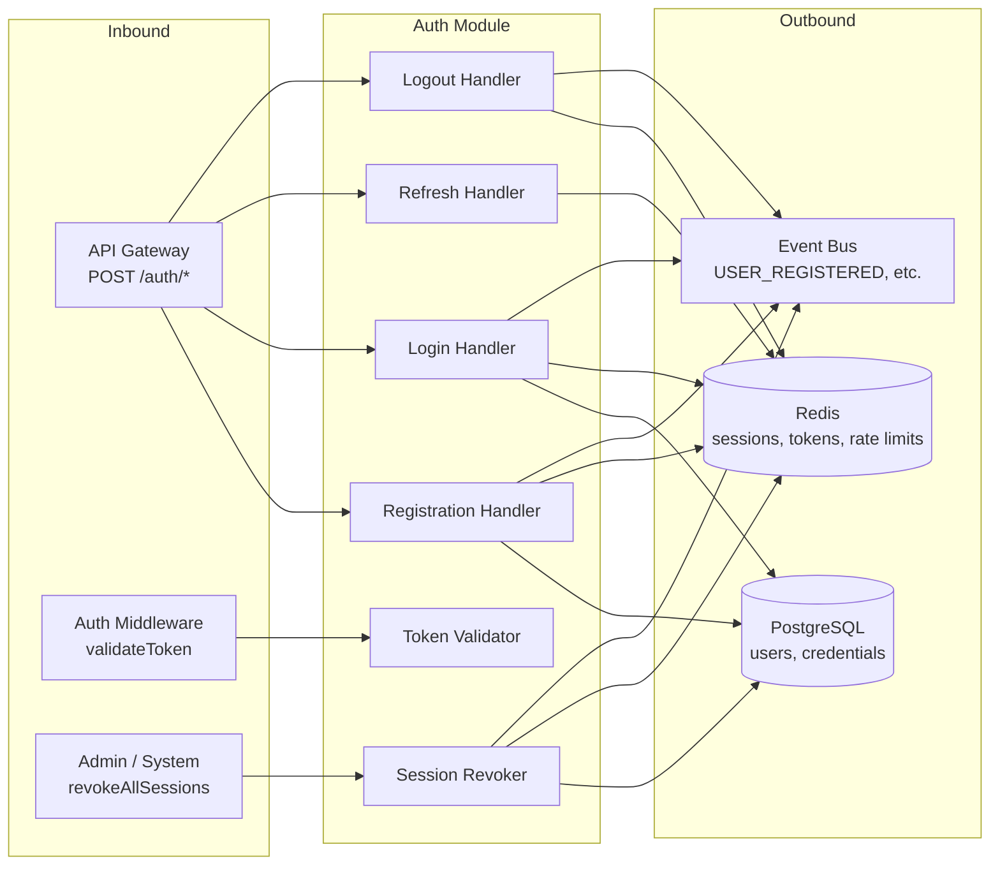

# Auth Module — Identity Management

> **Document Type:** Module Spec
> **Status:** Draft
> **Last Updated:** March 2026

---

## 1. Overview

The Auth Module is the identity management boundary of the Sbobuz platform. It owns user registration, login, token lifecycle (issue, refresh, revoke), and session tracking. Every authenticated request in the system flows through credentials and tokens managed by this module.

The module interacts with the API Gateway (which delegates `/auth/*` routes and runs the auth middleware for all other routes), the Lobby Module (which consumes user identity to associate players with rooms), PostgreSQL (durable storage for users and credentials), and Redis (ephemeral session and refresh-token state). It is the first module a user touches and the last to release them.

The central mechanic is a stateless-at-the-gateway, stateful-at-the-session-store authentication scheme: short-lived JWT access tokens for request-level auth, long-lived refresh tokens bound to tracked sessions for continuity. This enables forced logout, multi-device management, and ban enforcement without sacrificing the performance benefits of stateless token validation on the hot path.

---

## 2. Data Model

### 2.1 User

The canonical identity record. Owned by the Auth Module in PostgreSQL.

```typescript
interface User {
  /** UUIDv4, primary key */
  id: string;

  /** Unique, stored as lowercase, max 255 chars */
  email: string;

  /** Unique, stored as lowercase for comparison, original casing preserved in displayName.
   *  3-20 chars, alphanumeric + underscore only. */
  username: string;

  /** User-facing display name, defaults to username at registration.
   *  Preserves original casing of username. */
  displayName: string;

  /** URL to avatar image, nullable. Default null at registration. */
  avatarUrl: string | null;

  /** ISO 8601 timestamp */
  createdAt: string;

  /** ISO 8601 timestamp, updated on profile changes */
  updatedAt: string;

  /** Account status, controls access across the platform */
  status: UserStatus;
}

type UserStatus =
  | 'active'       // normal operating state
  | 'banned'       // all sessions revoked, login rejected
  | 'suspended';   // temporary restriction, login rejected (Phase 2 moderation)
```

### 2.2 Credentials

Password credentials stored separately from the user profile for separation of concerns. One-to-one relationship with User.

```typescript
interface Credentials {
  /** Foreign key to User.id */
  userId: string;

  /** bcrypt hash output (includes algorithm, cost, salt, and hash) */
  passwordHash: string;

  /** Not stored separately when using bcrypt — bcrypt embeds the salt in the hash output.
   *  This field exists in the interface for documentation clarity.
   *  In practice, bcrypt.hash() and bcrypt.compare() handle salt internally. */
  // salt: string; — embedded in passwordHash by bcrypt

  /** ISO 8601 timestamp of last password change */
  updatedAt: string;
}
```

**Design note:** bcrypt's output format is `$2b$12$<22-char-salt><31-char-hash>`, which embeds the algorithm version, cost factor, and salt. A separate `salt` column is unnecessary and would be misleading. The `Credentials` table stores only `userId`, `passwordHash`, and `updatedAt`.

### 2.3 Session

Tracks an active authenticated session. Stored in Redis with TTL. Enables forced logout and multi-device visibility.

```typescript
interface Session {
  /** UUIDv4, Redis key: session:{sessionId} */
  sessionId: string;

  /** Foreign key to User.id */
  userId: string;

  /** Metadata about the client that created this session */
  deviceInfo: DeviceInfo;

  /** ISO 8601 timestamp */
  createdAt: string;

  /** ISO 8601 timestamp, matches refresh token expiry (7 days from creation) */
  expiresAt: string;

  /** Set to true on explicit logout or forced revocation.
   *  Revoked sessions reject refresh attempts. */
  isRevoked: boolean;
}

interface DeviceInfo {
  /** User-Agent header, truncated to 512 chars */
  userAgent: string;

  /** Client IP at session creation */
  ipAddress: string;

  /** Derived from User-Agent: 'web' | 'mobile' | 'unknown' */
  platform: 'web' | 'mobile' | 'unknown';
}
```

**Redis key structure:**
- `session:{sessionId}` — JSON-serialized Session object, TTL = 7 days
- `user_sessions:{userId}` — Redis SET of active sessionIds for this user

### 2.4 Access Token Payload

The JWT claims included in every access token. Validated at the API Gateway middleware without hitting Redis or PostgreSQL.

```typescript
interface AccessTokenPayload {
  /** Subject — User.id */
  sub: string;

  /** User's email for display/context (not used for auth decisions) */
  email: string;

  /** User's username for display/context */
  username: string;

  /** Issued-at timestamp (Unix seconds) */
  iat: number;

  /** Expiration timestamp (Unix seconds), iat + 900 (15 minutes) */
  exp: number;

  /** Token ID — UUIDv4, for revocation tracking if needed */
  jti: string;
}
```

### 2.5 Refresh Token

Opaque token stored in Redis, bound to a session. Delivered as an httpOnly cookie.

```typescript
interface RefreshToken {
  /** UUIDv4, the token value itself (opaque string sent in cookie) */
  tokenId: string;

  /** Foreign key to User.id */
  userId: string;

  /** Foreign key to Session.sessionId — binds this token to a session */
  sessionId: string;

  /** ISO 8601 timestamp, 7 days from issuance */
  expiresAt: string;

  /** Set to true after the token is used once (rotation).
   *  A used token that is presented again indicates token theft. */
  isUsed: boolean;
}
```

**Redis key structure:**
- `refresh:{tokenId}` — JSON-serialized RefreshToken object, TTL = 7 days

### 2.6 OAuthProvider (Deferred to Phase 2)

```typescript
/**
 * DEFERRED — Phase 2.
 * Rationale: No users exist yet. Building OAuth integration before validating
 * the core game loop is premature. The User model supports OAuth by design
 * (email-based identity, no password required for OAuth users), so adding
 * this later is a non-breaking extension.
 *
 * Placeholder interface for future Google/Discord OAuth integration.
 */
interface OAuthProvider {
  userId: string;
  provider: 'google' | 'discord';
  providerUserId: string;
  accessToken: string;   // encrypted at rest
  refreshToken: string;  // encrypted at rest
  linkedAt: string;       // ISO 8601
}
```

---

## 3. Behavior Rules

### 3.1 Registration Flow

```
1. RECEIVE registration request {email, password, username}
2. VALIDATE input (see Section 6 — Validation Rules)
   ├─ FAIL → Return 400 with specific validation errors
   └─ PASS → Continue
3. NORMALIZE input:
   a. email = email.trim().toLowerCase()
   b. username_lower = username.trim().toLowerCase()
   c. displayName = username.trim()  (preserve original casing)
4. CHECK UNIQUENESS against PostgreSQL:
   a. SELECT EXISTS from users WHERE email = normalized_email
   b. SELECT EXISTS from users WHERE username = username_lower
   ├─ Email exists → Return 409 "Email already registered"
   ├─ Username exists → Return 409 "Username already taken"
   └─ Both unique → Continue
5. HASH PASSWORD:
   a. hash = bcrypt.hash(password, costFactor=12)
   b. Target: ~250ms hashing time on production hardware
6. CREATE USER (PostgreSQL transaction):
   a. INSERT into users (id=uuid(), email, username=username_lower, displayName, status='active', createdAt=now(), updatedAt=now())
   b. INSERT into credentials (userId, passwordHash=hash, updatedAt=now())
   c. COMMIT transaction — both inserts succeed or neither does
7. CREATE SESSION:
   a. sessionId = uuid()
   b. Store Session object in Redis with 7-day TTL
   c. Add sessionId to user_sessions:{userId} SET
8. ISSUE TOKENS:
   a. Generate access token JWT (15-minute TTL)
   b. Generate refresh token (UUIDv4), store in Redis with 7-day TTL
   c. Return access token in response body
   d. Set refresh token as httpOnly, Secure, SameSite=Strict cookie
9. EMIT event: USER_REGISTERED { userId, username, timestamp }
```

### 3.2 Login Flow

```
1. RECEIVE login request {email, password}
2. VALIDATE input format (email format, password not empty)
   ├─ FAIL → Return 400
   └─ PASS → Continue
3. CHECK RATE LIMIT:
   a. Key: login_attempts:{email_lower}
   b. If count >= 5 within 15-minute window → Return 429 "Too many login attempts"
   └─ Under limit → Continue
4. NORMALIZE: email = email.trim().toLowerCase()
5. FIND USER: SELECT user, credentials FROM users JOIN credentials WHERE email = normalized_email
   ├─ NOT FOUND → Increment rate limit counter. Return 401 "Invalid credentials"
   │   (Do NOT reveal whether email exists or password is wrong)
   └─ FOUND → Continue
6. CHECK USER STATUS:
   ├─ status === 'banned' → Return 403 "Account banned"
   ├─ status === 'suspended' → Return 403 "Account suspended"
   └─ status === 'active' → Continue
7. VERIFY PASSWORD: bcrypt.compare(password, credentials.passwordHash)
   ├─ MISMATCH → Increment rate limit counter. Return 401 "Invalid credentials"
   └─ MATCH → Reset rate limit counter. Continue
8. CREATE SESSION (same as registration step 7)
9. ISSUE TOKENS (same as registration step 8)
10. EMIT event: USER_LOGGED_IN { userId, sessionId, timestamp, deviceInfo }
```

### 3.3 Token Refresh Flow

```
1. RECEIVE refresh request (refresh token from httpOnly cookie)
2. EXTRACT tokenId from cookie
   ├─ Missing/malformed → Return 401 "No refresh token"
   └─ Present → Continue
3. LOOK UP refresh token in Redis: GET refresh:{tokenId}
   ├─ NOT FOUND (expired or never existed) → Return 401 "Invalid refresh token"
   └─ FOUND → Continue
4. CHECK token state:
   ├─ isUsed === true → SECURITY ALERT: Token reuse detected.
   │   a. Revoke ALL sessions for this user (potential token theft)
   │   b. Delete all refresh tokens for this user
   │   c. Return 401 "Token reuse detected"
   └─ isUsed === false → Continue
5. LOOK UP session: GET session:{refreshToken.sessionId}
   ├─ NOT FOUND → Return 401 "Session expired"
   ├─ isRevoked === true → Return 401 "Session revoked"
   └─ Valid session → Continue
6. LOOK UP user status:
   ├─ status !== 'active' → Revoke session. Return 403.
   └─ status === 'active' → Continue
7. ROTATE refresh token:
   a. Mark current token as used: isUsed = true (keep in Redis until TTL for reuse detection)
   b. Generate new refresh token (new UUIDv4), store in Redis with 7-day TTL
   c. Bind new token to same sessionId
8. ISSUE new access token JWT (15-minute TTL)
9. Return new access token in body, new refresh token as httpOnly cookie
```

### 3.4 Logout Flow

```
1. RECEIVE logout request (authenticated — access token in Authorization header)
2. EXTRACT sessionId from request (from access token claims or request body)
3. REVOKE session in Redis:
   a. SET session:{sessionId}.isRevoked = true
   b. (Keep the key until TTL for audit trail)
4. INVALIDATE refresh token:
   a. Find refresh token bound to this sessionId
   b. Mark as used or delete
5. REMOVE sessionId from user_sessions:{userId} SET
6. CLEAR refresh token cookie on response
7. EMIT event: SESSION_REVOKED { userId, sessionId, reason: 'user_logout' }
```

### 3.5 Forced Logout / Ban

```
1. RECEIVE ban or force-logout command (admin action or system trigger)
2. UPDATE user status in PostgreSQL: SET status = 'banned'
3. RETRIEVE all session IDs: SMEMBERS user_sessions:{userId}
4. For each sessionId:
   a. SET session:{sessionId}.isRevoked = true
   b. Find and invalidate associated refresh token
5. DELETE user_sessions:{userId} SET
6. EMIT event: SESSION_REVOKED { userId, sessionId: 'all', reason: 'ban' }
```

**Note:** Existing access tokens remain valid until they expire (up to 15 minutes). The API Gateway middleware does NOT check Redis on every request (that would defeat the purpose of JWTs). For immediate effect, the ban check occurs at the next token refresh or WebSocket heartbeat. A 15-minute maximum window of continued access after a ban is an accepted trade-off for gateway performance.

### 3.6 Token Validation (Gateway Middleware)

```
1. EXTRACT access token from Authorization: Bearer <token> header
   ├─ Missing → Return 401
   └─ Present → Continue
2. VERIFY JWT signature using the signing secret/key
   ├─ Invalid signature → Return 401
   └─ Valid → Continue
3. CHECK expiration: exp > now()
   ├─ Expired → Return 401 (client should attempt refresh)
   └─ Not expired → Continue
4. ATTACH decoded payload to request context (req.user = { sub, email, username })
5. PROCEED to route handler
```

### 3.7 Password Reset (Deferred to Phase 2)

```
/**
 * DEFERRED — Phase 2.
 * Rationale: Password reset requires email delivery infrastructure
 * (transactional email provider, templates, DNS records for SPF/DKIM).
 * For Phase 1, users who forget their password can re-register with a
 * different email. This is acceptable for an early-stage game platform
 * with no paid accounts or persistent progression.
 */
```

---

## 4. State Machine

The authentication state machine tracks the lifecycle of a user's authentication status from the perspective of the client-server relationship.



### State Descriptions

| State | Description | Valid Actions |
|---|---|---|
| **Anonymous** | No valid tokens held. User must register or log in. | REGISTER, LOGIN |
| **Authenticated** | Valid access token. Can make authenticated requests. | LOGOUT, REFRESH_TOKEN, VALIDATE_TOKEN, all app actions |
| **TokenRefreshRequired** | Access token expired, refresh token may still be valid. Client should attempt refresh before prompting re-login. | REFRESH_TOKEN |
| **Banned** | Account banned. All sessions revoked. Login rejected. Terminal state until admin intervention. | None (all actions rejected with 403) |

### Pseudocode State Transitions

```typescript
function transition(currentState: AuthState, event: AuthEvent): AuthState {
  switch (currentState) {
    case 'Anonymous':
      if (event === 'register_success' || event === 'login_success') return 'Authenticated';
      if (event === 'register_failure' || event === 'login_failure') return 'Anonymous';
      break;

    case 'Authenticated':
      if (event === 'logout') return 'Anonymous';
      if (event === 'access_token_expired') return 'TokenRefreshRequired';
      if (event === 'admin_ban') return 'Banned';
      break;

    case 'TokenRefreshRequired':
      if (event === 'refresh_success') return 'Authenticated';
      if (event === 'refresh_failed') return 'Anonymous';
      if (event === 'admin_ban') return 'Banned';
      break;

    case 'Banned':
      // Terminal — no transitions out. Admin must manually unban (Phase 2).
      return 'Banned';
  }
  return currentState; // Unknown event — no transition
}
```

---

## 5. Action Types

Every input to the Auth Module is a typed action. These map to API endpoints.

```typescript
type AuthAction =
  | RegisterAction
  | LoginAction
  | RefreshTokenAction
  | LogoutAction
  | RevokeAllSessionsAction
  | ValidateTokenAction;

interface RegisterAction {
  type: 'REGISTER';
  payload: {
    email: string;
    password: string;
    username: string;
  };
}

interface LoginAction {
  type: 'LOGIN';
  payload: {
    email: string;
    password: string;
  };
}

interface RefreshTokenAction {
  type: 'REFRESH_TOKEN';
  payload: {
    /** Extracted from httpOnly cookie, not from request body */
    refreshToken: string;
  };
}

interface LogoutAction {
  type: 'LOGOUT';
  payload: {
    /** The session to revoke (from the current access token context) */
    sessionId: string;
  };
}

interface RevokeAllSessionsAction {
  type: 'REVOKE_ALL_SESSIONS';
  payload: {
    /** The user whose sessions should be revoked (admin action or self-service) */
    userId: string;
    reason: 'user_request' | 'ban' | 'security_alert';
  };
}

interface ValidateTokenAction {
  type: 'VALIDATE_TOKEN';
  payload: {
    /** The JWT access token to validate */
    accessToken: string;
  };
}
```

### Preconditions, Postconditions, and Error Cases per Action

| Action | Preconditions | Postconditions | Error Cases |
|---|---|---|---|
| **REGISTER** | Email and username not taken. Input passes validation. | User created in PG. Session in Redis. Tokens issued. | 400 (validation), 409 (duplicate), 500 (DB error) |
| **LOGIN** | User exists with matching password. Not rate-limited. Account active. | New session in Redis. Tokens issued. | 400 (validation), 401 (bad credentials), 403 (banned/suspended), 429 (rate limit) |
| **REFRESH_TOKEN** | Refresh token valid, not used, session not revoked, user active. | Old token rotated. New tokens issued. | 401 (invalid/expired/reused token, revoked session) |
| **LOGOUT** | User is authenticated. Session exists. | Session revoked. Refresh token invalidated. Cookie cleared. | 401 (not authenticated) |
| **REVOKE_ALL_SESSIONS** | Caller is the user themselves or an admin. | All sessions for user revoked. All refresh tokens invalidated. | 401 (not authenticated), 403 (not authorized) |
| **VALIDATE_TOKEN** | Token is a well-formed JWT. | Decoded payload returned or rejection. | 401 (invalid, expired, malformed) |

---

## 6. Validation Rules

### 6.1 Email Validation

| Rule | Constraint |
|---|---|
| Format | Must match a reasonable email regex (RFC 5322 simplified). Use a proven library (e.g., `validator.js` `isEmail()`). |
| Max length | 255 characters |
| Uniqueness | Unique across all users (checked against PostgreSQL) |
| Normalization | Always stored and compared as lowercase. `trim()` before storage. |
| Encoding | UTF-8 allowed in local part (internationalized emails — Phase 2 concern, ASCII-only for Phase 1) |

### 6.2 Password Validation

| Rule | Constraint |
|---|---|
| Min length | 8 characters |
| Max length | 128 characters (prevents bcrypt DoS — bcrypt truncates at 72 bytes, but we cap at 128 to reject absurdly long inputs before hashing) |
| Uppercase | At least 1 uppercase letter [A-Z] |
| Lowercase | At least 1 lowercase letter [a-z] |
| Digit | At least 1 digit [0-9] |
| Special characters | Not required (balanced security vs UX for a game platform) |
| Common passwords | Not checked in Phase 1 (no dictionary/breach list). Phase 2 consideration. |

### 6.3 Username Validation

| Rule | Constraint |
|---|---|
| Length | 3 to 20 characters |
| Allowed characters | Alphanumeric (a-z, A-Z, 0-9) and underscore (_) |
| Pattern | Must match `^[a-zA-Z0-9_]{3,20}$` |
| Uniqueness | Unique when lowercased (case-insensitive uniqueness) |
| Display | Original casing preserved in `displayName`, lowercase stored in `username` |
| Profanity filter | Not implemented in Phase 1. Noted as Phase 2 moderation feature. |
| Reserved words | Block: `admin`, `moderator`, `system`, `null`, `undefined`, `deleted` (case-insensitive) |

### 6.4 Validation Error Response Format

```typescript
interface ValidationErrorResponse {
  status: 400;
  error: 'VALIDATION_ERROR';
  details: ValidationError[];
}

interface ValidationError {
  field: string;       // e.g., 'email', 'password', 'username'
  rule: string;        // e.g., 'min_length', 'format', 'unique'
  message: string;     // Human-readable: "Password must be at least 8 characters"
}
```

---

## 7. Security Considerations

### 7.1 JWT Access Tokens

| Property | Value | Rationale |
|---|---|---|
| Algorithm | HS256 | Single-service monolith in Phase 1. No token verification across services. RS256 is unnecessary overhead without a distributed verifier. Upgrade path to RS256 documented in Resolved Decisions. |
| TTL | 15 minutes (900 seconds) | Short enough to limit damage from token theft. Long enough to avoid constant refresh churn. |
| Signing secret | 256-bit random key, loaded from environment variable `JWT_SECRET` | Never hardcoded. Rotated via environment variable update + rolling restart. |
| Claims | sub, email, username, iat, exp, jti | Minimal claims. No sensitive data. No roles (Phase 1 has no role system). |
| Storage (client) | In-memory JavaScript variable | NOT localStorage (XSS-accessible). NOT sessionStorage (lost on tab close is acceptable). Refresh flow restores it. |

### 7.2 Refresh Tokens

| Property | Value | Rationale |
|---|---|---|
| Format | UUIDv4 (opaque string, not a JWT) | No need to decode refresh tokens. They are lookup keys into Redis. |
| TTL | 7 days | Balances convenience (users don't re-login weekly) against risk window. |
| Delivery | httpOnly cookie, Secure flag, SameSite=Strict | Not accessible to JavaScript. Immune to XSS. Sent automatically on same-site requests. |
| Rotation | Single-use. New token issued on every refresh. Old token marked as used. | Prevents replay attacks. Enables theft detection (reuse of a used token = alert). |
| Binding | Bound to a specific sessionId | Revoking a session invalidates its refresh token. |

### 7.3 Password Hashing

| Property | Value | Rationale |
|---|---|---|
| Algorithm | bcrypt | Industry standard for password hashing. Resistant to GPU attacks. Built-in salt. |
| Cost factor | 12 | Targets ~250ms per hash on production hardware. Tuned to be slow enough to resist brute force, fast enough not to degrade UX. Benchmark on deployment target and adjust if needed. |
| Salt | Generated by bcrypt internally (22-character random salt per hash) | Never stored separately. Embedded in the hash output. |
| Max input | 72 bytes (bcrypt limit). Passwords up to 128 chars accepted at API level, but bcrypt silently truncates. For Phase 1 this is acceptable given the 128-char cap. | Phase 2: consider pre-hashing with SHA-256 before bcrypt to support full-length passwords. |

### 7.4 Rate Limiting

| Scope | Limit | Window | Key |
|---|---|---|---|
| Login attempts per email | 5 attempts | 15 minutes (sliding window) | `login_attempts:{email}` in Redis |
| Registration per IP | 3 accounts | 1 hour | `register_ip:{ip}` in Redis |
| Token refresh | 10 refreshes | 1 minute | `refresh_rate:{userId}` in Redis |

**Implementation:** Redis-backed sliding window counter. Each attempt increments a key with TTL equal to the window. When the count exceeds the limit, requests are rejected with HTTP 429 and a `Retry-After` header.

### 7.5 Additional Security Measures

- **Constant-time comparison** for password verification (handled by bcrypt.compare internally).
- **Generic error messages** on login failure: "Invalid credentials" — never reveal whether the email exists or the password is wrong.
- **No user enumeration** on registration: return 409 for duplicate email/username, but rate-limit registration endpoints to prevent enumeration via brute force.
- **CORS** strict origin whitelist at the gateway level (not in this module, but this module relies on it).
- **Input sanitization** using Zod schemas at the API boundary. All inputs validated before reaching Auth Module logic.

---

## 8. Integration Points

### 8.1 Inbound

| Source | Route / Event | Description |
|---|---|---|
| API Gateway | `POST /auth/register` | Registration endpoint. Body: `{email, password, username}` |
| API Gateway | `POST /auth/login` | Login endpoint. Body: `{email, password}` |
| API Gateway | `POST /auth/refresh` | Token refresh. Refresh token from httpOnly cookie. |
| API Gateway | `POST /auth/logout` | Logout. Requires valid access token. |
| Auth Middleware | `validateToken()` | Called on every authenticated route. Synchronous JWT verification. |
| Admin (internal) | `revokeAllSessions(userId)` | Internal function call for ban enforcement. |

### 8.2 Outbound

| Target | Operation | Data |
|---|---|---|
| PostgreSQL | INSERT user + credentials | Registration flow |
| PostgreSQL | SELECT user + credentials | Login flow |
| PostgreSQL | UPDATE user.status | Ban / suspend |
| Redis | SET session:{sessionId} | Session creation |
| Redis | GET session:{sessionId} | Session validation |
| Redis | SET refresh:{tokenId} | Refresh token storage |
| Redis | GET refresh:{tokenId} | Refresh token lookup |
| Redis | SADD/SMEMBERS/SREM user_sessions:{userId} | Session tracking per user |
| Redis | INCR/GET login_attempts:{email} | Rate limiting |

### 8.3 Events Emitted

Events published to the internal event bus (in-process for monolith Phase 1, extractable to message queue in Phase 3).

```typescript
interface UserRegisteredEvent {
  type: 'USER_REGISTERED';
  payload: {
    userId: string;
    username: string;
    email: string;
    timestamp: string;  // ISO 8601
  };
}

interface UserLoggedInEvent {
  type: 'USER_LOGGED_IN';
  payload: {
    userId: string;
    sessionId: string;
    deviceInfo: DeviceInfo;
    timestamp: string;
  };
}

interface SessionRevokedEvent {
  type: 'SESSION_REVOKED';
  payload: {
    userId: string;
    sessionId: string | 'all';   // 'all' when revoking all sessions
    reason: 'user_logout' | 'ban' | 'security_alert' | 'user_request';
    timestamp: string;
  };
}
```

### 8.4 Dependency Diagram



---

## 9. Edge Cases

| # | Scenario | Expected Behavior |
|---|---|---|
| 1 | Registration with an email that already exists | Return 409 "Email already registered". Do not reveal the associated username. |
| 2 | Registration with a username that already exists (different casing) | Return 409 "Username already taken". Uniqueness is case-insensitive (`Alice` and `alice` collide). |
| 3 | Login with correct email, wrong password | Increment rate limit counter for that email. Return 401 "Invalid credentials". Same message as email-not-found to prevent enumeration. |
| 4 | Login with correct email, wrong password, 5th attempt | Return 429 "Too many login attempts. Try again in X minutes." Include `Retry-After` header. |
| 5 | Login attempt after rate limit window expires | Rate limit counter has expired (Redis TTL). Attempt proceeds normally. |
| 6 | Refresh with a revoked session (user logged out from another device) | Return 401 "Session revoked". Client must re-login. |
| 7 | Concurrent login from multiple devices | Each login creates a separate session. Both sessions are valid. Both have independent refresh tokens. User can see all active sessions (Phase 2 feature: session management UI). |
| 8 | Token refresh race condition — two browser tabs refresh simultaneously with the same refresh token | First request succeeds: token is rotated, new token issued. Second request finds the token marked `isUsed = true`. Security alert triggered: all sessions for the user are revoked. Both tabs must re-login. This is the correct behavior — it's indistinguishable from token theft. **Mitigation:** Client-side mutex on refresh (only one in-flight refresh request at a time, other requests queue behind it). |
| 9 | User banned while holding a valid access token | Access token remains valid for up to 15 minutes (stateless validation). On next refresh attempt, session is revoked and 403 is returned. WebSocket heartbeat check catches it sooner (realtime module checks user status periodically). |
| 10 | Expired refresh token (user hasn't visited in 8+ days) | Redis key `refresh:{tokenId}` has expired (TTL). Return 401. User must log in again. |
| 11 | Malformed JWT (tampered, truncated, wrong algorithm) | JWT verification fails at the gateway middleware. Return 401. Do not log the full token (security — may contain sensitive data if forged). Log only the error type. |
| 12 | PostgreSQL connection failure during registration | Transaction rolls back (no partial user creation). Return 503 "Service temporarily unavailable". Retry is safe — idempotency is maintained because no state was committed. |
| 13 | Redis unavailable for session storage | Registration/login cannot complete (session storage is required). Return 503. The system degrades gracefully — existing access tokens still work (stateless validation) but no new sessions can be created and no refreshes can be processed. |
| 14 | Username case sensitivity — user registers as "Alice", another tries "alice" | Second registration rejected. Username uniqueness is case-insensitive. `username` column stores lowercase; `displayName` preserves original casing. |
| 15 | Email case sensitivity — user registers as "Alice@Example.COM" | Stored as `alice@example.com`. All email comparisons are case-insensitive (normalized to lowercase). |
| 16 | bcrypt timing attack — attacker measures response time to determine if email exists | bcrypt.compare is called even if the user is not found (compare against a dummy hash). This ensures constant response time regardless of whether the email exists. Prevents timing-based user enumeration. |
| 17 | Token issued just before JWT secret rotation (key rollover) | During key rotation, the Auth Module accepts tokens signed with both the old and new key for a grace period equal to the access token TTL (15 minutes). After the grace period, only the new key is accepted. This requires the middleware to attempt verification with both keys. |
| 18 | Concurrent registration with the same email — two requests arrive simultaneously | PostgreSQL UNIQUE constraint on `email` column prevents duplicate insertion. First transaction commits, second receives a unique violation error. The second request returns 409 "Email already registered". No race condition — the database is the source of truth. |
| 19 | User registers with an email that looks valid but has no MX record | Accepted in Phase 1 (no email verification). Phase 2 adds email verification with a confirmation link, which would catch this. |
| 20 | Refresh token cookie not sent due to cross-origin request | SameSite=Strict prevents the cookie from being sent on cross-origin requests. The refresh endpoint returns 401. This is by design — refresh should only work from the same origin. |

---

## 10. Resolved Design Decisions

| # | Question | Decision | Alternatives Considered | Rationale |
|---|---|---|---|---|
| 1 | JWT signing algorithm | HS256 (symmetric) | RS256 (asymmetric), EdDSA | Phase 1 is a monolith — the same process signs and verifies tokens. HS256 is simpler and faster. When/if we extract Auth into a separate service, switch to RS256 so other services can verify without the signing secret. The token payload format remains identical; only the signing algorithm changes. |
| 2 | Refresh token rotation | Yes, single-use rotation | No rotation (reusable tokens), rotation without reuse detection | Single-use rotation prevents replay attacks. Reuse detection (presenting a used token triggers full session revocation) provides a security signal for token theft. The cost is client-side complexity (must handle race conditions). |
| 3 | Session tracking mechanism | Redis with TTL per session | PostgreSQL sessions table, in-memory Map, no session tracking (JWT-only) | Redis provides O(1) session lookup, automatic expiration via TTL, and survives server restart. PostgreSQL would work but adds write latency to the hot path. In-memory is lost on restart. JWT-only (no sessions) cannot support forced logout. |
| 4 | OAuth providers | Deferred to Phase 2 | Build Google + Discord OAuth now | No users exist. OAuth adds complexity (redirect flows, token storage, account linking) that doesn't help validate the core game loop. The User model is designed to support OAuth as a non-breaking addition. |
| 5 | Password complexity requirements | Min 8 chars, 1 upper, 1 lower, 1 digit. No special char required. | Stricter (special chars, min 12), looser (any 8 chars), passphrase-based | This is a free-to-play card game, not a bank. Requirements should resist basic attacks without frustrating casual users. The bcrypt cost factor (12) provides the real defense against brute force. |
| 6 | Email verification | Deferred to Phase 2 | Verify on registration (send confirmation email) | Requires email infrastructure (transactional email provider, DNS records). Not worth building before the game is playable. Users can register with any valid-format email for now. |
| 7 | Access token storage on client | In-memory variable (JavaScript closure) | localStorage, sessionStorage, httpOnly cookie | localStorage is XSS-accessible. sessionStorage is lost on tab close (acceptable but annoying). httpOnly cookie would work but complicates CSRF protection and API design. In-memory is safest; refresh flow restores it on page reload. |
| 8 | Rate limiting implementation | Redis sliding window | Fixed window, token bucket, in-memory rate limiter | Sliding window is the most accurate (no burst-at-boundary exploits). Redis survives restart and works across multiple server instances (Phase 2). In-memory rate limiting is lost on restart and doesn't work with horizontal scaling. |
| 9 | Password reset mechanism | Deferred to Phase 2 | Build now with email token flow | Same reason as email verification — requires email infrastructure. For Phase 1, users can re-register. |
| 10 | Separate salt column in credentials table | No — bcrypt embeds salt in hash output | Explicit salt column, separate salt generation | bcrypt handles salt generation and embedding internally. A separate column would be redundant and misleading. The `Credentials` interface documents this decision explicitly. |

---

## 11. Implications for Architecture

1. **Gateway Middleware Dependency:** The API Gateway's auth middleware imports the `validateToken()` function from this module. This is a synchronous, CPU-bound operation (JWT verification). It does NOT hit Redis or PostgreSQL. This means the middleware adds ~0.1ms per request, which is acceptable. If the JWT secret is rotated, the middleware must be reloaded (process restart or hot-reload of the secret).

2. **Redis as a Hard Dependency for Session Operations:** Registration, login, refresh, and logout all require Redis. If Redis is down, only stateless access-token validation continues to work. This means a Redis outage degrades the system to "existing tokens work, no new sessions" — which is acceptable for short outages. The health check endpoint (`GET /health/ready`) must include a Redis connectivity check.

3. **PostgreSQL Transaction Boundary:** User creation (user record + credentials) happens in a single PostgreSQL transaction. This means the Auth Module needs a database client that supports transactions (not just simple queries). The database connection pool is shared with other modules but the `users` and `credentials` tables are owned exclusively by Auth.

4. **Event Bus Contract:** The events emitted by Auth (`USER_REGISTERED`, `USER_LOGGED_IN`, `SESSION_REVOKED`) are consumed by other modules. The Lobby Module listens for `SESSION_REVOKED` to clean up room state when a user is banned. The event payloads are part of the public contract and must not change without coordinating with consumers.

5. **No Role System in Phase 1:** The access token payload does not include roles or permissions. All authenticated users have equal access. Admin operations (ban, force-logout) are protected by separate admin-only routes with hardcoded authorization checks (e.g., checking against a list of admin user IDs from environment config). A proper role/permission system is a Phase 2 concern.

6. **Upgrade Path to RS256:** When the monolith is split into services, the JWT algorithm must change from HS256 to RS256. The private key stays in the Auth Service (for signing), and the public key is distributed to other services (for verification). The token payload format, refresh flow, and session management remain unchanged. This is a configuration change + key generation, not a code rewrite.

---

## 12. API Endpoint Summary

| Method | Path | Auth Required | Body | Response |
|---|---|---|---|---|
| POST | `/auth/register` | No | `{ email, password, username }` | `{ accessToken, user: { id, email, username, displayName } }` + Set-Cookie (refresh) |
| POST | `/auth/login` | No | `{ email, password }` | `{ accessToken, user: { id, email, username, displayName } }` + Set-Cookie (refresh) |
| POST | `/auth/refresh` | No (cookie-based) | None (refresh token in cookie) | `{ accessToken }` + Set-Cookie (new refresh) |
| POST | `/auth/logout` | Yes | None | `204 No Content` + Clear-Cookie |
| GET | `/auth/me` | Yes | None | `{ user: { id, email, username, displayName, avatarUrl, status } }` |

---

## 13. PostgreSQL Schema

```sql
-- Owned by Auth Module

CREATE TABLE users (
    id          UUID PRIMARY KEY DEFAULT gen_random_uuid(),
    email       VARCHAR(255) NOT NULL UNIQUE,
    username    VARCHAR(20) NOT NULL UNIQUE,   -- stored lowercase
    display_name VARCHAR(20) NOT NULL,          -- original casing
    avatar_url  TEXT,
    status      VARCHAR(20) NOT NULL DEFAULT 'active'
                CHECK (status IN ('active', 'banned', 'suspended')),
    created_at  TIMESTAMPTZ NOT NULL DEFAULT NOW(),
    updated_at  TIMESTAMPTZ NOT NULL DEFAULT NOW()
);

CREATE TABLE credentials (
    user_id       UUID PRIMARY KEY REFERENCES users(id) ON DELETE CASCADE,
    password_hash VARCHAR(255) NOT NULL,
    updated_at    TIMESTAMPTZ NOT NULL DEFAULT NOW()
);

-- Indexes
CREATE INDEX idx_users_email ON users(email);
CREATE INDEX idx_users_username ON users(username);
CREATE INDEX idx_users_status ON users(status);
```
