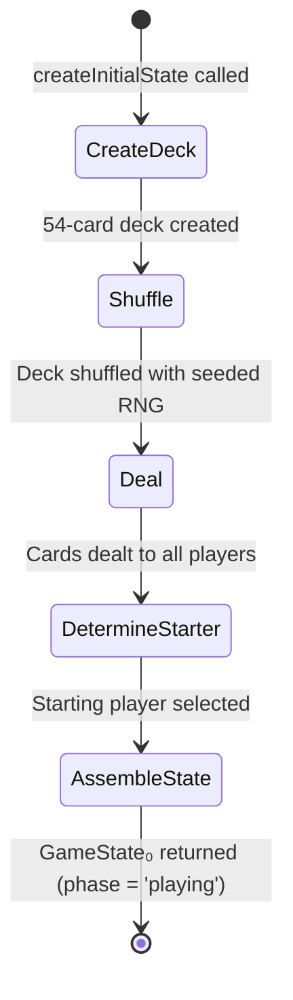

# State Factory — Initial Game State Creation

> **Document Type:** Engine Component Spec
> **Status:** Implementation-Ready
> **Last Updated:** March 2026
> **Parent Spec:** [SBOBUZ_ENGINE_SPEC.md](../../../SBOBUZ_ENGINE_SPEC.md) — Sections 2, 4, 8

---

## 1. Overview

The State Factory creates the initial `GameState` (State₀) from a player list, RNG seed, and game configuration. It is responsible for deck creation (54 cards), shuffling (via the seeded RNG), dealing cards to all players (3 face-down + 3 face-up + 3 hand per player), forming the draw pile from remaining cards, and determining the starting player.

This component runs exactly once per game — at the transition from lobby to gameplay. Its output is the complete, valid GameState₀ from which all subsequent actions are reduced.

The State Factory is a pure function. Given the same inputs, it produces the same initial state every time. All randomness flows through the seeded RNG.

---

## 2. Data Model

### 2.1 Types Owned by This Component

```typescript
/**
 * Input required to create a new game.
 */
interface CreateGameInput {
  /** Unique game identifier, generated by the caller (Lobby Module). */
  gameId: string;

  /** Player IDs in seating order (determines turnOrder). Must be 2-5 players. */
  playerIds: string[];

  /** The seed for the PRNG. Determines deck shuffle and starting player tiebreaker. */
  seed: number;

  /** Game configuration from room settings. */
  config: GameConfig;
}
```

### 2.2 Types Referenced from Parent Spec

- `GameState`, `PlayerState` — the output structures
- `GameConfig` — `{ turnTimerSeconds, disconnectGraceSeconds, maxPlayers, minPlayers }`
- `Card`, `StandardCard`, `JokerCard` — deck composition
- `Suit`, `Rank` — card attributes
- `GamePhase` — set to `'playing'` after setup

---

## 3. Public Interface

```typescript
/**
 * Creates the initial game state for a new Sbobuz game.
 *
 * Performs: deck creation → shuffle → deal → starting player selection.
 *
 * @param input - The game creation parameters.
 * @returns The initial GameState (State₀), ready for the first player's turn.
 * @throws If input validation fails (wrong player count, invalid seed).
 */
function createInitialState(input: CreateGameInput): GameState;

/**
 * Creates the standard 54-card deck.
 * 52 standard cards (4 suits × 13 ranks) + 2 jokers.
 * Cards are created in a deterministic order (before shuffling).
 *
 * @returns An unshuffled deck of 54 cards.
 */
function createDeck(): Card[];

/**
 * Determines the starting player using the multi-step tiebreaker algorithm.
 * See parent spec Section 4.1.
 *
 * @param players - Player states after dealing (with hand cards).
 * @param rng - The current RNG state (for random tiebreaker if needed).
 * @returns The index into the turnOrder array for the starting player,
 *          and the advanced RNG state.
 */
function determineStartingPlayer(
  players: PlayerState[],
  rng: SeededRNG
): { startingIndex: number; nextRng: SeededRNG };
```

---

## 4. Behavior Rules

### 4.1 Deck Creation

The deck is created in a fixed, deterministic order before shuffling:

```
1. For each suit in ['hearts', 'diamonds', 'clubs', 'spades']:
   For each rank in ['2', '3', '4', '5', '6', '7', '8', '9', '10', 'J', 'Q', 'K', 'A']:
     Create a StandardCard with id = '{suit}_{rank}' (e.g., 'hearts_7').

2. Create JokerCard with id = 'joker_1'.
3. Create JokerCard with id = 'joker_2'.

Total: 52 standard + 2 jokers = 54 cards.
```

### 4.2 Shuffle

The deck is shuffled using the RNG Module's `shuffle` function with the seeded PRNG:

```
rng = createRng(seed)
{ value: shuffledDeck, nextRng: rng } = shuffle(rng, deck)
```

### 4.3 Deal

Cards are dealt from the top of the shuffled deck (index 0) in this order:

```
For each player, in order of playerIds:
  1. Deal 3 cards face-down (take next 3 from deck).
  2. Deal 3 cards face-up (take next 3 from deck).
  3. Deal 3 cards to hand (take next 3 from deck).

Remaining cards form the draw pile.
```

**Card count verification:**

| Players | Cards Dealt | Draw Pile Size |
|---------|------------|----------------|
| 2 | 18 | 36 |
| 3 | 27 | 27 |
| 4 | 36 | 18 |
| 5 | 45 | 9 |

### 4.4 Starting Player Algorithm

The starting player is determined by who holds the lowest cards in hand. This is a multi-step tiebreaker:

```
STEP 1 — Sort each player's hand by rank ascending (using RANK_ORDER).

STEP 2 — Compare hands lexicographically by lowest card.
  For each player, extract sorted hand ranks: [lowest, middle, highest].
  Compare the lowest card rank across all players.
  If a single player has the uniquely lowest card → that player starts.
  If tied → continue.

STEP 3 — Tiebreaker: second-lowest card.
  Among tied players, compare their second card.
  If a single player has the uniquely lowest second card → that player starts.
  If tied → continue.

STEP 4 — Tiebreaker: third-lowest card.
  Among tied players, compare their third card.
  If a single player has the uniquely lowest third card → that player starts.
  If tied → continue.

STEP 5 — Tiebreaker: positional advantage (exactly 2 tied players only).
  If exactly 2 players remain tied:
    Choose the player whose position lets the other tied player play
    soonest after them.
    In a forward turn order, this means choosing the player such that
    the other player is the nearest next player in the sequence.
    Concretely: for players at indices i and j (i < j),
    pick the one that minimizes the distance for the other to play next.
    If equidistant (e.g., directly opposite in even-player game) → go to Step 6.
  If 3+ players remain tied → skip to Step 6.

STEP 6 — Final tiebreaker: random.
  Use the seeded RNG to pick randomly among remaining tied players.
  rng.pick(tiedPlayers)
```

### 4.5 Initial GameState Assembly

After deck creation, shuffle, deal, and starting player selection:

```typescript
const initialState: GameState = {
  gameId: input.gameId,
  phase: 'playing',
  config: input.config,

  drawPile: remainingCards,    // index 0 = top
  playPile: [],                // empty at start
  burnPile: [],                // empty at start

  players: playerStates,       // dealt cards
  turnOrder: input.playerIds,  // seating order
  currentPlayerIndex: startingIndex,
  turnDirection: 1,            // forward

  freePlay: false,
  nextCardOverride: null,

  rngSeed: input.seed,
  actionCount: 0,
};
```

---

## 5. Validation Rules

| Check | Condition | Error |
|-------|-----------|-------|
| Player count in range | `playerIds.length >= 2 && playerIds.length <= 5` | `'INVALID_PLAYER_COUNT: must be 2-5 players'` |
| No duplicate player IDs | All IDs are unique | `'DUPLICATE_PLAYER_ID: player IDs must be unique'` |
| Player IDs are non-empty strings | Each ID has `length > 0` | `'INVALID_PLAYER_ID: player ID must be non-empty string'` |
| Game ID is non-empty string | `gameId.length > 0` | `'INVALID_GAME_ID: game ID must be non-empty string'` |
| Seed is a finite number | `Number.isFinite(seed)` | `'INVALID_SEED: seed must be a finite number'` |
| Config has valid timer | `config.turnTimerSeconds > 0` | `'INVALID_CONFIG: turnTimerSeconds must be positive'` |
| Config has valid grace period | `config.disconnectGraceSeconds > 0` | `'INVALID_CONFIG: disconnectGraceSeconds must be positive'` |

---

## 6. State Diagram



---

## 7. Edge Cases & Test Scenarios

| # | Scenario | Expected Behavior |
|---|----------|-------------------|
| 1 | 2-player game setup | 18 cards dealt (9 per player), 36 in draw pile. Both players have 3 hand, 3 face-up, 3 face-down. |
| 2 | 5-player game setup | 45 cards dealt (9 per player), 9 in draw pile. |
| 3 | Same seed produces identical state | `createInitialState({ seed: 42, ... })` called twice with identical inputs produces byte-for-byte identical GameState. |
| 4 | Different seeds produce different states | Seed 42 and seed 43 produce different deck orders and potentially different starting players. |
| 5 | Starting player: clear winner (unique lowest card) | Player A has [3, 7, K], Player B has [5, 8, Q]. Player A starts (3 < 5). |
| 6 | Starting player: tie on first card, break on second | Player A has [3, 5, K], Player B has [3, 7, Q]. Tied on 3. Player A starts (5 < 7). |
| 7 | Starting player: tie on first two, break on third | Player A has [3, 5, J], Player B has [3, 5, Q]. Tied on 3 and 5. Player A starts (J < Q). |
| 8 | Starting player: complete tie (2 players), positional tiebreaker | Player A at index 0 has [3, 5, J], Player B at index 1 has [3, 5, J]. All cards identical. Positional advantage: pick A (B plays next after A in forward order). |
| 9 | Starting player: complete tie (3+ players), random tiebreaker | Three players with identical hand ranks. Random pick using seeded RNG. Deterministic for same seed. |
| 10 | All cards accounted for | Total cards in all zones + draw pile = 54. No card is duplicated. No card is missing. |
| 11 | Face-down cards are in faceDownCards array | Each player has exactly 3 face-down cards. |
| 12 | Face-up cards are in faceUpCards array | Each player has exactly 3 face-up cards. |
| 13 | Hand cards are in hand array | Each player has exactly 3 hand cards. |
| 14 | Draw pile convention (index 0 = top) | The first card drawn from the pile is at index 0. |
| 15 | Play pile starts empty | `playPile.length === 0`. |
| 16 | Burn pile starts empty | `burnPile.length === 0`. |
| 17 | Phase is 'playing' after creation | `state.phase === 'playing'`. |
| 18 | Turn direction starts at 1 (forward) | `state.turnDirection === 1`. |
| 19 | freePlay starts false | `state.freePlay === false`. |
| 20 | nextCardOverride starts null | `state.nextCardOverride === null`. |
| 21 | actionCount starts at 0 | `state.actionCount === 0`. |
| 22 | Card ID uniqueness | All 54 cards have unique `id` values. |
| 23 | Starting player with Joker in hand | Jokers have no rank. If a Joker is in a player's hand, it is excluded from the starting player rank comparison. Only standard cards participate. Each player sorts their 3 hand cards — if one is a Joker, compare using only the 2 ranked cards (fill with a sentinel "high" value for the missing slot, so the Joker holder is not disadvantaged). |

**Note on scenario #23:** The parent spec says "Sort each player's 3-card hand by rank ascending." Jokers have no rank. The implementation should handle this by treating Jokers as the highest possible value for starting player comparison (so holding a Joker is never an advantage for starting). If a player holds 3 Jokers (impossible — only 2 exist), they would compare as having the highest possible hand.

---

## 8. Integration Points

### 8.1 Inbound

| Source | Interface | Data |
|--------|-----------|------|
| Lobby Module (via Realtime Module) | `createInitialState(input)` | Game ID, player IDs, seed, config |

### 8.2 Outbound

| Target | Interface | Data |
|--------|-----------|------|
| RNG Module | `createRng(seed)`, `shuffle(rng, deck)`, `pick(rng, tiedPlayers)` | Seed, card array, player array |

### 8.3 Side Effects

None. This is a pure function. The resulting GameState is passed to the Action Logger and Realtime Module by the orchestrating layer.

---

## 9. Resolved Design Decisions

| # | Question | Decision | Rationale |
|---|----------|----------|-----------|
| 1 | Should the State Factory validate player existence (check Auth module)? | No. It receives player IDs and trusts them. The Lobby Module has already validated that all players are real, authorized users. | Separation of concerns. The engine is a logic module with no I/O. |
| 2 | How are Jokers handled in starting player selection? | Jokers are treated as the highest possible value (above Ace) for rank comparison. This means holding a Joker is never an advantage for starting. | The parent spec says only "hand cards participate." Since the comparison is "lowest card starts," treating Jokers as high ensures they do not give a false advantage. |
| 3 | Deal order: per-player (all 9 to P1, then all 9 to P2) or round-robin? | Per-player: 3 face-down + 3 face-up + 3 hand for P1, then same for P2, etc. | Matches the parent spec Section 4 description. With a seeded shuffle, the deal order is deterministic regardless. |
| 4 | Should the initial state include a `winner` field? | No. The `winner` is determined when `phase` transitions to `'finished'`. The initial state has no winner. | Avoid nullable fields that are never set at creation time. |
| 5 | Where does the seed come from? | The caller (Lobby Module / server orchestration layer) generates the seed, likely from `crypto.getRandomValues()`. The State Factory receives it as input. | The engine never generates true randomness. All randomness is injected via the seed. |

---

## 10. Implications for Architecture

1. **The State Factory is the only entry point for creating a game.** No other component should construct a GameState from scratch. This ensures every game starts from a validated, consistent initial state.

2. **The draw pile convention (index 0 = top) must be consistent across the entire engine.** The State Factory sets this convention, and the State Reducer must honor it when drawing cards.

3. **The play pile convention (last element = top) is set here as well.** The play pile starts empty, but when cards are added, the most recent card is pushed to the end (appended). This means `playPile[playPile.length - 1]` is always the top card.

4. **The starting player algorithm's complexity lives entirely in this component.** The State Reducer never needs to select a starting player — it only advances turns. This is a setup-only concern.

5. **The RNG state after State Factory execution is discarded.** The RNG is only used during setup. After the initial state is created, the seed is stored in `GameState.rngSeed` for replay purposes, but no RNG instance is preserved in the state.
