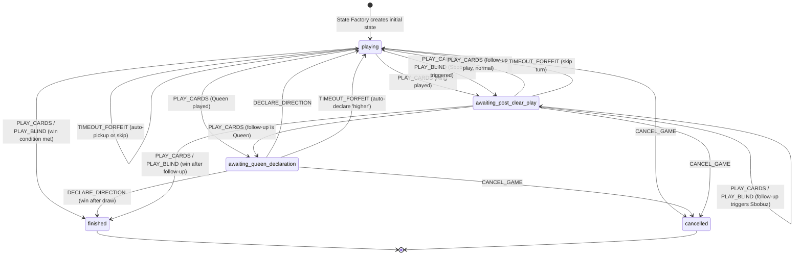

# State Reducer — Core Game State Transition Engine

> **Document Type:** Engine Component Spec
> **Status:** Implementation-Ready
> **Last Updated:** March 2026
> **Parent Spec:** [SBOBUZ_ENGINE_SPEC.md](../../../SBOBUZ_ENGINE_SPEC.md) — Section 11

---

## 1. Overview

The State Reducer is the heart of the Sbobuz game engine. It is a pure function that takes the current GameState and a validated GameAction, and returns a new GameState. No mutations. No side effects. Deterministic.

Every state transition in the game flows through this single function. It orchestrates all sub-components: Sbobuz detection, rank comparison (for blind plays), turn advancement, zone recomputation, and win condition checking. It resolves card effects (2's freePlay, Joker's direction reversal, Queen's declaration phase, King's pile clear) and enforces the effect priority order (Sbobuz overrides all individual card effects).

The reducer receives only validated actions. The Action Validator has already confirmed that the action is legal. The reducer does not re-validate — it processes.

The one exception: blind play card legality. When a face-down card is revealed, the reducer checks its legality against the pile. If illegal, the player picks up the pile. This is not a "rejection" — it is a game mechanic with different consequences than action validation failure.

---

## 2. Data Model

### 2.1 Types Owned by This Component

```typescript
/**
 * The result of reducing an action. Contains the new state and metadata
 * about what happened during the reduction.
 */
interface ReducerResult {
  /** The new game state after applying the action. */
  newState: GameState;

  /**
   * Events that occurred during reduction, for the Action Logger and
   * Realtime Module to broadcast. These are informational — they describe
   * what happened, not commands to execute.
   */
  events: GameEvent[];
}

/**
 * Events emitted by the reducer to describe what happened.
 * Used for logging, animation triggers, and client-side feedback.
 */
type GameEvent =
  | { type: 'CARDS_PLAYED'; playerId: string; cards: Card[]; fromZone: ActiveZone }
  | { type: 'BLIND_CARD_REVEALED'; playerId: string; card: Card; legal: boolean }
  | { type: 'PILE_PICKED_UP'; playerId: string; cardCount: number }
  | { type: 'CARDS_DRAWN'; playerId: string; count: number }
  | { type: 'SBOBUZ_TRIGGERED'; playerId: string; rank: Rank }
  | { type: 'PILE_BURNED'; cardCount: number; reason: 'sbobuz' | 'king' }
  | { type: 'DIRECTION_REVERSED'; newDirection: 1 | -1 }
  | { type: 'FREE_PLAY_SET'; byCard: '2' | 'joker' }
  | { type: 'QUEEN_AWAITING_DECLARATION'; playerId: string }
  | { type: 'DIRECTION_DECLARED'; playerId: string; direction: 'higher' | 'lower' }
  | { type: 'TURN_ADVANCED'; newPlayerIndex: number; newPlayerId: string }
  | { type: 'PLAYER_WON'; playerId: string }
  | { type: 'GAME_CANCELLED'; reason: string }
  | { type: 'PLAYER_TIMED_OUT'; playerId: string };
```

### 2.2 Types Referenced from Parent Spec

- `GameState`, `PlayerState` — input and output
- `GameAction` and all subtypes — the actions being reduced
- `GamePhase` — transitions managed by this component
- `Card`, `StandardCard`, `JokerCard`, `Rank` — card handling
- `ActiveZone` — from Active Zone Resolver
- `ComparisonContext` — from Rank Comparator
- `SbobuzCheckResult` — from Sbobuz Detector

---

## 3. Public Interface

```typescript
/**
 * The core reducer function. Takes the current state and a validated action,
 * returns the new state and a list of events describing what happened.
 *
 * PRECONDITION: The action has passed validation (Action Validator returned { valid: true }).
 * The reducer does not re-validate. It processes.
 *
 * POSTCONDITION: The returned state is a complete, valid GameState.
 * The input state is not modified.
 *
 * @param state - The current game state (immutable).
 * @param action - The validated action to apply.
 * @returns ReducerResult with the new state and events.
 */
function reduce(state: GameState, action: GameAction): ReducerResult;
```

---

## 4. Behavior Rules — PLAY_CARDS

The most complex action type. Handles card placement, flag consumption, Sbobuz detection, card effects, drawing, zone transitions, win checking, and turn advancement.

### 4.1 PLAY_CARDS Pseudocode

```
Input: state, action: PlayCardsAction
       action.playerId, action.cardIds

1. IDENTIFY PLAYER AND ZONE
   player = state.players.find(p => p.id === action.playerId)
   activeZone = getActiveZone(player, state.drawPile.length === 0)
   cards = resolve cards from player's active zone by action.cardIds

2. REMOVE CARDS FROM ZONE
   Create new player state with cards removed from active zone.
   - If activeZone === 'hand': remove from player.hand
   - If activeZone === 'faceUp': remove from player.faceUpCards

3. PLACE CARDS ON PILE
   Append cards to playPile (push to end — last element = top).

4. CONSUME SINGLE-USE FLAGS
   newFreePlay = false               // consumed regardless of current value
   newNextCardOverride = null         // consumed regardless of current value

5. SBOBUZ CHECK
   sbobuzResult = checkSbobuz(newPlayPile)
   IF sbobuzResult.triggered:
     5a. Move entire playPile to burnPile.
     5b. Flip turn direction: newTurnDirection = state.turnDirection * -1
     5c. Set phase = 'awaiting_post_clear_play' (same player plays again).
     5d. EMIT: SBOBUZ_TRIGGERED, PILE_BURNED, DIRECTION_REVERSED
     5e. SKIP to step 6 (no individual card effect).
   ELSE:
     Continue to step 5f.

   5f. RESOLVE INDIVIDUAL CARD EFFECT
       Determine the rank of the played card(s):
       - If card is StandardCard: use card.rank
       - If card is JokerCard: effect is 'joker'

       SWITCH rank:
         CASE '2':
           newFreePlay = true
           EMIT: FREE_PLAY_SET { byCard: '2' }

         CASE 'joker' (JokerCard):
           newFreePlay = true
           newTurnDirection = state.turnDirection * -1
           EMIT: FREE_PLAY_SET { byCard: 'joker' }, DIRECTION_REVERSED

         CASE 'Q':
           Set phase = 'awaiting_queen_declaration'.
           EMIT: QUEEN_AWAITING_DECLARATION
           ** STOP HERE ** — No draw phase. No turn advance.
           The Queen player must declare direction before anything else.
           Return new state with phase = 'awaiting_queen_declaration'.

         CASE 'K':
           Move entire playPile to burnPile.
           Set phase = 'awaiting_post_clear_play' (same player plays again).
           EMIT: PILE_BURNED { reason: 'king' }
           ** DO NOT advance turn ** — player plays again.
           Continue to step 6 for draw phase.

         DEFAULT (3-10, J, A):
           No special effect. Continue.

6. DRAW PHASE
   While player.hand.length < 3 AND drawPile.length > 0:
     Move top card from drawPile (index 0) to player.hand.
     drawCount++
   If drawCount > 0: EMIT CARDS_DRAWN

7. RECOMPUTE ACTIVE ZONE
   newActiveZone = getActiveZone(updatedPlayer, newDrawPile.length === 0)

8. WIN CHECK
   winResult = checkWinCondition(updatedPlayer, newDrawPile.length === 0)
   IF winResult.won:
     Set phase = 'finished'.
     EMIT: PLAYER_WON
     Return new state. STOP.

9. CHECK FOR SAME-PLAYER-PLAYS-AGAIN
   IF phase === 'awaiting_post_clear_play':
     Same player plays again. DO NOT advance turn.
     Return new state. STOP.

10. ADVANCE TURN
    newCurrentPlayerIndex = advanceTurn(
      state.currentPlayerIndex, newTurnDirection, state.turnOrder.length
    )
    Set phase = 'playing'.
    EMIT: TURN_ADVANCED

11. INCREMENT ACTION COUNT
    newActionCount = state.actionCount + 1

12. RETURN new state.
```

---

## 5. Behavior Rules — PLAY_BLIND

Face-down card play. The card is revealed, legality is checked post-reveal, and consequences differ from validation rejection.

### 5.1 PLAY_BLIND Pseudocode

```
Input: state, action: PlayBlindAction
       action.playerId, action.cardIndex

1. IDENTIFY PLAYER
   player = state.players.find(p => p.id === action.playerId)

2. REVEAL CARD
   revealedCard = player.faceDownCards[action.cardIndex]
   Remove card from player.faceDownCards at action.cardIndex.
   EMIT: BLIND_CARD_REVEALED

3. PLACE CARD ON PILE
   Append revealedCard to playPile.

4. CHECK LEGALITY OF REVEALED CARD
   Build ComparisonContext from state (using flags BEFORE consumption):
     pileTopRank = pile top rank BEFORE the revealed card was placed
                   (i.e., the card that was on top before this play)
     pileTopIsJoker = was the previous top a joker?
     freePlay = state.freePlay
     nextCardOverride = state.nextCardOverride

   result = isCardLegal(revealedCard, context)

   IF result.legal:
     4a. Continue with PLAY_CARDS flow from step 4 onward.
         (Consume flags, Sbobuz check, card effects, draw, zone, win, turn.)
         Process exactly as if the player had played this card from hand.
         EMIT: BLIND_CARD_REVEALED { legal: true }

   IF NOT result.legal:
     4b. ILLEGAL BLIND PLAY
         The revealed card stays on the pile (already placed in step 3).
         Move entire playPile (including the revealed card) into player's hand.
         Clear playPile.
         Clear freePlay = false.
         Clear nextCardOverride = null.
         Recompute active zone (now 'hand' — player has cards in hand).
         EMIT: BLIND_CARD_REVEALED { legal: false }, PILE_PICKED_UP
         Advance turn to next player.
         Set phase = 'playing'.
         Increment actionCount.
         Return new state.
```

### 5.2 Blind Play Legality Context

The legality check for a blind play uses the pile state BEFORE the revealed card was placed. This is because the card is being "played on top of" the existing pile — the comparison is against the previous top card, not the card itself.

---

## 6. Behavior Rules — PICK_UP_PILE

### 6.1 PICK_UP_PILE Pseudocode

```
Input: state, action: PickUpPileAction
       action.playerId

1. IDENTIFY PLAYER
   player = state.players.find(p => p.id === action.playerId)

2. MOVE PILE TO HAND
   Add all cards from playPile to player.hand.
   Clear playPile to empty array.
   EMIT: PILE_PICKED_UP

3. CLEAR FLAGS
   freePlay = false
   nextCardOverride = null

4. RECOMPUTE ACTIVE ZONE
   Active zone is now 'hand' (player has cards in hand).

5. ADVANCE TURN
   newCurrentPlayerIndex = advanceTurn(...)
   Set phase = 'playing'.
   EMIT: TURN_ADVANCED

6. INCREMENT ACTION COUNT
   Return new state.
```

---

## 7. Behavior Rules — DECLARE_DIRECTION

### 7.1 DECLARE_DIRECTION Pseudocode

```
Input: state, action: DeclareDirectionAction
       action.playerId, action.direction

1. SET DIRECTION OVERRIDE
   IF action.direction === 'lower':
     nextCardOverride = 'lower'
   IF action.direction === 'higher':
     nextCardOverride = null   // 'higher' is the default, no flag needed
   EMIT: DIRECTION_DECLARED

2. SET PHASE
   phase = 'playing'

3. DRAW PHASE (for the Queen player)
   While player.hand.length < 3 AND drawPile.length > 0:
     Draw cards.
   If drawCount > 0: EMIT CARDS_DRAWN

4. RECOMPUTE ACTIVE ZONE

5. WIN CHECK
   winResult = checkWinCondition(updatedPlayer, newDrawPile.length === 0)
   IF winResult.won:
     Set phase = 'finished'. EMIT PLAYER_WON. STOP.

6. ADVANCE TURN
   newCurrentPlayerIndex = advanceTurn(...)
   EMIT: TURN_ADVANCED

7. INCREMENT ACTION COUNT
   Return new state.
```

---

## 8. Behavior Rules — TIMEOUT_FORFEIT

### 8.1 TIMEOUT_FORFEIT Pseudocode

```
Input: state, action: TimeoutForfeitAction
       action.playerId

The timed-out player's turn is forfeited. The effect depends on the current phase:

1. IF phase === 'awaiting_queen_declaration':
   Auto-declare 'higher' (the default, no-op direction).
   Process as DECLARE_DIRECTION { direction: 'higher' }.

2. IF phase === 'awaiting_post_clear_play':
   The player must play but timed out. Auto-pick up pile is not possible
   (pile is empty after a clear). Player has no action forced — skip their
   turn and advance to next player.
   Set phase = 'playing'.
   Advance turn.
   EMIT: PLAYER_TIMED_OUT, TURN_ADVANCED

3. IF phase === 'playing':
   The player's turn is forfeited. If the pile is non-empty, auto-pick up the pile.
   If the pile is empty, simply advance the turn.

   IF playPile.length > 0:
     Process as PICK_UP_PILE.
   ELSE:
     Advance turn.
   EMIT: PLAYER_TIMED_OUT

4. INCREMENT ACTION COUNT
   Return new state.
```

---

## 9. Behavior Rules — CANCEL_GAME

### 9.1 CANCEL_GAME Pseudocode

```
Input: state, action: CancelGameAction
       action.reason, action.disconnectedPlayerId (optional)

1. Set phase = 'cancelled'.
2. EMIT: GAME_CANCELLED { reason: action.reason }
3. Return new state.

No further actions are accepted after cancellation.
```

---

## 10. State Transition Diagram



---

## 11. Effect Priority & Resolution Order

Restated from the parent spec for completeness. This is the canonical resolution order inside the reducer:

```
STEP 1 — SBOBUZ CHECK (highest priority)
    Top 4 pile cards share a rank?
    ├─ YES → Burn pile. Reverse direction. Same player plays again.
    │        STOP. No individual card effect.
    └─ NO  → Continue.

STEP 2 — INDIVIDUAL CARD EFFECT
    ├─ 2      → freePlay = true
    ├─ Joker  → freePlay = true + reverse direction
    ├─ Queen  → 'awaiting_queen_declaration'. STOP (no draw, no advance).
    ├─ King   → Burn pile. 'awaiting_post_clear_play'.
    └─ Other  → No effect.

STEP 3 — DRAW PHASE
    Hand < 3 cards AND draw pile non-empty → draw.

STEP 4 — ZONE RECOMPUTATION
    getActiveZone(player, drawPileEmpty)

STEP 5 — WIN CHECK
    All zones empty → game over.

STEP 6 — TURN ADVANCE
    Unless same-player-plays-again (King, Sbobuz) → advance turn.
```

---

## 12. Immutability Contract

The reducer MUST NOT mutate the input state. Every modification creates a new object:

```typescript
// WRONG — mutation
state.playPile.push(card);
state.freePlay = false;

// RIGHT — new objects
const newPlayPile = [...state.playPile, card];
const newState = { ...state, playPile: newPlayPile, freePlay: false };
```

All arrays and nested objects are shallow-copied before modification. This ensures:
- The Action Logger can safely store references to both the old and new states.
- Undo/revert is trivial (use the previous state).
- No spooky action at a distance from shared mutable references.

---

## 13. Edge Cases & Test Scenarios

These are the compound scenarios from the parent spec, plus reducer-specific cases.

| # | Scenario | Expected Behavior |
|---|----------|-------------------|
| 1 | Play a 2 on top of three 2s on pile | Sbobuz triggers. Pile burns, direction reverses, player goes again. freePlay is NOT set (Sbobuz overrides). |
| 2 | Four Queens accumulated on pile | Sbobuz triggers. No queen direction declaration. Sbobuz overrides all card effects. |
| 3 | Queen played, 'lower' declared, next player plays a 2 | Legal — 2 is always playable. nextCardOverride consumed. 2 sets freePlay = true for the next player. |
| 4 | King clears pile, follow-up is another King | Second King clears empty pile (burn is a no-op — empty pile moved to burn is no cards). Player must play again. Chainable. |
| 5 | King played as last card — no cards left | Win condition checked before requiring post-clear play. Player wins. phase = 'finished'. |
| 6 | Blind play reveals illegal card | Revealed card placed on pile, then entire pile (including revealed card) moved to player's hand. Active zone reverts to hand. Turn advances. |
| 7 | Blind play reveals a Queen (legal) | Queen effect triggers. Game enters 'awaiting_queen_declaration'. Player declares direction. |
| 8 | Blind play reveals a King (legal) | King effect triggers. Pile clears. Player must play again (from hand if pile pickup happened previously, or from next face-down). |
| 9 | Player picks up pile with special cards | Cards go into hand. No effects trigger on pickup — effects only fire on play. |
| 10 | Sbobuz completed across multiple turns | Sbobuz triggered by the player who completes the four-of-a-kind. That player gets the play-again. |
| 11 | Joker reverses direction, then Sbobuz also reverses | Two reversals = back to original direction. turnDirection *= -1 applied twice. |
| 12 | Player plays Joker, pile now has 4 same rank beneath | Joker on top. Top 4 = Joker + 3 cards. Joker has no rank → NOT Sbobuz. |
| 13 | Draw pile empties mid-hand | Player keeps remaining cards, plays them out. On next getActiveZone call, transitions to face-up (if hand empty). |
| 14 | Multiple same-rank face-up cards played | Legal. Same multi-play rule. Cards removed from faceUpCards. |
| 15 | Player picks up pile while in face-up zone | Pile goes to hand. Active zone reverts to hand. |
| 16 | Last two players, one wins | Game ends immediately. Remaining player does not play. |
| 17 | Sbobuz on empty pile | Impossible — pile needs >= 4 cards. Detector returns false. |
| 18 | Queen 'lower' override, pile cleared by King before target plays | nextCardOverride flag still set. Pile is empty → any card is legal regardless. Flag consumed on next play. |
| 19 | Voluntary pile pickup for strategy | Legal. No legality check for pickup. |
| 20 | Player plays 3 cards at once, all 3 are the same rank | All 3 removed from zone, all 3 placed on pile. Sbobuz check examines top 4 (the 3 just played + the one below). |
| 21 | King played on empty pile | Burn is a no-op (no cards to move). Player must play again. |
| 22 | TIMEOUT_FORFEIT during 'awaiting_queen_declaration' | Auto-declare 'higher'. Process as DECLARE_DIRECTION. |
| 23 | TIMEOUT_FORFEIT during 'playing' with non-empty pile | Auto-pickup pile. Process as PICK_UP_PILE. |
| 24 | TIMEOUT_FORFEIT during 'playing' with empty pile | Skip turn. Advance to next player. |
| 25 | TIMEOUT_FORFEIT during 'awaiting_post_clear_play' | Player had to play but timed out. Skip and advance turn. |
| 26 | CANCEL_GAME sets phase to 'cancelled' | State returned with phase = 'cancelled'. No further processing. |
| 27 | Flags consumed even when Sbobuz triggers | After Sbobuz: freePlay = false, nextCardOverride = null. Flags are consumed in step 4 before Sbobuz check. |
| 28 | Draw phase after King clear | Player's hand might be < 3 after playing a King. Draw cards before requiring next play. |
| 29 | Blind play: revealed card is a 2 on pile top A | 2 is always legal. Play succeeds. freePlay set for next player. |
| 30 | Blind play: illegal card on empty pile | Impossible — any card is legal on empty pile. Blind play always succeeds if pile is empty. |

---

## 14. Integration Points

### 14.1 Inbound

| Source | Interface | Data |
|--------|-----------|------|
| Orchestration layer (after Action Validator) | `reduce(state, action)` | Current GameState, validated GameAction |

### 14.2 Outbound (dependencies called during reduction)

| Target | Interface | Data |
|--------|-----------|------|
| Sbobuz Detector | `checkSbobuz(playPile)` | Play pile after card placement |
| Rank Comparator | `isCardLegal(card, context)` | Blind play revealed card, comparison context |
| Turn Manager | `advanceTurn(index, direction, count)` | Current index, direction, player count |
| Active Zone Resolver | `getActiveZone(player, drawPileEmpty)` | Updated player state, draw pile status |
| Win Condition Evaluator | `checkWinCondition(player, drawPileEmpty)` | Updated player state, draw pile status |

### 14.3 Side Effects

None. The reducer is a pure function. Events in the ReducerResult are data — they describe what happened but do not execute side effects.

---

## 15. Resolved Design Decisions

| # | Question | Decision | Rationale |
|---|----------|----------|-----------|
| 1 | Should the reducer return events alongside the new state? | Yes. Events are metadata describing what happened. They drive animations, logging, and broadcasts without coupling the reducer to those systems. | The reducer stays pure. Event consumers (Action Logger, Realtime Module) decide what to do with the events. |
| 2 | When are flags consumed? | Immediately at step 4 of PLAY_CARDS, before Sbobuz check and card effects. | Flags are single-use per the parent spec. They are consumed by the act of playing, not by the effect resolution. If Sbobuz triggers and overrides the card effect, the flags are still consumed. |
| 3 | Should the reducer handle TIMEOUT_FORFEIT or should it be a separate component? | The reducer handles it. TIMEOUT_FORFEIT is mapped to an equivalent game action internally. | Keeps all state transitions in one place. The Game Clock generates the synthetic action; the reducer processes it uniformly. |
| 4 | Should the King's "play again" use the same phase as Sbobuz's "play again"? | Yes — both use 'awaiting_post_clear_play'. | Same consequence: player must play another card. The cause (King vs Sbobuz) is tracked in events, not in the phase. |
| 5 | What happens when a King clears an empty pile? | Burn is a no-op (moving empty array to burn pile adds nothing). Player still must play again. | Parent spec Section 6.3: "Playing a King on an empty pile still grants another play." |
| 6 | Should PLAY_BLIND reuse PLAY_CARDS logic for the legal path? | Yes. After the revealed card is confirmed legal, the remainder of the flow is identical to PLAY_CARDS from step 4 onward. | Avoids duplicating the Sbobuz check, card effect, draw, zone, win, and turn logic. Implementation can extract a shared helper. |
| 7 | Queen STOP: why does Queen halt processing before draw/advance? | The Queen player must declare direction before the game proceeds. The draw phase happens AFTER the declaration (in DECLARE_DIRECTION step 3). | Parent spec Section 6.2: "the game enters awaiting_queen_declaration phase." The declaration is a separate action. |

---

## 16. Implications for Architecture

1. **The reducer is the single source of truth for state transitions.** No other component modifies GameState. Every change to the game state is a call to `reduce(state, action)`.

2. **The events array enables loose coupling.** The Action Logger, Realtime Module, and any future analytics system consume events without the reducer knowing about them. Add new event types as needed without changing the reducer's callers.

3. **The draw pile convention (index 0 = top) is critical here.** Drawing takes from `drawPile[0]`, not the end. This matches the State Factory's convention.

4. **Blind play reuse of PLAY_CARDS logic suggests implementation should extract a shared `resolveCardPlay` helper** that handles steps 4-10 of PLAY_CARDS. Both PLAY_CARDS and the legal branch of PLAY_BLIND call this helper after cards are on the pile.

5. **The TIMEOUT_FORFEIT handling means the Game Clock's synthetic actions flow through the same pipeline** as player actions. From the reducer's perspective, there is no distinction between a player-initiated action and a system-initiated action. This is by design.

6. **actionCount is incremented for every action including CANCEL_GAME and TIMEOUT_FORFEIT.** It is a monotonic counter of all actions processed, used for event sourcing ordering.
