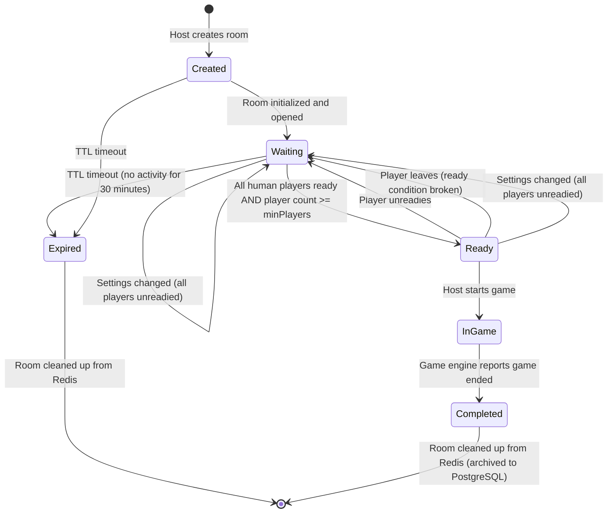
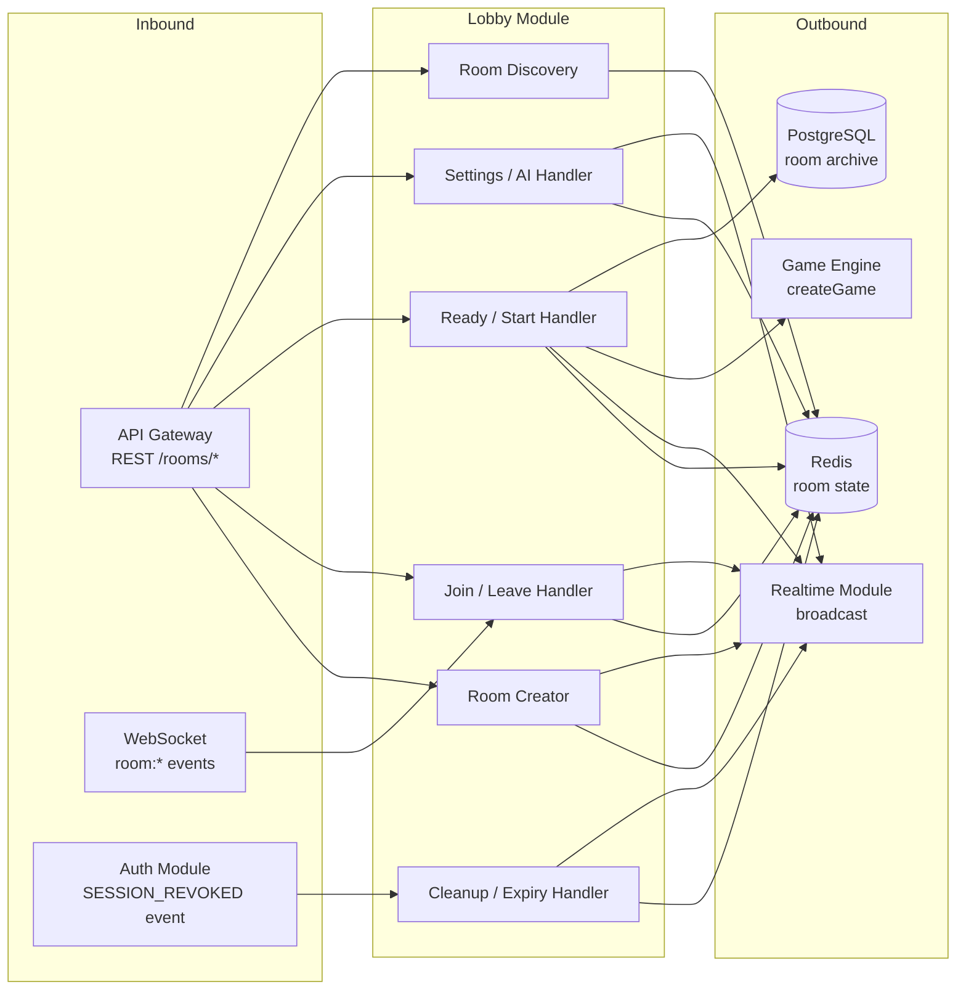

# Lobby Module — Room Lifecycle & Pre-Game Coordination

> **Document Type:** Module Spec
> **Status:** Draft
> **Last Updated:** March 2026

---

## 1. Overview

The Lobby Module manages the full lifecycle of game rooms: creation, player join/leave, the ready system, invitation links, room discovery, and the handoff to the Game Engine when a match starts. It is the coordination layer between user identity (Auth Module) and gameplay (Game Engine Module), bridging the gap between "I want to play" and "the game has started."

Room state is ephemeral by design. Active rooms live in Redis with a TTL and are never persisted to PostgreSQL until a game actually starts (at which point the room metadata is archived for history). This reflects the architecture's principle: ephemeral state in Redis, durable state in Postgres.

The module interacts with Auth (user identity for every room operation), the Game Engine (triggered when the host starts a game from a READY room), the Realtime Module (WebSocket broadcasts for room state changes), Redis (room state CRUD, public room listing), and PostgreSQL (room archival on game start). Every room operation is server-authoritative. The client renders room state but never computes it.

---

## 2. Data Model

### 2.1 Room

The core entity. Represents a pre-game lobby where players gather.

```typescript
interface Room {
  /** UUIDv4, primary key. Redis key: room:{roomId} */
  roomId: string;

  /** User.id of the room creator. Transferred on host departure. */
  hostId: string;

  /** Human-readable room name, 1-50 chars */
  name: string;

  /** Configurable game settings, set by host */
  settings: RoomSettings;

  /** Ordered list of players currently in the room */
  players: RoomPlayer[];

  /** Current lifecycle status */
  status: RoomStatus;

  /** ISO 8601 timestamp of room creation */
  createdAt: string;

  /** Maximum number of players (from settings, 2-5) */
  maxPlayers: number;

  /** Minimum number of players required to start (always 2) */
  minPlayers: number;

  /** If true, room does not appear in public room list.
   *  Joinable only via invite code. */
  isPrivate: boolean;

  /** UUIDv4 invite code for private rooms. Also works for public rooms. */
  inviteCode: string;

  /** Time-to-live in seconds. Room expires after this duration of inactivity.
   *  Refreshed on every player action (join, leave, ready, settings change). */
  ttlSeconds: number;

  /** ISO 8601 timestamp of last activity. Used to compute expiry. */
  lastActivityAt: string;
}
```

### 2.2 RoomSettings

Configurable parameters set by the host. Immutable once the game starts (copied into GameConfig).

```typescript
interface RoomSettings {
  /** Maximum number of players, 2-5.
   *  Constrained by game engine: 5 players = 9 cards in draw pile.
   *  6+ would leave 0 draw pile, removing the draw mechanic. */
  maxPlayers: 2 | 3 | 4 | 5;

  /** Turn timer duration in seconds. Configurable per room.
   *  Casual rooms use longer timers, competitive rooms use shorter. */
  turnTimerSeconds: number;  // 30-120, validated on input

  /** Whether AI opponents can be added to this room */
  allowAI: boolean;

  /** Disconnect grace period in seconds before game cancellation.
   *  Passed to GameConfig when the game starts. */
  disconnectGraceSeconds: number;  // 15-60, default 30
}

/** Default settings applied at room creation if not specified */
const DEFAULT_ROOM_SETTINGS: RoomSettings = {
  maxPlayers: 4,
  turnTimerSeconds: 60,
  allowAI: true,
  disconnectGraceSeconds: 30,
};
```

### 2.3 RoomPlayer

A player's presence in a room. Lightweight projection of the user's identity plus room-specific state.

```typescript
interface RoomPlayer {
  /** User.id (for human players) or generated ID for AI (e.g., "ai_easy_1") */
  userId: string;

  /** Copied from User.username at join time */
  username: string;

  /** Copied from User.displayName at join time */
  displayName: string;

  /** Whether this player has confirmed readiness to start */
  isReady: boolean;

  /** Whether this player is the current room host */
  isHost: boolean;

  /** Whether this is an AI-controlled player */
  isAI: boolean;

  /** AI difficulty level, only set when isAI is true */
  aiDifficulty?: 'easy' | 'medium' | 'hard';

  /** ISO 8601 timestamp of when this player joined the room.
   *  Used for host transfer (longest-standing player becomes host). */
  joinedAt: string;

  /** Connection status for human players.
   *  AI players are always 'connected'. */
  connectionStatus: 'connected' | 'disconnected';
}
```

### 2.4 RoomStatus

Discriminated enum representing the room lifecycle.

```typescript
type RoomStatus =
  | 'CREATED'     // Room just created, not yet open (transitional, <1ms)
  | 'WAITING'     // Open for players to join/leave/ready
  | 'READY'       // All players ready + minimum met. Host can start.
  | 'IN_GAME'     // Game has started. Room is locked. No joins/leaves.
  | 'COMPLETED'   // Game ended. Room archived. Terminal.
  | 'EXPIRED';    // TTL expired. Room cleaned up. Terminal.
```

### 2.5 RoomInvitation

Represents the invite code used to join a room (especially private rooms).

```typescript
interface RoomInvitation {
  /** UUIDv4 invite code — the shareable token */
  inviteCode: string;

  /** The room this invitation points to */
  roomId: string;

  /** User.id of the person who created this invite (the host at creation time) */
  createdBy: string;

  /** ISO 8601 timestamp. Invite expires when the room expires or game starts.
   *  Not independently TTL'd — tied to room lifecycle. */
  expiresAt: string;
}
```

**Redis key structure:**
- `room:{roomId}` — JSON-serialized Room object, TTL = room.ttlSeconds (refreshed on activity)
- `room:invite:{inviteCode}` — Value: roomId. TTL synced with room TTL.
- `room:public_list` — Redis SET of roomIds for rooms where `isPrivate === false` and `status === 'WAITING'`
- `user:current_room:{userId}` — Value: roomId. Tracks which room a user is in (enforces max 1 room per user). TTL synced with room TTL.

### 2.6 Room Archive (PostgreSQL)

When a game starts, room metadata is archived to PostgreSQL for history.

```typescript
interface RoomArchive {
  /** Same as Room.roomId */
  roomId: string;

  /** Host at the time the game started */
  hostId: string;

  /** Room name */
  name: string;

  /** Settings snapshot at game start */
  settings: RoomSettings;  // stored as JSONB

  /** Player list snapshot at game start */
  players: RoomPlayer[];   // stored as JSONB

  /** ISO 8601 */
  createdAt: string;

  /** ISO 8601 timestamp when the game started */
  gameStartedAt: string;

  /** Foreign key to the game that was created */
  gameId: string;
}
```

---

## 3. State Machine

### 3.1 State Diagram



### 3.2 State Transition Pseudocode

```typescript
function computeRoomStatus(room: Room): RoomStatus {
  // Terminal states are never recomputed
  if (room.status === 'EXPIRED' || room.status === 'COMPLETED' || room.status === 'IN_GAME') {
    return room.status;
  }

  const humanPlayers = room.players.filter(p => !p.isAI);
  const allHumansReady = humanPlayers.length > 0 && humanPlayers.every(p => p.isReady);
  const totalPlayers = room.players.length;
  const meetsMinimum = totalPlayers >= room.minPlayers;

  // At least one human must be present (can't have all-AI room start)
  const hasHumanPlayers = humanPlayers.length >= 1;

  if (allHumansReady && meetsMinimum && hasHumanPlayers) {
    return 'READY';
  }

  return 'WAITING';
}
```

### 3.3 Transition Rules (Exhaustive)

| From | Event | To | Conditions |
|---|---|---|---|
| Created | Room initialized | Waiting | Always (immediate transition on creation) |
| Waiting | Player joins | Waiting | Room not full, user not already in room |
| Waiting | Player leaves | Waiting | At least one player remains |
| Waiting | Player leaves (last) | -- | Room deleted (see Business Rules) |
| Waiting | Player toggles ready | Waiting or Ready | Recompute: all humans ready + min met = Ready, else Waiting |
| Waiting | Settings changed | Waiting | All players unreadied on settings change |
| Waiting | TTL expires | Expired | No activity for `ttlSeconds` |
| Ready | Player unreadies | Waiting | Ready condition broken |
| Ready | Player leaves | Waiting | Ready condition broken (fewer players or unready) |
| Ready | Host starts game | InGame | All players ready, min met, host issued START |
| InGame | Game ends | Completed | Game engine signals completion |
| Expired | -- | Cleaned up | Redis keys deleted |
| Completed | -- | Cleaned up | Redis keys deleted, archive persisted |

---

## 4. Action Types

Every input to the Lobby Module is a typed action.

```typescript
type LobbyAction =
  | CreateRoomAction
  | JoinRoomAction
  | LeaveRoomAction
  | SetReadyAction
  | StartGameAction
  | AddAIPlayerAction
  | RemovePlayerAction
  | UpdateSettingsAction;

interface CreateRoomAction {
  type: 'CREATE_ROOM';
  payload: {
    hostId: string;
    name: string;
    settings?: Partial<RoomSettings>;  // defaults applied for omitted fields
    isPrivate?: boolean;               // default: false
  };
}

interface JoinRoomAction {
  type: 'JOIN_ROOM';
  payload: {
    userId: string;
    /** Exactly one of roomId or inviteCode must be provided */
    roomId?: string;
    inviteCode?: string;
  };
}

interface LeaveRoomAction {
  type: 'LEAVE_ROOM';
  payload: {
    userId: string;
    roomId: string;
  };
}

interface SetReadyAction {
  type: 'SET_READY';
  payload: {
    userId: string;
    roomId: string;
    isReady: boolean;
  };
}

interface StartGameAction {
  type: 'START_GAME';
  payload: {
    hostId: string;
    roomId: string;
  };
}

interface AddAIPlayerAction {
  type: 'ADD_AI_PLAYER';
  payload: {
    hostId: string;
    roomId: string;
    difficulty: 'easy' | 'medium' | 'hard';
  };
}

interface RemovePlayerAction {
  type: 'REMOVE_PLAYER';
  payload: {
    /** Must be the host */
    hostId: string;
    roomId: string;
    /** The player to kick. Cannot be the host. */
    targetUserId: string;
  };
}

interface UpdateSettingsAction {
  type: 'UPDATE_SETTINGS';
  payload: {
    /** Must be the host */
    hostId: string;
    roomId: string;
    settings: Partial<RoomSettings>;
  };
}
```

### Preconditions, Postconditions, and Error Cases

| Action | Preconditions | Postconditions | Error Cases |
|---|---|---|---|
| **CREATE_ROOM** | User authenticated. User not in another room. Name 1-50 chars. | Room created in Redis. User is host + first player. Invite code generated. | 400 (validation), 409 (already in a room) |
| **JOIN_ROOM** | Room exists. Room is WAITING. Room not full. User not already in room. User not in another room. User not banned. | User added to players[]. Room status recomputed. Activity refreshed. | 400 (validation), 404 (room not found), 409 (already in room / in another room), 403 (banned), 422 (room full / wrong status) |
| **LEAVE_ROOM** | User is in the specified room. | User removed from players[]. Host transfer if needed. Room deleted if empty. Status recomputed. | 400 (not in room) |
| **SET_READY** | User is in room. Room is WAITING or READY. User is not AI. | Player's isReady updated. Room status recomputed (may transition WAITING <-> READY). | 400 (not in room), 422 (wrong room status) |
| **START_GAME** | User is host. Room is READY. All human players ready. Total players >= minPlayers. | Room status -> IN_GAME. Room archived to PG. Game Engine invoked. | 403 (not host), 422 (not ready / insufficient players) |
| **ADD_AI_PLAYER** | User is host. Room not full. Room is WAITING or READY. settings.allowAI is true. | AI player added to players[]. All human players unreadied. Status recomputed. | 403 (not host), 422 (full / AI not allowed) |
| **REMOVE_PLAYER** | User is host. Target is in room. Target is not the host. | Target removed from players[]. Status recomputed. | 403 (not host), 400 (target not in room / target is host) |
| **UPDATE_SETTINGS** | User is host. Room is WAITING or READY. Settings values within valid ranges. | Settings updated. All players unreadied. Status -> WAITING. | 403 (not host), 400 (validation), 422 (wrong room status) |

---

## 5. Validation Rules

### 5.1 CREATE_ROOM Validations

```
1. User is authenticated (access token valid)
2. User is not currently in any room:
   - CHECK Redis: EXISTS user:current_room:{userId}
   - If exists → 409 "You are already in a room"
3. Room name:
   - Length: 1-50 characters after trim()
   - Allowed characters: alphanumeric, spaces, hyphens, apostrophes
   - Pattern: ^[a-zA-Z0-9 '\-]{1,50}$
   - No leading/trailing whitespace (trimmed)
4. Settings (if provided):
   - maxPlayers: integer, 2-5 inclusive
   - turnTimerSeconds: integer, 30-120 inclusive
   - allowAI: boolean
   - disconnectGraceSeconds: integer, 15-60 inclusive
5. isPrivate: boolean (default false)
```

### 5.2 JOIN_ROOM Validations

```
1. User is authenticated
2. Exactly one of roomId or inviteCode provided:
   - Both provided → 400 "Provide roomId or inviteCode, not both"
   - Neither provided → 400 "Provide roomId or inviteCode"
3. Resolve room:
   - If roomId → GET room:{roomId}
   - If inviteCode → GET room:invite:{inviteCode} → roomId → GET room:{roomId}
   - Room not found → 404 "Room not found"
4. Room status must be WAITING:
   - CREATED → 422 "Room is not ready yet" (should not happen, transitional)
   - READY → 422 "Room is full or game is about to start"
     (Note: READY rooms reject joins because all players are ready and the
      game may start any moment. A new player joining would disrupt this.)
   - IN_GAME → 422 "Game has already started"
   - COMPLETED / EXPIRED → 404 "Room no longer exists"
5. Room is not full: players.length < maxPlayers
   - Full → 422 "Room is full"
6. User is not already in this room: !players.some(p => p.userId === userId)
   - Already in → 409 "You are already in this room"
7. User is not in another room: NOT EXISTS user:current_room:{userId}
   - In another room → 409 "You are already in another room. Leave it first."
8. User is not banned: user.status !== 'banned'
   - Banned → 403 "Your account is banned"
```

### 5.3 LEAVE_ROOM Validations

```
1. User is authenticated
2. User is in the specified room: players.some(p => p.userId === userId)
   - Not in room → 400 "You are not in this room"
```

### 5.4 SET_READY Validations

```
1. User is authenticated
2. User is in the specified room
3. Room status is WAITING or READY
   - Other status → 422 "Cannot change ready status in current room state"
4. User is not an AI player: !player.isAI
   - AI players cannot toggle ready (they are always ready by default)
5. isReady is a boolean
```

### 5.5 START_GAME Validations

```
1. User is authenticated
2. User is the host of this room: room.hostId === userId
   - Not host → 403 "Only the host can start the game"
3. Room status is READY
   - WAITING → 422 "Not all players are ready"
   - Other → 422 "Cannot start game in current room state"
4. All human players are ready: humanPlayers.every(p => p.isReady)
5. Total player count >= minPlayers (2)
6. At least one human player exists: humanPlayers.length >= 1
   - All AI → 422 "Cannot start a game with only AI players"
```

### 5.6 ADD_AI_PLAYER Validations

```
1. User is authenticated
2. User is the host: room.hostId === userId
3. Room status is WAITING or READY
4. settings.allowAI === true
   - AI not allowed → 422 "AI players are not allowed in this room"
5. Room is not full: players.length < maxPlayers
6. difficulty is one of: 'easy', 'medium', 'hard'
```

### 5.7 REMOVE_PLAYER (Kick) Validations

```
1. User is authenticated
2. User is the host: room.hostId === userId
3. Target user is in this room: players.some(p => p.userId === targetUserId)
4. Target is not the host: targetUserId !== room.hostId
   - Cannot kick yourself. Use LEAVE_ROOM instead.
```

### 5.8 UPDATE_SETTINGS Validations

```
1. User is authenticated
2. User is the host: room.hostId === userId
3. Room status is WAITING or READY
4. Each provided setting is within valid range:
   - maxPlayers: 2-5 AND >= current player count
     (Cannot reduce below current occupancy)
   - turnTimerSeconds: 30-120
   - allowAI: boolean. If set to false and AI players exist,
     all AI players are removed first.
   - disconnectGraceSeconds: 15-60
```

---

## 6. Business Rules

### 6.1 Room TTL and Activity Tracking

- Rooms are created in Redis with a TTL of **30 minutes** (1800 seconds).
- The TTL is **refreshed** (reset to 30 minutes) on every player action: join, leave, ready, unready, settings change, chat message (if implemented).
- If no activity occurs for 30 minutes, the Redis key expires and the room is considered EXPIRED.
- A background cleanup job (or Redis keyspace notification listener) handles associated key cleanup (`room:invite:*`, `room:public_list` membership, `user:current_room:*` entries for players who were in the room).

### 6.2 One Room Per User

- A user can be in at most **one room** at a time.
- Tracked via `user:current_room:{userId}` in Redis.
- On JOIN: set the key. On LEAVE: delete the key.
- On room expiry/completion: all associated `user:current_room:{userId}` keys must be cleaned up.
- This prevents a user from occupying slots in multiple rooms and simplifies lobby UI (user is either in a room or browsing).

### 6.3 Public Room Discovery

- Public rooms (`isPrivate === false`) with status `WAITING` are listed in `room:public_list` (Redis SET).
- Room list queries retrieve the SET members, then fetch room details for each.
- Rooms are **added** to the set on creation (if public) and **removed** when status changes to anything other than WAITING or when the room expires.
- Response includes: roomId, name, hostDisplayName, playerCount/maxPlayers, settings summary. Does NOT include invite codes.
- Pagination: SSCAN with cursor for large room lists. In Phase 1, scanning all is fine (<1000 rooms expected).

### 6.4 Private Room Join

- Private rooms (`isPrivate === true`) do not appear in the public room list.
- They are joinable only via the invite code (UUIDv4).
- The invite code is generated at room creation and persists for the room's lifetime.
- Invite code is stored at `room:invite:{inviteCode}` with value = roomId, TTL synced with room TTL.
- Public rooms also have invite codes and can be joined via code. The invite code is an alternative join path, not exclusive to private rooms.

### 6.5 Host Transfer

When the host leaves a room that still has other players:

```
1. Remove the host from the players list.
2. Find the longest-standing non-AI player:
   - Sort remaining players by joinedAt ascending (earliest first).
   - Filter to human players only (AI cannot be host).
   - Select the first (earliest joined) human player.
3. If a human player is found:
   a. Set them as the new host: player.isHost = true, room.hostId = player.userId.
   b. Remove isHost from the departing host (already removed from list).
   c. Broadcast HOST_TRANSFERRED event with new host info.
4. If NO human players remain (only AI):
   a. Delete the room entirely (AI-only rooms cannot exist without a human host).
   b. Clean up all associated Redis keys.
```

### 6.6 Empty Room Cleanup

- If the last player leaves a room, the room is deleted immediately.
- All associated Redis keys are cleaned up: `room:{roomId}`, `room:invite:{inviteCode}`, membership in `room:public_list`.
- No archive is created (the room never reached IN_GAME status).

### 6.7 AI Player Behavior

- AI players count toward the `maxPlayers` limit.
- AI players do **not** need to toggle ready status. They are always considered ready.
- AI players cannot be the host.
- AI players are added by the host via the ADD_AI_PLAYER action.
- AI player IDs follow the format: `ai_{difficulty}_{incrementing_counter}` (e.g., `ai_easy_1`, `ai_medium_2`).
- AI players have `connectionStatus: 'connected'` always (they cannot disconnect).
- When the game starts, AI player IDs are passed to the Game Engine, which delegates to the AI Module for move computation.

### 6.8 Settings Change Side Effects

When the host changes room settings:
- **All human players are unreadied.** This prevents a host from changing game parameters after players have committed their readiness based on previous settings.
- Room status reverts to WAITING (if it was READY).
- If `maxPlayers` is reduced below the current player count, the action is rejected (not silently kicking players).
- If `allowAI` is changed to `false` and AI players are present, all AI players are removed from the room and all human players are unreadied.

### 6.9 Room Archival on Game Start

When the host starts the game:

```
1. Set room status = IN_GAME
2. Archive room metadata to PostgreSQL (RoomArchive record)
3. Invoke Game Engine: createGame(players, settings)
4. Store gameId in the room (for reference)
5. Broadcast GAME_STARTING event with gameId to all players in the room
6. Room Redis key remains alive (IN_GAME status) until the game completes
7. On game completion:
   a. Set room status = COMPLETED
   b. Clean up Redis keys
   c. Clear user:current_room:{userId} for all players
```

---

## 7. Processing Logic

### 7.1 CREATE_ROOM Handler

```
1. Validate input (Section 5.1)
2. Generate roomId = uuid()
3. Generate inviteCode = uuid()
4. Build Room object:
   - hostId = payload.hostId
   - name = payload.name.trim()
   - settings = merge(DEFAULT_ROOM_SETTINGS, payload.settings)
   - maxPlayers = settings.maxPlayers
   - minPlayers = 2 (always)
   - isPrivate = payload.isPrivate ?? false
   - inviteCode = generated code
   - status = 'WAITING' (skip CREATED transitional state)
   - ttlSeconds = 1800
   - lastActivityAt = now()
   - players = [{
       userId: hostId,
       username: user.username,
       displayName: user.displayName,
       isReady: false,
       isHost: true,
       isAI: false,
       joinedAt: now(),
       connectionStatus: 'connected'
     }]
5. Store in Redis (atomic MULTI/EXEC):
   a. SET room:{roomId} (JSON, TTL = 1800)
   b. SET room:invite:{inviteCode} → roomId (TTL = 1800)
   c. SET user:current_room:{hostId} → roomId (TTL = 1800)
   d. If !isPrivate: SADD room:public_list roomId
6. Emit ROOM_CREATED event
7. Return { roomId, inviteCode, room }
```

### 7.2 JOIN_ROOM Handler

```
1. Validate input (Section 5.2)
2. Resolve roomId (from direct ID or invite code lookup)
3. Fetch room from Redis: GET room:{roomId}
4. Run all join validations against room state
5. Build new RoomPlayer for the joining user
6. Add player to room.players[]
7. Refresh room activity: lastActivityAt = now()
8. Recompute room status
9. Store updated room in Redis (SET with refreshed TTL)
10. SET user:current_room:{userId} → roomId (TTL = 1800)
11. Broadcast PLAYER_JOINED event to room (via Realtime Module)
12. Return { room }
```

### 7.3 LEAVE_ROOM Handler

```
1. Validate input (Section 5.3)
2. Fetch room from Redis
3. Remove player from room.players[]
4. DELETE user:current_room:{userId}
5. If room.players is empty:
   a. Delete room from Redis (all keys)
   b. SREM room:public_list roomId (if was public)
   c. Broadcast ROOM_CLOSED event
   d. Return
6. If departing player was host:
   a. Execute host transfer logic (Section 6.5)
7. Refresh room activity: lastActivityAt = now()
8. Recompute room status (may transition READY → WAITING)
9. Store updated room in Redis
10. Broadcast PLAYER_LEFT event to room
11. If host transferred, also broadcast HOST_TRANSFERRED event
```

### 7.4 SET_READY Handler

```
1. Validate input (Section 5.4)
2. Fetch room from Redis
3. Find player in room.players[]
4. Update player.isReady = payload.isReady
5. Refresh room activity: lastActivityAt = now()
6. Recompute room status:
   - All humans ready + min met → READY
   - Otherwise → WAITING
7. Store updated room in Redis
8. Broadcast PLAYER_READY event to room
```

### 7.5 START_GAME Handler

```
1. Validate input (Section 5.5)
2. Fetch room from Redis
3. Set room.status = 'IN_GAME'
4. Archive room to PostgreSQL:
   a. INSERT RoomArchive record (roomId, hostId, name, settings, players, gameStartedAt)
5. Invoke Game Engine:
   a. gameId = gameEngine.createGame({
        players: room.players.map(p => ({ id: p.userId, isAI: p.isAI, aiDifficulty: p.aiDifficulty })),
        config: {
          turnTimerSeconds: room.settings.turnTimerSeconds,
          disconnectGraceSeconds: room.settings.disconnectGraceSeconds,
        }
      })
6. Store gameId in room object in Redis
7. SREM room:public_list roomId (no longer joinable)
8. Broadcast GAME_STARTING event to room { gameId }
9. Return { gameId }
```

### 7.6 ADD_AI_PLAYER Handler

```
1. Validate input (Section 5.6)
2. Fetch room from Redis
3. Generate AI player ID: ai_{difficulty}_{counter}
   - Counter: count existing AI players in room + 1
4. Build AI RoomPlayer:
   - userId = generated AI ID
   - username = "AI ({Difficulty})"
   - displayName = "AI ({Difficulty})"
   - isReady = false (AI doesn't need to ready, but ready status is ignored for AI in status computation)
   - isHost = false
   - isAI = true
   - aiDifficulty = payload.difficulty
   - joinedAt = now()
   - connectionStatus = 'connected'
5. Add to room.players[]
6. Unready all human players (settings-change-like disruption)
7. Recompute room status
8. Store updated room in Redis
9. Broadcast AI_PLAYER_ADDED event to room
```

### 7.7 REMOVE_PLAYER (Kick) Handler

```
1. Validate input (Section 5.7)
2. Fetch room from Redis
3. Remove target player from room.players[]
4. If target is human: DELETE user:current_room:{targetUserId}
5. Recompute room status
6. Store updated room in Redis
7. Broadcast PLAYER_REMOVED event to room { targetUserId, reason: 'kicked' }
8. Send targeted notification to kicked player via Realtime Module
```

### 7.8 UPDATE_SETTINGS Handler

```
1. Validate input (Section 5.8)
2. Fetch room from Redis
3. If settings.allowAI changed to false and AI players exist:
   a. Remove all AI players from room.players[]
   b. Broadcast AI_PLAYERS_REMOVED event
4. Merge new settings into room.settings
5. Unready all human players
6. Refresh room activity
7. Recompute room status (→ WAITING)
8. Store updated room in Redis
9. Broadcast SETTINGS_UPDATED event to room
```

---

## 8. Edge Cases

| # | Scenario | Expected Behavior |
|---|---|---|
| 1 | Host leaves a room with 3 other players | Host is removed. The player who joined earliest (lowest `joinedAt`) becomes the new host. Their `isHost` flag is set to true. `HOST_TRANSFERRED` event broadcast. Room remains WAITING (ready states may be disrupted). |
| 2 | All players leave a room (last one departs) | Room is deleted from Redis immediately. All associated keys cleaned up (`room:{id}`, `room:invite:{code}`, `room:public_list` membership). No archive created. |
| 3 | Player attempts to join via an expired invite code | `room:invite:{code}` key has expired in Redis (TTL). Return 404 "Room not found". The invite code is indistinguishable from a never-existed code. |
| 4 | Host starts game while a player is in the process of disconnecting | The START_GAME validation checks room state at the moment of execution. If the disconnecting player is still in the players list (disconnect hasn't been processed yet), the game starts with them included. Their disconnection is then handled by the Game Engine's disconnect grace period. If the disconnect is processed first (player removed from room), the room may revert to WAITING and START_GAME fails with 422. |
| 5 | Player joins a room and immediately leaves (within milliseconds) | Both operations execute sequentially (Redis operations are atomic per command). JOIN adds the player and broadcasts. LEAVE removes them and broadcasts. Other players see a rapid join/leave sequence. No race condition — Redis single-threaded command execution ensures ordering. |
| 6 | Room TTL expires with 3 players in it | Redis key expires. Background cleanup job (or keyspace notification handler) detects expiry and cleans up associated keys. All `user:current_room:{userId}` keys for those players are deleted. Players are notified via WebSocket (ROOM_EXPIRED event) if still connected. Players return to lobby browse state. |
| 7 | Two players try to join the last available slot simultaneously | Redis-level concurrency control: use optimistic locking (WATCH/MULTI/EXEC) on the room key. The first transaction to commit succeeds, adding the player. The second transaction detects the key was modified, retries, sees the room is now full, and returns 422 "Room is full". No race condition. |
| 8 | Host tries to start a game with only AI players | Validation rule: `humanPlayers.length >= 1`. Returns 422 "Cannot start a game with only AI players". A game requires at least one human participant. |
| 9 | Host changes settings while players are ready | All human players are unreadied. Room status reverts to WAITING. Players must re-confirm readiness under the new settings. This prevents a bait-and-switch where the host changes the turn timer after everyone has readied. |
| 10 | Player disconnects from WebSocket vs. player explicitly leaves | **Disconnect:** Player's `connectionStatus` changes to `'disconnected'`. A grace period timer starts (e.g., 30 seconds). If they reconnect within the grace period, status reverts to `'connected'`. If the timer expires, they are treated as having left (LEAVE_ROOM logic executes). **Explicit leave:** Immediate removal, no grace period. Different flows, same end state. |
| 11 | Redis connection lost while a room is active | Room state becomes inaccessible. All room operations fail with 503. Existing WebSocket connections to room members remain open but room state cannot be read or modified. On Redis recovery, rooms with remaining TTL are accessible again. Rooms whose TTL expired during the outage are gone. This is an accepted trade-off of ephemeral Redis storage. The health check (`GET /health/ready`) reports unhealthy, and the load balancer stops routing new requests. |
| 12 | Room state diverges between Redis and connected WebSocket clients | The server is authoritative. Every room mutation writes to Redis first, then broadcasts to WebSocket clients. If a client's state drifts (missed event), the client can request a full room state sync via a `room:sync` WebSocket event. The server responds with the current room object from Redis. This is a pull-based reconciliation — the client detects staleness and requests refresh. |
| 13 | Maximum rooms per server instance | No hard per-instance limit in Phase 1. Each room is a small Redis object (~2-5KB). Redis can hold millions of keys. The practical limit is WebSocket connections per Node.js process (~10,000-50,000 depending on activity). This is a Realtime Module concern, not a Lobby Module concern. Lobby Module trusts Redis capacity. |
| 14 | Player is banned while sitting in a room | Auth Module emits `SESSION_REVOKED` event with reason `'ban'`. Lobby Module listens for this event. On receipt: remove the banned player from their current room (lookup via `user:current_room:{userId}`). Execute the same logic as LEAVE_ROOM. If the banned player was host, host transfer occurs. Broadcast `PLAYER_REMOVED { reason: 'banned' }` to the room. |
| 15 | Invite code collision (two rooms generate the same UUIDv4) | Probability: 1 in 2^122 (~5.3 x 10^36). For practical purposes, this cannot happen. UUIDv4 is generated using a cryptographically secure random number generator. No collision check is performed. If a collision did occur, the second `SET room:invite:{code}` would overwrite the first, making the first room unjoinable via invite. This is an accepted risk given the astronomical improbability. |
| 16 | Player in READY room tries to join a different room | Blocked by the "one room per user" rule. `user:current_room:{userId}` exists and points to the current room. Return 409 "You are already in another room. Leave it first." |
| 17 | Host adds an AI player when room has 4 of 5 slots filled, then a human tries to join | AI player occupies the slot. Room is full (5/5). Human's join attempt returns 422 "Room is full". The host can remove the AI player to make space. |
| 18 | Game engine fails to create a game after START_GAME | Room status was set to IN_GAME optimistically. If game creation fails, roll back: set room status back to READY. Return 500 to the host. Broadcast error to room members. All player ready states preserved (they don't need to re-ready). |

---

## 9. Integration Points

### 9.1 Inbound

| Source | Route / Event | Description |
|---|---|---|
| API Gateway | `POST /rooms` | Create room |
| API Gateway | `POST /rooms/:roomId/join` | Join room by ID |
| API Gateway | `POST /rooms/join/:inviteCode` | Join room by invite code |
| API Gateway | `POST /rooms/:roomId/leave` | Leave room |
| API Gateway | `PATCH /rooms/:roomId/ready` | Toggle ready status |
| API Gateway | `POST /rooms/:roomId/start` | Start game |
| API Gateway | `POST /rooms/:roomId/ai` | Add AI player |
| API Gateway | `DELETE /rooms/:roomId/players/:userId` | Kick player |
| API Gateway | `PATCH /rooms/:roomId/settings` | Update settings |
| API Gateway | `GET /rooms` | List public rooms |
| API Gateway | `GET /rooms/:roomId` | Get room details |
| WebSocket | `room:sync` | Client requests full room state |
| Auth Module | `SESSION_REVOKED` event | Player banned, remove from room |

### 9.2 Outbound

| Target | Operation | Data |
|---|---|---|
| Game Engine | `createGame(players, config)` | On START_GAME. Returns gameId. |
| Realtime Module | `broadcast(roomId, event)` | Every room state change |
| Redis | Room CRUD | `room:{roomId}`, `room:invite:{code}`, `room:public_list`, `user:current_room:{userId}` |
| PostgreSQL | INSERT RoomArchive | On game start (archival) |

### 9.3 Events Emitted

```typescript
interface RoomCreatedEvent {
  type: 'ROOM_CREATED';
  payload: {
    roomId: string;
    hostId: string;
    name: string;
    isPrivate: boolean;
    timestamp: string;
  };
}

interface PlayerJoinedEvent {
  type: 'PLAYER_JOINED';
  payload: {
    roomId: string;
    userId: string;
    username: string;
    displayName: string;
    playerCount: number;
    maxPlayers: number;
    timestamp: string;
  };
}

interface PlayerLeftEvent {
  type: 'PLAYER_LEFT';
  payload: {
    roomId: string;
    userId: string;
    reason: 'voluntary' | 'kicked' | 'banned' | 'disconnected';
    playerCount: number;
    timestamp: string;
  };
}

interface PlayerReadyEvent {
  type: 'PLAYER_READY';
  payload: {
    roomId: string;
    userId: string;
    isReady: boolean;
    roomStatus: RoomStatus;
    timestamp: string;
  };
}

interface GameStartingEvent {
  type: 'GAME_STARTING';
  payload: {
    roomId: string;
    gameId: string;
    players: Array<{ userId: string; displayName: string; isAI: boolean }>;
    timestamp: string;
  };
}

interface RoomExpiredEvent {
  type: 'ROOM_EXPIRED';
  payload: {
    roomId: string;
    playerIds: string[];  // players who were in the room
    timestamp: string;
  };
}

interface HostTransferredEvent {
  type: 'HOST_TRANSFERRED';
  payload: {
    roomId: string;
    previousHostId: string;
    newHostId: string;
    newHostDisplayName: string;
    timestamp: string;
  };
}

interface SettingsUpdatedEvent {
  type: 'SETTINGS_UPDATED';
  payload: {
    roomId: string;
    settings: RoomSettings;
    changedBy: string;
    timestamp: string;
  };
}
```

### 9.4 Integration Diagram



---

## 10. Resolved Design Decisions

| # | Question | Decision | Alternatives Considered | Rationale |
|---|---|---|---|---|
| 1 | Where does active room state live? | Redis with TTL | PostgreSQL, in-memory Map | Rooms are ephemeral. Redis provides sub-millisecond reads, automatic TTL-based expiry, and survives server restart. PostgreSQL is too heavy for transient state. In-memory is lost on restart. Per architecture-overview.md: "Active rooms live in Redis with TTL — ephemeral by nature." |
| 2 | When is room state persisted to PostgreSQL? | Only when a game starts (room archive) | On every change, never | Per architecture-overview.md: "Room state persisted to Postgres only when a game starts — for history and replay." Writing on every change would add ~2-10ms latency per operation and generate enormous write volume for transient state. |
| 3 | How are public rooms discovered? | Redis SET (`room:public_list`) with SSCAN | PostgreSQL query, Redis sorted set by creation time | Simple membership set is sufficient for Phase 1. No sorting/ranking needed yet. SSCAN provides cursor-based iteration without blocking. Per architecture-overview.md: "Room discovery: public rooms listed via Redis scan." |
| 4 | How do private rooms work? | Invite code (UUIDv4) as the sole join mechanism for private rooms | Password-protected rooms, friend-list-only rooms | Invite codes are simple, shareable, and don't require additional infrastructure. UUIDv4 is practically unguessable. Per architecture-overview.md: "Private rooms via invite link (UUID token)." |
| 5 | Can a player be in multiple rooms? | No, maximum 1 room per user | Allow multiple rooms, no limit | Simplifies lobby UX, prevents slot-hoarding, and aligns with the game flow (you join a room, play a game, leave). Tracked via `user:current_room:{userId}` key. |
| 6 | What happens when the host leaves? | Longest-standing human player becomes host. If no humans remain, room is deleted. | Random selection, room destroyed, vote-based | Longest-standing is deterministic and rewards loyalty. Random could frustrate players. Vote-based adds complexity for minimal benefit. |
| 7 | Do AI players affect the ready system? | AI players are always considered ready. Only human players must toggle ready. | AI must be readied by host, AI readies after a delay | AI players don't have agency. Requiring the host to ready them is busywork. They are always ready by nature. |
| 8 | What happens when settings change while players are ready? | All human players are unreadied. Room reverts to WAITING. | Keep ready states, only unready if affected setting changed | Conservative approach prevents confusion. Players should review new settings before confirming readiness. A setting like `turnTimerSeconds` affects gameplay strategy, so all players should re-confirm. |
| 9 | Room TTL duration | 30 minutes of inactivity | 15 min, 1 hour, no expiry | 30 minutes balances resource cleanup with reasonable AFK tolerance. 15 min is too aggressive for casual play. 1 hour wastes Redis memory. No expiry risks resource exhaustion. |
| 10 | Can READY rooms accept new players? | No. READY rooms reject join requests. | Allow joins (auto-unready all), allow joins silently | When all players are ready, the game may start at any moment. A new player joining would disrupt the ready flow. If the host wants more players, someone can unready, which transitions back to WAITING, which accepts joins. |
| 11 | Server-side enforcement of room rules | Maximum room size enforced server-side. Client is never trusted. | Client-side enforcement with server validation | Per architecture-overview.md: "Maximum room size enforced server-side. Client is never trusted." This prevents cheating and ensures consistency regardless of client implementation. |
| 12 | Concurrency control for room mutations | Redis WATCH/MULTI/EXEC (optimistic locking) | Distributed locks (Redlock), Lua scripts, no concurrency control | Optimistic locking is sufficient for Phase 1 (low contention expected). If contention increases, Lua scripts provide atomic read-modify-write. Redlock is overkill for single-Redis-instance Phase 1. |

---

## 11. Implications for Architecture

1. **Redis Key Namespace:** The Lobby Module uses keys prefixed with `room:`, `user:current_room:`, and operates on the `room:public_list` set. These key patterns must not conflict with other modules. The Auth Module uses `session:` and `refresh:` prefixes; the Game Engine uses `game:` prefixes. This namespace isolation is enforced by convention, documented here and in the architecture overview.

2. **Realtime Module Coupling:** The Lobby Module depends on the Realtime Module for broadcasting room events to connected clients. In the monolith, this is a direct function call. When extracting to services, this becomes an event publish (e.g., Redis pub/sub or a message queue). The event payload formats defined in Section 9.3 serve as the contract for both implementations.

3. **Game Engine Handoff:** The START_GAME flow is the only point where the Lobby Module directly invokes the Game Engine. The interface is a single function: `createGame(players, config) -> gameId`. This clean boundary makes service extraction straightforward. The Game Engine does not know about rooms — it receives a player list and config, and returns a game.

4. **Auth Module Event Subscription:** The Lobby Module subscribes to `SESSION_REVOKED` events from the Auth Module. This creates an indirect dependency. In the monolith, this is an in-process event emitter subscription. In a service-extracted future, this becomes an event stream subscription. The event payload must include `userId` so the Lobby Module can look up the affected room.

5. **PostgreSQL Table Ownership:** The Lobby Module owns the `room_archives` table. It does NOT own `users` or any Auth tables. When it needs user information (e.g., username, displayName), it receives it from the Auth Module's validated token payload or from the room state itself (which captured user info at join time). No cross-module table queries.

6. **WebSocket Room Mapping:** The Realtime Module must maintain a mapping between WebSocket connections and room IDs. When the Lobby Module calls `broadcast(roomId, event)`, the Realtime Module looks up which Socket.IO connections are in that room and delivers the event. This mapping is managed by Socket.IO's built-in room feature, not by the Lobby Module.

---

## 12. PostgreSQL Schema

```sql
-- Owned by Lobby Module
-- Only written when a game starts (archival, not active state)

CREATE TABLE room_archives (
    room_id         UUID PRIMARY KEY,
    host_id         UUID NOT NULL REFERENCES users(id),
    name            VARCHAR(50) NOT NULL,
    settings        JSONB NOT NULL,      -- RoomSettings snapshot
    players         JSONB NOT NULL,      -- RoomPlayer[] snapshot
    created_at      TIMESTAMPTZ NOT NULL,
    game_started_at TIMESTAMPTZ NOT NULL DEFAULT NOW(),
    game_id         UUID NOT NULL
);

-- Index for querying a user's game history
CREATE INDEX idx_room_archives_host ON room_archives(host_id);
CREATE INDEX idx_room_archives_game ON room_archives(game_id);
CREATE INDEX idx_room_archives_started ON room_archives(game_started_at);

-- GIN index for querying players in JSONB (e.g., find all rooms a user participated in)
CREATE INDEX idx_room_archives_players ON room_archives USING GIN (players);
```
