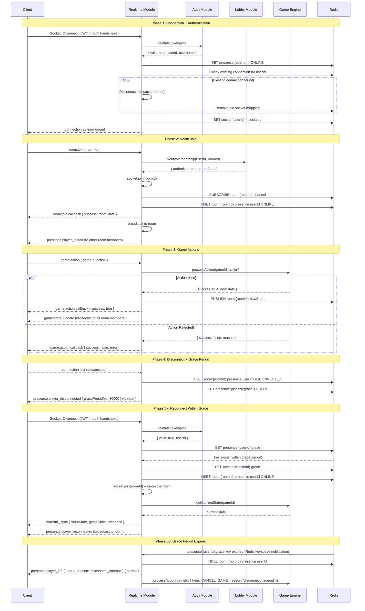
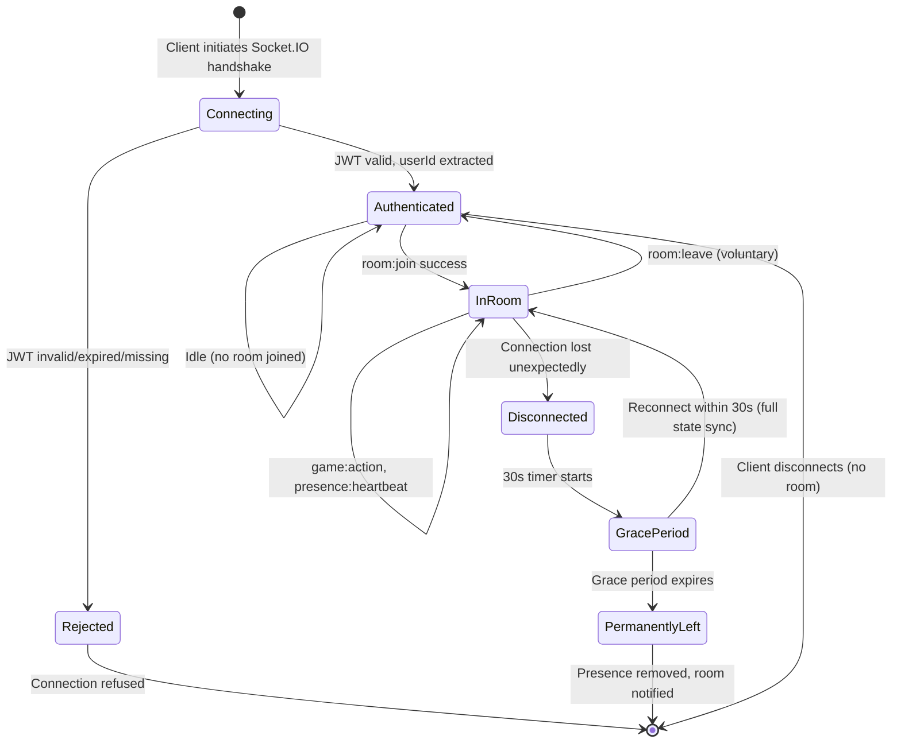
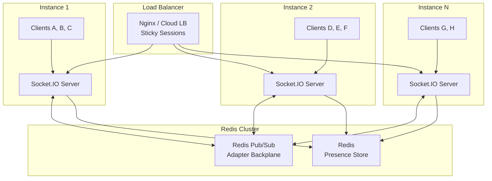
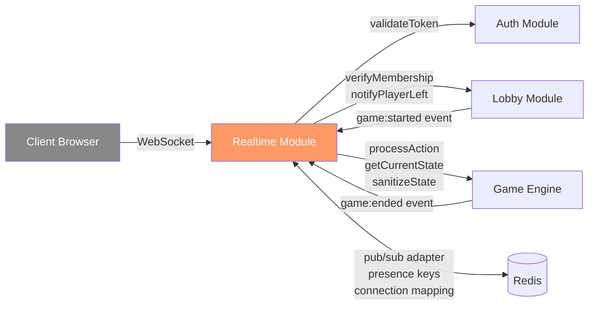

# Realtime Module -- Bidirectional WebSocket Communication, Presence, and State Broadcasting

> **Document Type:** Module Spec
> **Status:** Draft
> **Last Updated:** March 2026

---

## 1. Overview

The Realtime Module is the nervous system of the Sbobuz platform. It manages bidirectional WebSocket communication between clients and the server using Socket.IO, providing room-scoped event broadcasting, player presence tracking, connection authentication, and state rehydration on reconnect.

Every game action a player takes flows through this module: the client sends a typed event over its WebSocket connection, the Realtime Module validates the connection's authorization, relays the action to the Game Engine, receives the resulting state, and broadcasts it to every player in the room. When a player disconnects unexpectedly, the module manages a 30-second grace period, notifies remaining players, and performs full state rehydration if the player returns within that window.

The module interacts with four other system components: **Auth** (JWT validation on connection handshake), **Lobby** (room membership verification and room lifecycle events), **Game Engine** (action relay and state update propagation), and **Redis** (pub/sub backplane for multi-instance broadcasting, presence key storage, and connection tracking).

---

## 2. Data Model

All types are defined in TypeScript. Types imported from other modules are referenced by name with their source noted.

### 2.1 Core Connection Types

```typescript
/**
 * Represents a single active WebSocket connection.
 * One SocketConnection per authenticated user at any given time.
 */
interface SocketConnection {
  socketId: string;                // Socket.IO socket ID (auto-generated)
  userId: string;                  // Extracted from validated JWT
  roomId: string | null;           // The room this socket is subscribed to (null if in lobby/idle)
  connectedAt: string;             // ISO 8601 timestamp of initial connection
  lastPingAt: string;              // ISO 8601 timestamp of last received heartbeat or event
  deviceInfo: DeviceInfo;          // Client metadata from handshake
}

interface DeviceInfo {
  userAgent: string;               // Raw user-agent string from handshake headers
  transport: 'websocket' | 'polling'; // Current Socket.IO transport
  ip: string;                      // Client IP (from X-Forwarded-For or direct)
}
```

### 2.2 Presence Types

```typescript
/**
 * Tracks a player's connectivity status within a room.
 * Stored in Redis with TTL for automatic cleanup.
 */
interface PresenceState {
  userId: string;
  status: PresenceStatus;
  lastSeen: string;                // ISO 8601 timestamp of last activity
  gracePeriodEndsAt: string | null; // ISO 8601 -- non-null only when status is DISCONNECTED
}

type PresenceStatus =
  | 'ONLINE'                       // Active connection, heartbeats arriving
  | 'AWAY'                         // Connected but no heartbeat for > 15s (1 missed interval)
  | 'DISCONNECTED';                // Socket closed, grace period running

/**
 * Tracks all connected members in a specific room.
 * Lives in server memory; rebuilt from Redis on server restart.
 */
interface RoomSubscription {
  roomId: string;
  members: Map<string, SocketConnection>; // userId -> SocketConnection
}
```

### 2.3 Event Type Contracts

These interfaces define the complete Socket.IO typed event contract between client and server.

```typescript
/**
 * Events the server sends to connected clients.
 * Every event is room-scoped unless explicitly noted.
 */
interface ServerToClientEvents {
  // --- Room Events ---
  'room:state_update': (payload: RoomStateUpdatePayload) => void;

  // --- Game Events ---
  'game:state_update': (payload: GameStateUpdatePayload) => void;
  'game:action_rejected': (payload: ActionRejectedPayload) => void;
  'game:started': (payload: GameStartedPayload) => void;
  'game:ended': (payload: GameEndedPayload) => void;

  // --- Presence Events ---
  'presence:player_joined': (payload: PlayerJoinedPayload) => void;
  'presence:player_left': (payload: PlayerLeftPayload) => void;
  'presence:player_disconnected': (payload: PlayerDisconnectedPayload) => void;
  'presence:player_reconnected': (payload: PlayerReconnectedPayload) => void;

  // --- System Events ---
  'error': (payload: SocketErrorPayload) => void;
  'state:full_sync': (payload: FullSyncPayload) => void;
  'server:draining': (payload: ServerDrainingPayload) => void;
}

/**
 * Events the client sends to the server.
 * All events require an authenticated socket.
 */
interface ClientToServerEvents {
  'room:join': (
    payload: RoomJoinPayload,
    callback: (response: RoomJoinResponse) => void
  ) => void;
  'room:leave': (
    payload: RoomLeavePayload,
    callback: (response: AckResponse) => void
  ) => void;
  'game:action': (
    payload: GameActionPayload,
    callback: (response: GameActionResponse) => void
  ) => void;
  'presence:heartbeat': () => void;
}

/**
 * Events exchanged between Socket.IO server instances
 * via the Redis adapter for multi-instance coordination.
 */
interface InterServerEvents {
  'user:force_disconnect': (payload: { userId: string; reason: string }) => void;
  'room:broadcast': (payload: { roomId: string; event: string; data: unknown }) => void;
  'presence:sync': (payload: { roomId: string; presence: PresenceState[] }) => void;
}
```

### 2.4 Event Payloads

```typescript
// --- Room Payloads ---
interface RoomJoinPayload {
  roomId: string;
}

interface RoomJoinResponse {
  success: boolean;
  error?: { code: string; message: string };
  roomState?: RoomStateUpdatePayload;       // Current room state on successful join
}

interface RoomLeavePayload {
  roomId: string;
}

interface RoomStateUpdatePayload {
  roomId: string;
  players: { userId: string; username: string; isReady: boolean; isConnected: boolean }[];
  hostUserId: string;
  status: string;                           // Room status from Lobby module
}

// --- Game Payloads ---
interface GameActionPayload {
  gameId: string;
  action: GameAction;                       // Imported from Game Engine types
}

interface GameActionResponse {
  success: boolean;
  error?: { code: string; message: string };
}

interface GameStateUpdatePayload {
  gameId: string;
  state: SanitizedGameState;                // Player-specific view (no hidden info)
  lastAction: {                             // What caused this update
    type: string;
    playerId: string;
    timestamp: string;
  };
}

interface ActionRejectedPayload {
  reason: string;
  actionType: string;
  gameId: string;
}

interface GameStartedPayload {
  gameId: string;
  initialState: SanitizedGameState;         // Player-specific initial view
}

interface GameEndedPayload {
  gameId: string;
  result: {
    winnerId: string;
    reason: 'completed' | 'cancelled' | 'forfeit';
    finalState: SanitizedGameState;
  };
}

// --- Presence Payloads ---
interface PlayerJoinedPayload {
  userId: string;
  username: string;
}

interface PlayerLeftPayload {
  userId: string;
  reason: 'voluntary' | 'kicked';
}

interface PlayerDisconnectedPayload {
  userId: string;
  gracePeriodMs: number;                    // 30000ms (30 seconds)
}

interface PlayerReconnectedPayload {
  userId: string;
}

// --- System Payloads ---
interface SocketErrorPayload {
  code: SocketErrorCode;
  message: string;
}

type SocketErrorCode =
  | 'AUTH_FAILED'                           // JWT invalid or expired
  | 'AUTH_EXPIRED'                          // Token expired during session
  | 'ROOM_NOT_FOUND'                        // Room does not exist
  | 'ROOM_FULL'                             // Room at max capacity
  | 'NOT_IN_ROOM'                           // Action requires room membership
  | 'GAME_NOT_FOUND'                        // Game does not exist
  | 'NOT_YOUR_TURN'                         // Action sent out of turn
  | 'INVALID_ACTION'                        // Malformed action payload
  | 'RATE_LIMITED'                          // Too many events
  | 'INTERNAL_ERROR';                       // Unexpected server error

interface FullSyncPayload {
  roomState: RoomStateUpdatePayload;
  gameState: SanitizedGameState | null;     // null if no active game
  presence: PresenceState[];                // All players' presence in the room
}

interface ServerDrainingPayload {
  reason: string;
  reconnectAfterMs: number;                 // Suggested delay before reconnect attempt
}

interface AckResponse {
  success: boolean;
  error?: { code: string; message: string };
}

/**
 * SanitizedGameState is the player-specific view of GameState.
 * Generated by the Game Engine's state sanitizer.
 * - Own hand cards: visible
 * - Other players' hand cards: count only
 * - All face-up cards: visible
 * - Face-down cards: count only (no values)
 * - Draw pile: count only
 * See SBOBUZ_ENGINE_SPEC.md Section 18 for full visibility rules.
 */
type SanitizedGameState = Record<string, unknown>; // Fully typed in shared/types
```

---

## 3. Connection Lifecycle

### 3.1 Lifecycle Diagram



### 3.2 Lifecycle States



---

## 4. Event Catalog

### 4.1 Client -> Server Events

| Event | Payload | Phase Required | Description |
|---|---|---|---|
| `connection` | JWT in `auth.token` handshake option | N/A (handshake) | Initial WebSocket connection. JWT extracted from `socket.handshake.auth.token`. Rejected connections receive an error frame and are closed immediately. |
| `room:join` | `{ roomId: string }` | Authenticated | Client requests to join a room. Server verifies membership via Lobby module. Callback returns room state on success or error on failure. |
| `room:leave` | `{ roomId: string }` | InRoom | Client voluntarily leaves a room. Server removes socket from Socket.IO room and updates presence. Callback acknowledges. |
| `game:action` | `{ gameId: string, action: GameAction }` | InRoom | Client submits a game action. Server relays to Game Engine. Callback returns success/failure. State update broadcast follows asynchronously. |
| `presence:heartbeat` | (no payload) | Authenticated | Client heartbeat signal. Must be sent every 15 seconds. Server updates `lastPingAt` on the connection record. |

### 4.2 Server -> Client Events

| Event | Payload Type | Trigger | Scope |
|---|---|---|---|
| `room:state_update` | `RoomStateUpdatePayload` | Room membership changes (join, leave, ready, unready) | Room broadcast |
| `game:state_update` | `GameStateUpdatePayload` | Game Engine produces new state after a valid action | Room broadcast (sanitized per player) |
| `game:action_rejected` | `ActionRejectedPayload` | Game Engine rejects an action | Sender only |
| `game:started` | `GameStartedPayload` | Game transitions from lobby to playing | Room broadcast |
| `game:ended` | `GameEndedPayload` | Game reaches `finished` or `cancelled` phase | Room broadcast |
| `presence:player_joined` | `PlayerJoinedPayload` | Player joins the room | Room broadcast (excluding joiner) |
| `presence:player_left` | `PlayerLeftPayload` | Player leaves the room voluntarily or grace period expires | Room broadcast (excluding leaver) |
| `presence:player_disconnected` | `PlayerDisconnectedPayload` | Player's socket closes unexpectedly | Room broadcast (excluding disconnected player) |
| `presence:player_reconnected` | `PlayerReconnectedPayload` | Player reconnects within grace period | Room broadcast (excluding reconnecting player) |
| `error` | `SocketErrorPayload` | Any error condition (auth failure, invalid action, etc.) | Sender only |
| `state:full_sync` | `FullSyncPayload` | Player reconnects within grace period | Reconnecting player only |
| `server:draining` | `ServerDrainingPayload` | Server is shutting down gracefully (SIGTERM received) | All connected clients |

### 4.3 Per-Player State Sanitization

The `game:state_update` and `state:full_sync` events contain **player-specific** game state. The Realtime Module calls the Game Engine's state sanitizer for each recipient:

```
For each player P in room:
  sanitizedState = gameEngine.sanitizeStateForPlayer(fullState, P.userId)
  emit('game:state_update', { state: sanitizedState }) to P's socket
```

This ensures no player ever receives another player's hand contents, face-down card values, or draw pile ordering. See `SBOBUZ_ENGINE_SPEC.md` Section 18 for visibility rules.

---

## 5. Behavior Rules

### 5.1 Authentication

- JWT is **required** in the Socket.IO handshake `auth` object: `{ token: string }`.
- On connection, the server calls `authModule.validateToken(token)` synchronously during the Socket.IO middleware pipeline.
- If the token is invalid, expired, or missing, the connection is rejected with an `AUTH_FAILED` error and the socket is not created.
- The `userId` and `username` are extracted from the validated token payload and attached to the socket instance for the duration of the connection.
- Token expiration during an active session is handled by a periodic check (every 60 seconds). If the token has expired, the server emits an `error` event with code `AUTH_EXPIRED` and disconnects the socket. The client should obtain a new access token via the refresh flow and reconnect.

### 5.2 One Socket Per User Policy

- When a new socket connects with a `userId` that already has an active socket, the **old socket is forcefully disconnected** before the new socket is fully admitted.
- The old socket receives an `error` event with code `AUTH_FAILED` and message `"Connection superseded by new session"` before disconnection.
- This prevents duplicate event delivery, split-brain state, and resource leaks from abandoned connections (e.g., user closes a tab without clean disconnect, then opens a new tab).
- In a multi-instance deployment, the inter-server event `user:force_disconnect` is broadcast via Redis to ensure the old connection is found and closed regardless of which server instance it lives on.

### 5.3 Room Membership

- A socket must call `room:join` before sending any `game:action` events. Actions sent without an active room subscription are rejected with `NOT_IN_ROOM`.
- A socket can be in **at most one room** at a time. Joining a new room implicitly leaves the current room.
- Room membership is verified against the Lobby module on join. The Lobby module is the source of truth for who is allowed in which room.
- When a socket joins a room, the server calls `socket.join(roomId)` to enter the Socket.IO room, and publishes the player's presence to Redis.

### 5.4 Heartbeat and Timeout

- The client **must** emit `presence:heartbeat` every **15 seconds**.
- The server updates `lastPingAt` on every received heartbeat.
- If the server receives no heartbeat and no other events from a socket for **45 seconds** (3 missed intervals), it considers the connection dead and initiates the disconnect flow, even if the TCP connection is technically still open.
- The 45-second threshold accounts for one missed heartbeat (network jitter) plus a full additional interval as buffer.
- The server runs a heartbeat sweep every 15 seconds, checking all connections for staleness.

### 5.5 Disconnect and Grace Period

- When a socket disconnects (network drop, browser close, heartbeat timeout), the server does NOT immediately remove the player from the room.
- A **30-second grace period** begins. During this window:
  - The player's presence status is set to `DISCONNECTED` in Redis.
  - A Redis key `presence:{userId}:grace` is set with a 30-second TTL.
  - All room members receive `presence:player_disconnected` with `gracePeriodMs: 30000`.
  - If a game is active and it is the disconnected player's turn, the **turn timer continues running**. The game does not pause.
- If the player reconnects within 30 seconds:
  - The grace period key is deleted from Redis.
  - Presence status is restored to `ONLINE`.
  - The player receives `state:full_sync` with the complete current room and game state.
  - Room members receive `presence:player_reconnected`.
- If the grace period expires:
  - Room members receive `presence:player_left` with reason `'disconnect_timeout'`.
  - If a game is active, the Realtime Module triggers a `CANCEL_GAME` action on the Game Engine with reason `'disconnect_timeout'`.
  - The player's presence is removed from Redis.

### 5.6 State Rehydration on Reconnect

- Reconnection uses **full state push**, not event replay.
- On reconnect, the server sends a single `state:full_sync` event containing:
  - Current room state (player list, readiness, host)
  - Current game state (sanitized for the reconnecting player) or `null` if no game is active
  - Presence of all players in the room
- This approach is simpler and more reliable than replaying missed events, which would require the server to track which events each client has received.

### 5.7 Room-Scoped Broadcasting

- All game and presence events are scoped to the Socket.IO room. Events are **never** sent to sockets outside the room.
- Broadcasting uses `io.to(roomId).emit(event, payload)` for room-wide events.
- For player-specific payloads (sanitized game state), the server iterates over room members and emits individually to each socket.
- The Redis pub/sub adapter ensures broadcasts reach clients connected to other server instances.

### 5.8 Rate Limiting

- WebSocket events are rate-limited per socket:
  - `game:action`: 10 events per second (burst), 2 events per second (sustained)
  - `room:join` / `room:leave`: 5 events per 10 seconds
  - `presence:heartbeat`: 2 events per second (prevent spam)
  - All other events: 20 events per second combined
- Rate limit violations result in an `error` event with code `RATE_LIMITED`. Persistent violation (>10 violations in 60 seconds) results in forced disconnect.
- Rate limiting is tracked per socket in server memory (not Redis) for performance.

### 5.9 Payload Size Protection

- Maximum incoming WebSocket message size: **16 KB**.
- Messages exceeding this limit are silently dropped and the socket receives an `error` event with code `INVALID_ACTION`.
- This prevents memory exhaustion from malicious or malformed payloads.
- The 16 KB limit is generous for game actions (typical action is < 500 bytes) while preventing abuse.

---

## 6. Scaling Architecture

### 6.1 Multi-Instance Topology



### 6.2 Socket.IO Redis Adapter

- The `@socket.io/redis-adapter` package is used to distribute events across server instances.
- All `io.to(roomId).emit()` calls are transparently routed through Redis pub/sub, ensuring that a broadcast on Instance 1 reaches clients connected to Instance 2.
- The adapter uses two Redis pub/sub channels: one for broadcasting events, one for request/response patterns (e.g., fetching all sockets in a room across instances).

### 6.3 Sticky Sessions

- WebSocket connections require **sticky sessions** (session affinity) at the load balancer level.
- The affinity key is the Socket.IO `sid` (session ID) set during the initial HTTP handshake.
- Without sticky sessions, the Socket.IO polling fallback will fail because subsequent HTTP requests may hit different instances.
- Implementation: the load balancer uses a cookie or IP-hash to route all requests from the same client to the same backend instance.

### 6.4 Connection Count Metrics

The Realtime Module exposes the following metrics for capacity planning:

| Metric | Type | Description |
|---|---|---|
| `ws_connections_active` | Gauge | Total active WebSocket connections on this instance |
| `ws_connections_per_room` | Histogram | Distribution of connections per room |
| `ws_rooms_active` | Gauge | Number of rooms with at least one connected member |
| `ws_messages_in_total` | Counter | Total inbound WebSocket events received |
| `ws_messages_out_total` | Counter | Total outbound WebSocket events sent |
| `ws_disconnects_unclean_total` | Counter | Unexpected disconnections (not voluntary leave) |
| `ws_reconnects_within_grace_total` | Counter | Successful reconnections within grace period |
| `ws_reconnects_after_grace_total` | Counter | Reconnection attempts after grace period expired |
| `ws_grace_periods_expired_total` | Counter | Grace periods that expired without reconnection |
| `ws_redis_adapter_latency_ms` | Histogram | Latency of Redis adapter pub/sub operations |
| `ws_auth_failures_total` | Counter | Connection attempts with invalid/expired JWT |
| `ws_rate_limit_hits_total` | Counter | Rate limit violations |

---

## 7. Redis Key Schema

The Realtime Module owns these Redis keys:

| Key Pattern | Type | TTL | Description |
|---|---|---|---|
| `ws:socket:{userId}` | String (socketId) | None (deleted on disconnect) | Maps userId to active socketId. Used for one-socket-per-user enforcement. |
| `ws:connection:{socketId}` | Hash | None (deleted on disconnect) | Full `SocketConnection` record. Used for debugging and metrics. |
| `ws:room:{roomId}:presence` | Hash (userId -> JSON PresenceState) | None (deleted when room is destroyed) | Presence state for all members of a room. |
| `presence:{userId}:grace` | String ("1") | 30 seconds | Grace period marker. Existence = player is in grace period. |
| `ws:room:{roomId}` | Pub/Sub channel | N/A | Channel for room-scoped event broadcasting via Redis adapter. |
| `ws:instance:{instanceId}:connections` | Set (socketIds) | 120 seconds (refreshed periodically) | Tracks connections per server instance. Used for capacity monitoring and orphan cleanup after crash. |

---

## 8. Edge Cases

| # | Scenario | Expected Behavior |
|---|---|---|
| 1 | Two connections from same user (different tabs/devices) | Old socket receives `error { code: 'AUTH_FAILED', message: 'Connection superseded by new session' }` and is forcefully disconnected. New socket proceeds normally. In multi-instance deployments, the `user:force_disconnect` inter-server event ensures the old socket is found. |
| 2 | Token expires during active WebSocket session | Periodic token check (every 60s) detects expiration. Server emits `error { code: 'AUTH_EXPIRED' }` and disconnects the socket. Client must refresh the access token and reconnect. If the player is in a room with an active game, the disconnect grace period applies. |
| 3 | Redis pub/sub connection lost | The Socket.IO Redis adapter emits an `error` event. The Realtime Module logs the error at `error` level and enters a degraded mode where broadcasts only reach clients on the local instance. A reconnection loop attempts to restore the Redis connection every 5 seconds. An alert fires via the observability stack. Room-scoped events may be missed by clients on other instances during the outage. |
| 4 | Server restart mid-game (state recovery from Redis snapshots) | On startup, the Realtime Module reads `ws:instance:{instanceId}:connections` from Redis to identify orphaned connections. It cleans up stale presence entries and socket mappings. Active games survive because game state is snapshotted to Redis by the Game Engine. Reconnecting clients receive full state sync from the new server instance. |
| 5 | Client sends game action for wrong game/room | The Realtime Module checks that `gameId` in the action payload matches the active game in the socket's current room. Mismatch results in `game:action_rejected` with reason `"Game ID does not match active game in your room"`. |
| 6 | Rate limiting on WebSocket events | Per-socket sliding window counters track event frequency. When the limit is exceeded, the server emits `error { code: 'RATE_LIMITED' }` and drops the event. The action is NOT relayed to the Game Engine. Persistent abuse triggers forced disconnect. |
| 7 | Large payload protection (>16 KB message) | Socket.IO's `maxHttpBufferSize` is set to 16 KB. Messages exceeding this are dropped at the transport level. The socket receives an `error` event. This is a defense against memory exhaustion attacks. |
| 8 | Connection during server graceful shutdown (SIGTERM) | After SIGTERM, the server emits `server:draining` to all connected clients with a suggested reconnect delay. New connection attempts are refused (HTTP 503 on the handshake). Existing connections are kept alive until either the client disconnects or a hard timeout (30 seconds after SIGTERM) is reached, after which all sockets are forcefully closed. Active game states are snapshotted to Redis before process exit. |
| 9 | Reconnect after grace period expired | The player's presence has already been removed from the room. They are treated as a new connection. They must call `room:join` again. If the game was cancelled due to their disconnect, `room:join` succeeds but there is no active game. If the game is somehow still running (e.g., multi-player and another player also disconnected and rejoined), they rejoin normally. |
| 10 | Network partition between server instances | Server instances cannot communicate via Redis pub/sub. Each instance broadcasts only to its local clients. After the partition heals, the Redis adapter automatically resynchronizes. In-flight events during the partition are lost (not queued). Clients may see stale state until the next game action triggers a fresh broadcast. The observability stack alerts on Redis adapter errors. |
| 11 | Client sends events before joining a room | Events like `game:action` that require room membership are rejected with `error { code: 'NOT_IN_ROOM' }`. The only events valid without a room are `room:join` and `presence:heartbeat`. |
| 12 | Simultaneous disconnect of all players in a room | Each player enters their own grace period independently. If no player reconnects within 30 seconds, all grace periods expire and the game is cancelled. The room enters an "expired" state. If one player reconnects, the game remains alive but enters cancellation when other grace periods expire (per Game Engine's disconnect timeout rules). |
| 13 | Broadcasting to room with 0 connected players | The broadcast operation is a no-op. Socket.IO's `io.to(roomId).emit()` silently does nothing when no sockets are in the room. No error, no resource waste. Game state updates from the Game Engine are still processed and snapshotted to Redis for potential future reconnections. |
| 14 | Socket.IO fallback from WebSocket to polling | Socket.IO automatically falls back to HTTP long-polling when WebSocket is unavailable (corporate proxies, restrictive firewalls). The Realtime Module operates identically in both transport modes. Sticky sessions are required for polling to work correctly across multiple requests. The `DeviceInfo.transport` field tracks which transport each connection is using for monitoring purposes. |
| 15 | Memory leak from abandoned socket connections | The heartbeat sweep (every 15 seconds) detects sockets that have been silent for >45 seconds and forcefully disconnects them. On server startup, the instance checks Redis for stale connection records from its instance ID (from a previous crash) and cleans them up. Socket.IO's built-in `pingTimeout` and `pingInterval` provide a secondary safety net. |
| 16 | Client sends malformed event payload (fails Zod validation) | All incoming event payloads are validated with Zod schemas before processing. Malformed payloads are rejected with `error { code: 'INVALID_ACTION', message: <Zod error details> }`. The event is not relayed to any downstream module. |
| 17 | Redis keyspace notification for grace period not delivered | If the Redis keyspace notification for grace period expiration is missed (rare), the heartbeat sweep detects the orphaned presence record on its next pass and cleans it up. Maximum delay for cleanup: 15 seconds beyond the intended 30-second grace period. |

---

## 9. Integration Points

### 9.1 Inbound

| Source | Interface | Data |
|---|---|---|
| Client (Browser) | Socket.IO WebSocket connection | `ClientToServerEvents` -- typed events with payloads |
| Redis Pub/Sub | `@socket.io/redis-adapter` subscription | Room-scoped broadcasts from other server instances |
| Redis Keyspace | Keyspace notification subscription | Grace period key expiration events |

### 9.2 Outbound

| Target | Interface | Data |
|---|---|---|
| Auth Module | `authModule.validateToken(jwt): Promise<TokenPayload>` | JWT string, returns userId and username or throws |
| Lobby Module | `lobbyModule.verifyMembership(userId, roomId): Promise<MembershipResult>` | Checks if userId is authorized to join roomId |
| Lobby Module | `lobbyModule.notifyPlayerLeft(userId, roomId, reason): Promise<void>` | Notifies Lobby of permanent player departure (grace period expired) |
| Game Engine | `gameEngine.processAction(gameId, action): Promise<ActionResult>` | Relays validated game action, receives new state or rejection |
| Game Engine | `gameEngine.getCurrentState(gameId): Promise<GameState>` | Fetches current game state for full sync on reconnect |
| Game Engine | `gameEngine.sanitizeStateForPlayer(state, userId): SanitizedGameState` | Produces player-specific view of game state |
| Redis | `SET`, `GET`, `HSET`, `HGET`, `DEL`, `PUBLISH` | Presence tracking, connection mapping, grace period keys |

### 9.3 Side Effects

| Side Effect | Trigger | Description |
|---|---|---|
| Redis pub/sub publish | Every room-scoped broadcast | Event published to `ws:room:{roomId}` channel for cross-instance delivery |
| Redis presence write | Connection, disconnection, reconnection, heartbeat | Presence state updated for room members |
| Redis connection mapping write | Connection, disconnection | `ws:socket:{userId}` and `ws:connection:{socketId}` keys updated |
| Structured log emission | Every significant event | JSON logs with traceId, userId, roomId, gameId for observability |
| OpenTelemetry span creation | Every inbound event, every outbound module call | Distributed tracing across the Realtime -> Auth -> GameEngine pipeline |
| Metrics emission | Connection, disconnection, event processing, errors | Prometheus counters and gauges updated |

### 9.4 Module Dependency Diagram



---

## 10. Resolved Design Decisions

| # | Question | Decision | Alternatives Considered | Rationale |
|---|---|---|---|---|
| 1 | Socket.IO vs raw WebSocket (ws) | **Socket.IO** | `ws` library, `uWebSockets.js`, SSE | Socket.IO provides built-in rooms, auto-reconnect with backoff, polling fallback, typed events, and the Redis adapter for multi-instance scaling. Raw WS would require reimplementing all of these. The overhead of Socket.IO's protocol framing is negligible for a card game's event volume. |
| 2 | Grace period duration | **30 seconds** | 10s, 60s, configurable per room | 30 seconds covers typical network hiccups and mobile app backgrounding. 10 seconds is too aggressive (mobile networks often need 15-20 seconds to recover). 60 seconds keeps other players waiting too long. Fixed rather than configurable to keep the system predictable. |
| 3 | Full state sync vs delta/event replay on reconnect | **Full state push** | Event replay from last acknowledged event, delta diffs | Full sync is simpler, requires no server-side tracking of per-client event acknowledgment, and is immune to missed-event bugs. The game state is small (< 5 KB serialized) so bandwidth is not a concern. Event replay adds significant complexity for no measurable benefit at this scale. |
| 4 | Heartbeat interval (client sends) | **15 seconds** | 5s, 30s, 60s | 15 seconds balances responsiveness (detect dead connections within 45 seconds) against overhead (4 events/minute is negligible). 5 seconds would triple overhead. 30 seconds would mean 90 seconds to detect a dead connection. |
| 5 | Disconnect detection threshold | **45 seconds (3 missed heartbeats)** | 20s (1 miss + buffer), 60s | One missed heartbeat is normal (network jitter). Two misses is concerning. Three misses (45 seconds) provides high confidence that the connection is truly dead while minimizing false positives. |
| 6 | One socket per user policy | **Enforce one socket, disconnect old on new** | Allow multiple sockets (fan-out), reject new connection | Multiple sockets per user creates complexity: duplicate event delivery, inconsistent state, resource waste. Rejecting the new connection punishes users who legitimately moved to a new tab. Disconnecting the old socket is the cleanest behavior. |
| 7 | Token expiration handling during session | **Periodic check (60s) + disconnect** | Ignore expiration until reconnect, proactive token refresh over WebSocket | Ignoring expiration means potentially running unauthorized connections indefinitely. Proactive refresh over WebSocket adds a non-standard auth flow. Periodic check is simple, secure, and aligns with the existing JWT + refresh token architecture. The client-side Socket.IO reconnection handler should automatically refresh the token and reconnect. |
| 8 | Rate limiting implementation | **Per-socket in-memory sliding window** | Redis-backed rate limiting, token bucket | In-memory is faster (no Redis round-trip per event). Per-socket isolation means a misbehaving client only affects itself. Redis-backed would be needed if rate limiting must survive reconnection, but that is not required here -- a new socket gets a fresh rate limit window. |
| 9 | Pub/sub adapter for multi-instance | **@socket.io/redis-adapter** | @socket.io/redis-streams-adapter, custom Redis pub/sub, NATS | The standard Redis adapter is battle-tested, officially maintained, and requires minimal configuration. Redis Streams adapter offers durability but adds complexity we do not need (events are ephemeral). Custom pub/sub would reinvent existing functionality. NATS would add an infrastructure dependency. |
| 10 | State sanitization location | **Realtime Module calls Game Engine sanitizer per player** | Game Engine broadcasts pre-sanitized states, client-side filtering | The Game Engine owns the visibility rules (Section 18 of the engine spec) so it must produce the sanitized view. The Realtime Module calls the sanitizer once per player per state update. Client-side filtering is insecure (would require sending full state to all clients). |

---

## 11. Implications for Architecture

1. **Sticky sessions are a deployment requirement.** The load balancer (Nginx, AWS ALB, etc.) must be configured with session affinity before multi-instance deployment. This affects the infrastructure/Terraform configuration and must be documented in the deployment runbook.

2. **Redis is a hard dependency at runtime.** If Redis is unavailable, the Realtime Module degrades to single-instance mode (local broadcasts only). This is acceptable for development but not for production multi-instance deployments. Health check endpoints must reflect Redis connectivity status.

3. **The Lobby Module must emit room lifecycle events** (game started, player kicked) that the Realtime Module can translate into WebSocket broadcasts. The interface between Lobby and Realtime must be defined as a typed event emitter or callback registration.

4. **The Game Engine's `sanitizeStateForPlayer` function is called N times per state update** (once per player in the room). For a 5-player game, every game action triggers 5 sanitization calls. This is acceptable given the small state size but should be profiled if performance becomes a concern.

5. **The Auth Module's `validateToken` is called on every new WebSocket connection** but NOT on every event. Token validation is a one-time cost at connection time. Mid-session token expiration is handled by the periodic check, not per-event validation. This means there is a window of up to 60 seconds where an expired token's connection remains active.

6. **Graceful shutdown must coordinate with the Game Engine.** Before the Realtime Module closes connections, it must signal the Game Engine to snapshot all active game states to Redis. The shutdown sequence defined in `architecture-overview.md` Section 9.4 governs this ordering.

7. **AI players bypass the Realtime Module entirely.** AI opponents (see `ai-opponent-module.md`) submit actions directly to the Game Engine, not through WebSocket connections. The Realtime Module does not manage AI player presence -- AI players are always considered "online" by convention. The Realtime Module broadcasts state updates that include AI player actions to human players.
