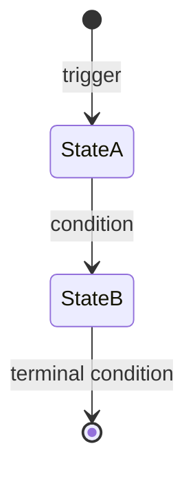

# Spec-Driven Architecture

Define every architecture block through a detailed specification before writing a single line of implementation code. The spec is the source of truth — code is the artifact that fulfills it.

## Why Specs First

Code without a spec is a guess. Specs force you to think through interfaces, edge cases, data flow, and failure modes before the complexity of implementation clouds your judgment. A good spec is:

- **Reviewable** — stakeholders can evaluate the design without reading code.
- **Testable** — every decision in the spec maps to a verifiable behavior.
- **Replayable** — a new developer (or agent) can read the spec and produce a conforming implementation independently.
- **Durable** — the spec survives refactors. Code changes; the contract holds.

A spec is NOT documentation written after the fact. It's a design artifact that precedes and drives the implementation.

## When to Activate

- Designing a new module, service, or bounded context
- Adding a major feature that spans multiple components
- Defining the contract between two systems (API, event schema, shared state)
- Planning a state machine, workflow, or multi-step process
- Refactoring a module boundary or extracting a service
- When the complexity of what you're about to build exceeds what you can hold in your head

## The Spec-Driven Workflow

```
1. SCOPE    — What is this block responsible for? What is it NOT responsible for?
2. MODEL    — What are the core data types and their relationships?
3. BEHAVIOR — What are the rules, state transitions, and edge cases?
4. CONTRACT — What are the interfaces (inputs, outputs, events)?
5. DECIDE   — Resolve every open question. No TBDs survive.
6. VALIDATE — Walk through scenarios against the spec. Find the gaps.
7. BUILD    — Only now, write the code. The spec is your blueprint.
```

## Spec Structure

Every architecture block spec follows this skeleton. Sections can be added or removed based on the block's nature, but the ordering and the intent behind each section should be preserved.

### 1. Header

```markdown
# [Block Name] — [One-Line Purpose]

> **Document Type:** [Architecture Spec | Module Spec | Engine Spec | Integration Spec]
> **Status:** [Draft | Review | Approved | Implementation-Ready]
> **Last Updated:** [Date]
```

The status field matters. A spec in "Draft" status has unresolved questions. "Implementation-Ready" means every decision is final and a developer can build against it without asking further questions.

### 2. Overview

Two to three paragraphs max. Answer:
- What does this block do, in plain language?
- Who interacts with it (other modules, users, external systems)?
- What is the core mechanic or central idea?

State the player count, the constraints, the invariants — whatever defines the shape of this block. A reader should understand the block's purpose without reading further.

### 3. Data Model

Define every type, enum, and data structure the block owns. Use TypeScript interfaces or equivalent typed notation — not prose descriptions.

```typescript
interface ExampleState {
  id: string;
  phase: Phase;
  items: Item[];
  // Every field has a comment explaining WHY it exists,
  // not just WHAT it is
}
```

**Rules for the data model:**
- Every field must justify its existence. If you can derive it from other fields, mark it as "computed, never stored" and show the derivation function.
- Distinguish between stored state and derived state explicitly.
- Use discriminated unions over boolean flags when a field represents mutually exclusive states.
- Show the complete type — no `any`, no `unknown`, no hand-waving.

### 4. Behavior Rules

This is the heart of the spec. Define:

**State transitions** — If the block has phases or modes, draw the state machine. Use mermaid diagrams for visual clarity, but ALSO define the transitions in text/pseudocode so they're unambiguous.



**Business rules** — Express every rule as a clear conditional:
- "X is legal if any of the following are true: ..."
- "When Y happens, the system must: ..."
- "Z takes priority over W. Always."

**Priority and resolution order** — When multiple rules could apply simultaneously, define the exact resolution order. This is where most bugs hide — ambiguous priority between competing effects.

```
STEP 1 — Check condition A (highest priority)
    ├─ YES → Do X. STOP. No further processing.
    └─ NO  → Continue to Step 2.
STEP 2 — Check condition B
    ...
```

### 5. Action / Event Types

Define every input the block accepts. Use typed action objects with discriminated unions.

```typescript
type BlockAction =
  | ActionTypeA
  | ActionTypeB
  | ActionTypeC;

interface ActionTypeA {
  type: 'ACTION_A';
  payload: { /* typed fields */ };
}
```

For each action type, specify:
- **Preconditions** — What must be true for this action to be valid?
- **Postconditions** — What is guaranteed to be true after this action succeeds?
- **Error cases** — What happens when validation fails?

### 6. Validation Rules

Separate validation from behavior. The validator is a gate — it either accepts an action and passes it to the reducer, or rejects it with a reason. Rejected actions never touch the state.

Organize validations by action type. For each action, list every check:
- Universal checks (apply to all actions)
- Action-specific checks (apply to one action type)

### 7. State Reducer / Processing Logic

The pure function at the core: `(currentState, validatedAction) → newState`.

Write this as numbered pseudocode steps, not prose. Each step should be mechanically translatable to code. Include:
- Where flags are consumed (single-use effects)
- Where derived state is recomputed
- Where terminal conditions are checked
- What happens on each branch

### 8. Edge Cases & Test Scenarios

This section is a table of compound scenarios — situations where multiple rules interact. For each scenario:

| # | Scenario | Expected Behavior |
|---|----------|-------------------|
| 1 | [Describe the setup] | [What should happen — be specific] |

Aim for 15-20 edge cases. The goal is not to list every possible scenario, but to cover the interactions between rules that are most likely to produce bugs. Think about:
- Two effects triggering simultaneously
- Boundary conditions (empty collections, maximum values)
- State transitions that revert or cycle
- Actions that are valid in one phase but not another

### 9. Integration Points

How does this block connect to the rest of the system? Define:
- **Inbound** — What calls this block? What data does it receive?
- **Outbound** — What does this block call? What data does it produce?
- **Side effects** — Does this block write to a database, publish events, send messages?

Make the boundaries explicit. A well-spec'd block can be replaced with a different implementation that honors the same interfaces.

```
[Upstream Module] → receives action
    → [This Block] (validate + process) → returns new state
        → [Downstream Module] → broadcasts result
```

### 10. Resolved Design Decisions

Every open question must be closed before the spec reaches "Implementation-Ready" status. Track decisions in a table:

| # | Question | Decision | Rationale |
|---|----------|----------|-----------|
| 1 | [The question that was open] | [The final answer] | [Why this choice over alternatives] |

Include alternatives that were considered and why they were rejected. This prevents future developers from re-litigating settled decisions.

### 11. Implications for Architecture

After resolving all decisions, spell out what they mean for the broader system. Each decision may constrain or enable choices in other modules. Make these implications explicit.

## Spec Quality Checklist

Before declaring a spec "Implementation-Ready," verify:

- [ ] Every data type is fully defined — no `any`, no `TODO`, no "TBD"
- [ ] Every rule is expressed as a testable conditional, not vague prose
- [ ] Priority/resolution order is explicit when multiple rules compete
- [ ] Edge cases cover rule interactions, not just individual rules
- [ ] Open questions section is empty (all moved to Resolved Decisions)
- [ ] A developer who has never seen the codebase could implement from this spec alone
- [ ] Derived state is clearly separated from stored state
- [ ] Integration boundaries are defined with typed interfaces
- [ ] State transitions are both diagrammed AND written in pseudocode
- [ ] The spec doesn't prescribe implementation details (algorithms, data structures) unless they are architecturally significant

## Anti-Patterns to Avoid

**The wishful spec** — "The system should be fast and reliable." This says nothing. Quantify constraints or omit them.

**The implementation spec** — "Use a HashMap with String keys." A spec defines WHAT and WHY, not HOW. The implementation is free to choose its own data structures unless the choice is architecturally significant (e.g., event sourcing vs. mutable state).

**The incomplete spec** — "Authentication: TBD." If it's not decided, it's not a spec, it's a sketch. Every section must be resolved or explicitly deferred with a rationale for why it can be deferred safely.

**The prose novel** — Walls of text with no structure. Specs are reference documents, not narratives. Use tables, type definitions, pseudocode, and diagrams. A developer should be able to ctrl+F to find the rule they need.

**The over-spec** — Specifying the color of every pixel when the block is a backend service. Match the level of detail to the block's complexity and risk. Critical path logic gets exhaustive coverage. Configuration plumbing gets a sentence.

## Adapting the Template

Not every block needs every section. Use judgment:

| Block Type | Key Sections |
|---|---|
| **State machine / game engine** | Data model, behavior rules, reducer, edge cases — all critical |
| **CRUD service** | Data model, validation, API contract — behavior is straightforward |
| **Integration adapter** | Contract, error handling, retry strategy — behavior is about resilience |
| **UI component** | Props interface, state management, interaction patterns |
| **Background job** | Trigger conditions, idempotency, failure/retry, completion criteria |

## Working with Existing Specs

When a project already has specs (like an engine spec or architecture overview), new block specs should:
- Reference the parent spec for shared types and decisions
- Not duplicate definitions — import and extend
- Call out where the new block's decisions affect or constrain the parent architecture
- Maintain the same notation conventions (TypeScript for types, mermaid for diagrams, tables for decisions)
